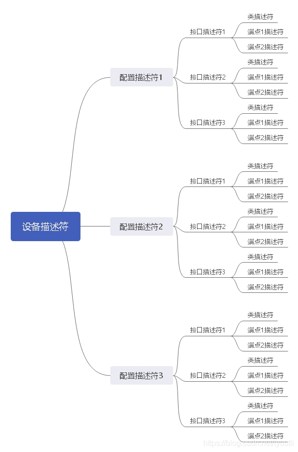

# USB 协议

## USB 描述符

当设备有多个接口，并且接口有多个端点时，数据返回配置描述符集合的格式如下

    {
        配置描述符

        第一个接口的接口描述符

        第一个接口的类特殊描述符(如果有)

        第一个接口的端点1描述符

        第一个接口的端点2描述符

        第一个接口的端点n描述符

        第二个接口的接口描述符

        第二个接口的类特殊描述符(如果有)

        第二个接口的端点1描述符

        第二个接口的端点n描述符

        第n个接口的接口描述符
    }

## HID 报表描述符

    HID 报表描述符 是由HID设备的数据项目组成.
    项目的第一个字节(项目前缀)由三部分组成, 即: 项目类型(item type)、项目标志(item tag)、项目长度(item size).

    项目类型 -- 项目的数据类型
    项目标志 -- 项目的功能
    项目长度 -- 项目的数据部分的长度

    HID 的项目有短项目和长项目

    短项目:

        位序:                                 bit7~bit4   bit3~bit2   bit1~bit0
        字段: Data(0,1,2,3,或4, 取决于bsize),     bTag,      bType,       bSize
        data部分的字节数 取决于 bSize, bSize 为 0、1、2、3时data的字节数为0、1、2、4.
        项目类型 由 bType 定义, bType 为 0、1、2时分别为 Main、Global、Local类型.

    长项目:
