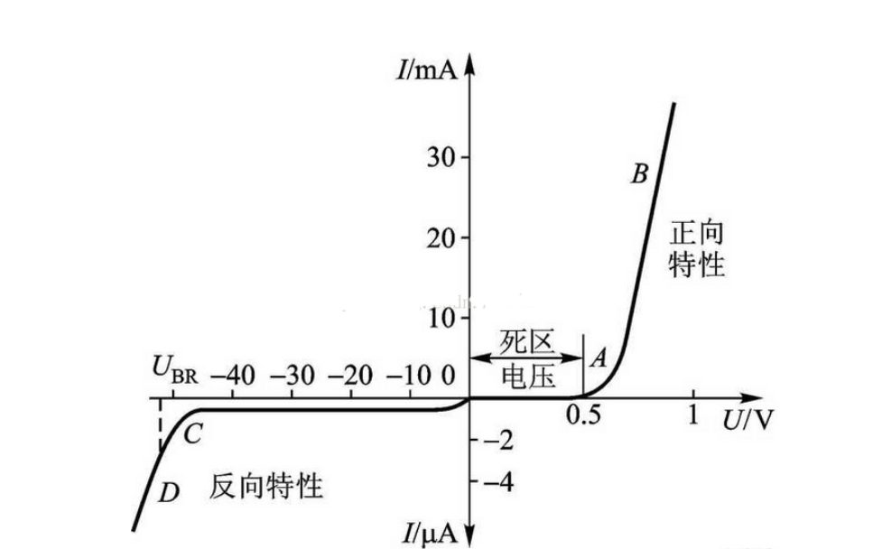

# 电路知识

## 电容、电阻 大小

    电容
        3位数标注法, 前2位是有效数, 第3位则是倍率数, 单位是 pf
        如:
            103 电容 --> 10 000 pf
            104 电容 --> 10 0000 pf

    电阻
        3位数标注法, 前2位是有效数, 第3位则是倍率数, 单位是 Ω
        如:
            103 电阻 --> 10 000 Ω
            104 电阻 --> 10 0000 Ω

## 电阻

ESR, 是Equivalent Series Resistance, 等效串联电阻

## 上拉电阻

图1 描述的是一个使用情景: Vt1.c作为下一级的带有输入电阻的输入

图2 把图1中的下一级中输入电阻和基级电阻当做一个5K的电阻

图3 给Vc这个输入信号添加一个5k的上拉电阻

对图2分析:

    如果输入5V的信号, 假设Vt1.b=0.7V, T1处于饱和状态, Vt1.c约为0.3V, 即低电平
    如果输入0V的信号, t1晶体管截止, Vt1.c为12*5/(10+5)=4V, 这个电平既不是高电平, 也不是低电平

对图3分析:

    如果输入5V的信号, 假设Vt1.b=0.7V, T1处于饱和状态, Vt1.c约为0.3V, 即低电平
    如果输入0V的信号, t1晶体管截止, BT1的C与E间电阻很大(视为断路), Rc与Rs的并联电阻为(10*5)/(10+5)k, 即3.33kΩ, Vt1.c为12*5/(3.33+5), 即7.2V, 即高电平

结论: 上拉电阻用于提高输入级的高电平输入电压. 需注意: 上拉电阻产生的电流将灌入T1的集电极, 因此, 上拉电阻对T1来说, 是灌电流负载, 需要考虑发热功耗.

### 下拉电阻

没有下拉电阻时, 按下key能获取到B端的电平, 没有按下时, B端电平不确定

有了下拉电阻后, 按下key能获取到B端的电平, 没有按下时, B端电平为低

如果出现一尖脉冲电平, 由于时间比较短, 所以这个电压很容易被电阻拉低; 如果高电平的时间比较长, 那就不能拉低了, 也就是正常高电平时没有影响

## 二极管

普通二极管, 用在电频电路
肖特基二极管, 用于高频

TVS, Transient Voltage Suppressor Diode, 瞬态二极管, 是一种保护用的电子零件, 可以保护电器设备不受导线引入的电压尖峰破坏

### 稳压管

稳压管在反向击穿时, 由于通过其的电流在$i_Z$~$i_{ZM}$间, 端电压几乎不变, 表现为稳压特性.

稳压管的主要参数:

1. 稳定电压 U$_Z$
    在规定电流下稳压管的反向击穿电压. 对某一只管子来说, U$_Z$是确定值
2. 稳定电流 I$_Z$
    I$_Z$是稳压管稳定工作在稳定电压状态时的参考电流, 电流低于此值时效果变坏, 也记作I$_Z$$_{min}$, 最大稳定电流是I$_{ZM}$
3. 额定功耗P$_{ZM}$
    P$_{ZM}$=U$_Z$ * I$_{ZM}$, 稳压管的功耗超过此值时, 会因结温升过高而损坏.
4. 动态电阻
    r$_{z}$=$\Delta U_Z$ / $\Delta I_z$, r$_{z}$: r$_{z}$时稳压管稳定工作时, 端电压变化量与其电流变化量之比, r$_z$越小, 电流变化时电压变化就越小, 稳压管的稳压特性就越好
5. 温度系数$\alpha$
    $\alpha$=$\Delta U_z$/$\Delta t$, 稳定电压在4~7V时, 温度系数近似为0

## 三极管

PN结, p接正极, N接负极, 则为PN结正向偏置或正偏

三极管有三个工作状态: 截止区, 放大区, 饱和区

三极管的作用是信号放大和开关.

简单的技巧:

    三极管上箭头所在方向的二极管, 只要二极管正向导通, 那么三极管上下就能导通。

### NPN

截止区: 当基极的偏置电压小于0.7V时, B极电流为零, CE极无电流流过, 三极管处于不导通状态

放大区: 当基极的偏置电压等于0.7V时, CE极处于半导通状态, CE电流跟随B极电流发生变化, 呈现电流的放大状态

饱和区: 当基极的偏置电压大于0.7V时, CE极电流达到一定程度不再跟随B极电流发生变化, CE极处于导通状态

Ube < 0.5V时已经开始截止了, 但为了可靠, 一般使Ube=0或反偏. 三极管截止时, 集电极处于反向偏置, 这是Ib,Ic,Ie均为0

### NPN放大电路

### NPN三极管开关电路

一个仿真测试:

处于饱和区时, 集电极几乎为0, 图中是0.019V

## 高阻态

## 偏置电路

## 漏电流

## 三极管饱和深度

## DC-DC 工作原理, 常用电路分析

    http://www.elecfans.com/dianyuan/451609.html

## LDO 工作原理, 常用电路分析

## 单片机供电系统分析

    如何设计供电系统, 对MCU供电 及 对外供电

## 数据锁存的含义

    8080并口, I2C锁存寄存器

## 电解电容什么时候可以替换为贴片电容

    10uF 电解电容 --> 22uF 贴片电容 ?

## 对晶振的理解

    1. 负载电容比较大的谐振器, 将需要更大的功率驱动振荡环路

        所以 低功耗产品的谐振器 需要更小的负载电容

## 电阻 电容 磁珠

    GND隔离

        GND线路上, 通常流动着系统中各种信号的GND返回电流.
        返回电流变化比较大的话, 就会存在GND电位浮动, 这是一种明显的噪声

        可以做的是隔离GND, 用一个小电阻或磁珠把两个GND串起来

    磁珠专用于抑制信号线、电源线上的高频噪声和尖峰干扰, 还具有吸收静电脉冲的能力。
    磁珠是用来吸收超高频信号, 像一些RF电路, PLL, 振荡电路, 含超高频存储器电路（DDR SDRAM, RAMBUS等）都需要在电源输入部分加磁珠, 而电感是一种蓄能元件, 用在LC振荡电路, 中低频的滤波电路等, 其应用频率范围很少超过50MHZ。
    磁珠有很高的电阻率和磁导率, 等效于电阻和电感串联, 但电阻值和电感值都随频率变化。

## RF信号

RF信号也就是射频信号.

交变电流流过导体时, 都会在其周围产生交变磁场, 而交变磁场又会在其周围产生交变电场, 如此反反复复, 就形成电磁波向外辐射. 一般来说, 频率越高, 这现象就越明显, 即发射频率就越高. 这就是射频信号, 所依据的就是频率.

# 电容

小电容用于高频

## 滤波电容

滤波电容用在电源整流电路中, 用来滤除交流成分, 使输出的直流更平滑.

## 去耦电容

去耦电容用在放大电路中不需要交流信号的地方, 用于消除自激, 使放大器稳定工作.

去耦电容主要用来去除高频和RF信号的干扰, 干扰的方式是电磁辐射.

(1) 器件VCC到总电源有一段距离, 就算距离不长, 在频率很高的时候, 阻抗等于Z=i*wL+R, 线路的电感影响也会非常大, 会导致器件在需要电流的时候, 不能被及时供给. 去耦电容可以弥补这一不足. 这也是高频器件VCC引脚处放置一个小电容的原因之一(在VCC引脚上通常并联一个去耦电容, 这样交流分量就从这个电容接地)

(2) 有源器件在开关时产生的高频开关噪声将沿着电源线传播. 去耦电容的作用就是提供一个局部的直流电源给有源器件, 以减少开关噪声在板上的传播和将噪声引导到地.

## 旁路电容

主要作用是给交流信号提供一个低阻抗的通路.

旁路电容用在有点组连接的地方, 接在电阻两端使交流信号顺利通过.

## 去耦电容与旁路电容的区别

电源与地连接着去耦电容. 它有三个作用:

		1. 本电路的蓄能电容
  		2. 消除该器件的高频噪声, 切断其通过供电回路进行传播的通路
  		3. 防止电源携带的噪声对电路造成干扰

旁路电容一般是把输入信号中的高频噪声作为滤除对象, 把前级携带的高频杂波滤除

而去耦电容是把输出信号的干扰作为滤除对象

旁路电容一般是指高频旁路, 也就是给高频的开关噪声打开一条低阻抗的通道. 高频旁路电容一般比较小, 根据谐振频率一般是0.1u, 0.01u等. 而去耦合电容一般比较大, 是10u或者更大, 根据电路分布参数, 以及驱动电流的变化大小来确定.

数字电路中典型的去耦电容值是0.1u, 这个电容的分布电感的典型值是5u.

0.1u的去耦电容有5u的分布电感, 它的并行共振频率大约在7MHz左右, 也就是说对10MHz以下的噪声有比较好的去耦效果, 对40MHz以上的噪声几乎不起作用.

1u、10u的电容, 并行频率在20MHz以上, 去除高频噪声效果好些.

每10片左右的电路要加一个充放电电容, 或一个蓄能电容, 可选10u左右. 最好不用电解电容, 因为卷起的薄膜结构在高频时表现为电感. 要使用钽电容或聚碳酸酯电容.

去耦电容的选用并不严格, 可按C=1/F, 即10MHz取0.1u, 100MHz取0.01u.

## 电容和电阻形成一个低通滤波器从而抑制了噪声 ?

## 陶瓷电容

    陶瓷电容器 (ceramic capacitor; ceramic condenser) 又称为瓷介电容器或独石电容器。顾名思义, 瓷介电容器就是介质材料为陶瓷的电容器。根据陶瓷材料的不同, 可以分为低频陶瓷电容器和高频陶瓷电容器两类。按结构形式分类, 又可分为圆片状电容器、管状电容器、矩形电容器、片状电容器、穿心电容器等多种。

## 电压源输出阻抗低 ?

##

    出于干扰影响考虑, 供给 XPT2046 的电源必须是干净的, 并且是有很好的旁路. XPT2046 对外部参考电压源输入没有噪声抑制能力, 如果参考电压源输入直接与电源连在一起, 电源上的噪声和纹波将直接影响转换数值精度。尽管高频噪声可以滤除, 但工频信号干扰的滤除相当困难, 这是在设计中需要高度注意的

## 在尽量紧靠芯片旁边, 加一个 0.1µF 的瓷介电容

## VCC（或者 IOVDD）与电源之间呈高阻抗, 那么还应该添加一个 1µF～10µF的电容 ?
