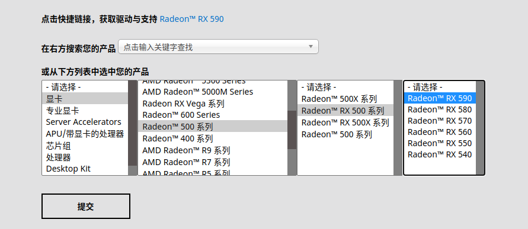

RX 590 显卡驱动， linux版下载:

[点击链接](https://www.amd.com/zh-hans/support/)



https://amdgpu-install.readthedocs.io/en/latest/install-script.html

我用的是

./amdgpu-pro-install -y --opencl=pal,legacy

## 安装 AMD 显卡驱动

```sh
# Install the AMD Drivers
apt install firmware-linux firmware-linux-nonfree libdrm-amdgpu1 xserver-xorg-video-amdgpu

# Install Vulkan
apt install mesa-vulkan-drivers libvulkan1 vulkan-tools vulkan-utils vulkan-validationlayers

# Install OpenCL
apt install mesa-opencl-icd

apt install ocl-icd-* opencl-headers

apt install clinfo

clinfo

```

## 查看显卡

lspci -nn | grep VGA


mkdir -p ~/.local/share/deepin/themes/deepin/dark

vim titlebar.ini:

    [Active]
    height=24

    [Inactive]
    height=24


apt-get install firmware-amd-graphics libgl1-mesa-dri libglx-mesa0 mesa-vulkan-drivers xserver-xorg-video-all

dpkg-deb: 错误: 粘贴 子进程被信号(断开的管道) 终止了
sudo dpkg -i --force-overwrite /var/cache/apt/archives/firmware-amd-graphics_20190114-2_all.deb


