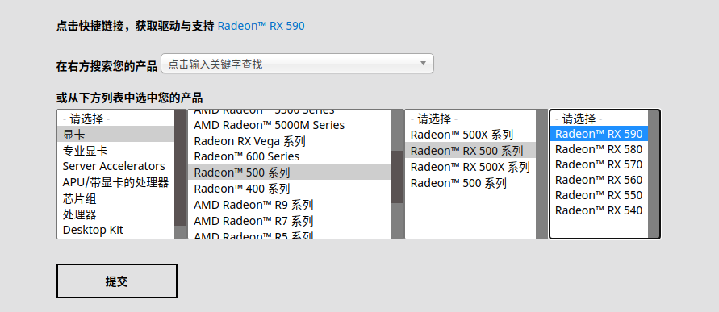

# Blender 笔记

## 文档整理说明

- 本文档当前主要记录 Blender 相关环境依赖, 尤其是 Linux 下 AMD 显卡驱动与配套组件安装.
- 后续如补充建模, 渲染, 插件使用, 可继续按主题扩展.

## Linux 下安装 AMD 显卡驱动

RX 590 显卡驱动 Linux 版下载:

- 官方入口: https://www.amd.com/zh-hans/support/
- 安装脚本说明: https://amdgpu-install.readthedocs.io/en/latest/install-script.html



我使用过的安装方式:

```sh
./amdgpu-pro-install -y --opencl=pal,legacy
```

### 安装 AMD 驱动

```sh
apt install firmware-linux firmware-linux-nonfree libdrm-amdgpu1 xserver-xorg-video-amdgpu
```

### 安装 Vulkan

```sh
apt install mesa-vulkan-drivers libvulkan1 vulkan-tools vulkan-utils vulkan-validationlayers
```

### 安装 OpenCL

```sh
apt install mesa-opencl-icd
apt install ocl-icd-* opencl-headers
apt install clinfo
clinfo
```

## 查看显卡

```sh
lspci -nn | grep VGA
```

## Deepin 标题栏高度调整

```sh
mkdir -p ~/.local/share/deepin/themes/deepin/dark
```

编辑 `titlebar.ini`:

```ini
[Active]
height=24

[Inactive]
height=24
```

## 其他安装记录

```sh
apt-get install firmware-amd-graphics libgl1-mesa-dri libglx-mesa0 mesa-vulkan-drivers xserver-xorg-video-all
```

若遇到 `dpkg-deb: 错误: 粘贴 子进程被信号(断开的管道) 终止了`, 可尝试:

```sh
sudo dpkg -i --force-overwrite /var/cache/apt/archives/firmware-amd-graphics_20190114-2_all.deb
```

## 插件与相关项目

### CAD Sketcher

- 安装说明: https://hlorus.github.io/CAD_Sketcher/installation/

### screencast_keys

- 当前仅保留插件名称, 后续可继续补充使用笔记.
