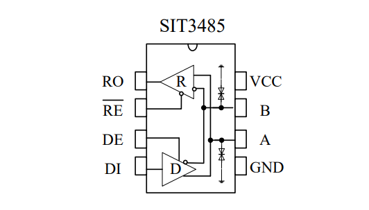

## 485标准

标准 RS485 接收器的输入阻抗为 12kΩ(1 个单位负载)，标准驱动器可最多驱动 32 个单位负载

如果一个 485芯片 的输入阻抗是 1/8 输入阻抗, 则 最多可驱动 8 * 32 个 单位负载

## SIT3485ESA

DI: Driver Input, 驱动器输入, 接 ttl RX

RO: Receiver Output, 读取器输出, 接 ttl TX

RE为低时, 接收器输出使能; DE为高时, 发送器输出使能

当 RE 和 DE 同为高时, 发送器输出使能, 接收器输出禁能

当 RE 和 DE 同为低时, 发送器输出禁能, 接收器输出使能

可以用单片机 控制 RE 和 DE 的高低 实现 自动收发电路

电路用例介绍, 并用 三极管实现 自动收发电路:

https://blog.csdn.net/qq_33056691/article/details/107876091

使用 CH344Q 的 TNOW 功能, 控制 自动收发:

TNOW引脚 需要 TNOW引脚 接下拉电阻, 才会切换到 TNOW功能, 即 RS485 发送和接收 控制

https://blog.csdn.net/WCH_TechGroup/article/details/124798207
