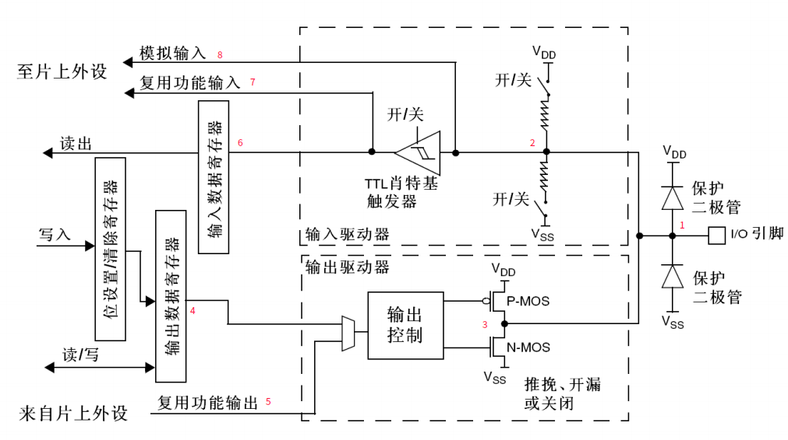

# GPIO和AFIO

参考: STM32F10xxx参考手册.pdf

## GPIO 功能描述

GPIO 配置寄存器
GPIO 数据寄存器
GPIO 置位/复位寄存器
GPIO 锁定寄存器

GPIO的多种工作模式

- 输入浮空
- 输入上拉
- 输入下拉
- 模拟输入
- 开漏输出
- 推挽式输出
- 推挽式复用功能
- 开漏复用功能

### GPIO 基本结构

参考: [STM32入门系列-GPIO结构](https://zhuanlan.zhihu.com/p/67412159)



理解好了GPIO的内部结构, 那么GPIO的各种模式将非常清楚. 分析图中标注的数字部分:

1. 保护二极管

加这两个保护二极管可以防止不正常电压进入芯片导致芯片烧毁.

当引脚电压大于 $V_{DD}$ 时, 上方的保护二极管导通, 输入被钳位到 $V_{DD}$, 当引脚电压低于 $V_{SS}$ 时, 下方的保护二极管导通, 输入被钳位到 $V_{SS}$.

尽管GPIO内部有这样的保护, 但是如果将引脚直连大功率器件, 要么器件不工作, 要么芯片烧毁. 如果要驱动大功率器件, 必须加 大功率及隔离电路驱动. 所以说GPIO引脚是做控制的, 不是做驱动使用的.

问题: 为什么这里会被钳位?

2. 上下拉电阻

上拉电阻和下拉电阻旁都有一个开关, 通过配置这个开关, 可以控制开启上拉电阻或下拉电阻, 间接地控制输入引脚的默认电平, 这可以消除不确定状态的影响. 当开启上拉时 默认输入是高电平, 当开启下拉时 默认输入是低电平.

如果上拉和下拉都关断, 我们称这为浮空模式, 一旦配置成这种模式, 引脚的初始电压是不确定的, 如果用万用表量一下此模式下引脚的电平会发现只有1点几伏, 而且还不时改变.

``` STM32内部的上拉是一个弱上拉, 即此上拉电阻输出的电流很小, 如果想输出较大的电流, 就需要外接上拉电阻了. ```

3. PMOS和NMOS

P-MOS和N-MOS管组成的单元电路, 这让GPIO引脚具有了推挽和开漏两种输出模式. 在推挽输出模式中,
