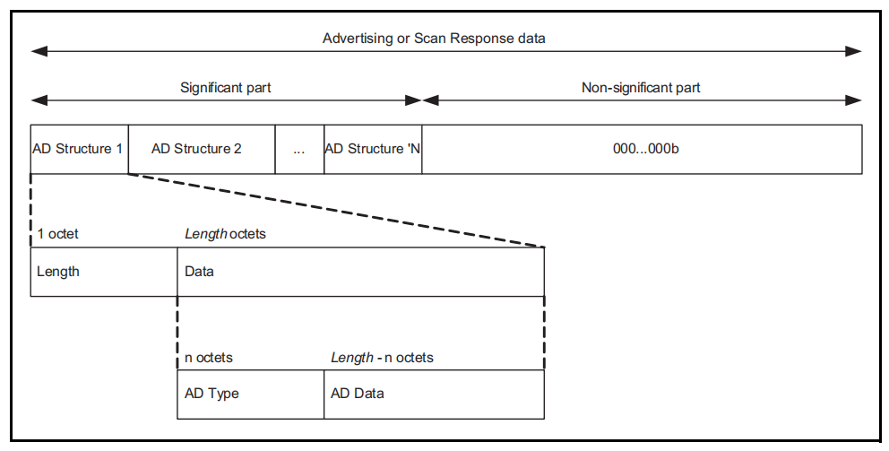

# 蓝牙相关总结

## 扫描的过程

1. 主设备 主动 发起 Scan Request
2. 广播设备接收到 Scan Request 后, 会发送 Scan Response
3. 主设备会执行 Scan Response 的回调函数

## 启动广播

```c
static uint8_t raw_ext_adv_data_1m[] = {
    // 长度 0x02, Flags, 0x06
    0x02, 0x01, 0x06,
    // 长度 0x02, Tx Power Level, 0xeb
    0x02, 0x0a, 0xeb,
    // 长度 0x0b, Complete Local Name, EH_BLE_TEST
    0x0b, 0x09, 'E', 'H', '_', 'B', 'L', 'E', '_', 'T', 'E', 'S', 'T'
};
uint8_t addr_1m[6] = {0xc0, 0xde, 0x52, 0x00, 0x00, 0x02};

esp_ble_gap_ext_adv_set_params(0, &ext_adv_params_1M);

esp_ble_gap_ext_adv_set_rand_addr(0, addr_1m);

esp_ble_gap_config_ext_adv_data_raw(0, sizeof(raw_ext_adv_data_1m), &raw_ext_adv_data_1m[0]);

esp_ble_gap_ext_adv_start(1, &ext_adv[0]);
```

ADVERTISING AND SCAN RESPONSE DATA FORMAT:



AD: Advertise Data Type
PDU: Packet Data Unit

AD Type 的定义位于:

bluetooth-Assigned_Numbers.pdf -- 2.3 Common Data Types


## BLE ADVERTISING PACKET

The advertising channel PDUs serve following functions.
• It broadcasts the data.
• It helps in discovering slaves in order to connect with them.
• There are different types of advertising PDUs each with different payload formats and functions.

➤ Advertising PDUs ( ADV_IND, ADV_DIRECT_IND, ADV_NONCONN_IND, ADV_SCAN_IND)
➤ Scanning PDUs (SCAN_REQ, SCAN_RSP)
➤ Initiating PDUs (CONNECT_REQ)

## 蓝牙地址

1. 公共地址 需要向 IEEE 购买, 如: 4CE1000000C1
2. 随机地址 CCE1000000C1, 最左边的C, 最高两个bit是11

mac[0] & 0x01 为true 表示一个多播地址

单播，多播和广播

## 蓝牙测试

RF 单载波测试: 选择 channel, 发射功率

测试指标: 发射功率 频偏

蓝牙广播, 扫描到广播时 可以获取 接收到的发射功率

## GATT

GATT 是蓝牙协议栈的基础, 提供属性列表

Service 是 多个 att 的组合, 表示一个特定的服务, 如 电池服务 心跳服务

Profile 是 多个 Service 的组合, 一个 Profile 中包含多个 Service

## adv 原始数据

```c
static uint8_t raw_adv_data[128] = {
    // Flags: TYPE = 0x01。这个数据用来标识设备 LE 物理连接的功能。DATA 是 0 到多个字节的 Flag 值，每个 bit 上用 0 或者 1 来表示是否为 True。如果有任何一个 bit 不为 0，并且广播包是可连接的，就必须包含此数据。各 bit 的定义如下：

    // bit 0: LE 有限发现模式
    // bit 1: LE 普通发现模式
    // bit 2: 不支持 BR/EDR
    // bit 3: 对 Same Device Capable(Controller) 同时支持 BLE 和 BR/EDR
    // bit 4: 对 Same Device Capable(Host) 同时支持 BLE 和 BR/EDR
    // bit 5…7: 预留
    0x02, 0x01, 0x06,
    // Tx Power Level
    0x02, 0x0a, 0xeb,
    // Complete Local Name
    0x08, 0x09, 'E', 'H', '_', '8', '0', '3', '2'};
```

## scan repoonse 原始数据

## 设置 public address

esp_iface_mac_addr_set(mac_addr, ESP_MAC_BT), 设置默认的蓝牙MAC地址

设置 esp_ble_gap_ext_adv_params_t 的 own_addr_type 为 BLE_ADDR_TYPE_PUBLIC

## esp32 基地址

https://docs.espressif.com/projects/esp-idf/zh_CN/latest/esp32/api-reference/system/misc_system_api.html#mac

通过 `esp_iface_mac_addr_set(base_mac, ESP_MAC_BASE)` 设置基地址, 则 默认时:

Wi-Fi Station 为 base_mac,

Wi-Fi SoftAP 为 base_mac 最后一组字节后加 1,

蓝牙 base_mac 最后一组字节后加 2,

以太网 base_mac 最后一组字节后加 3

## 蓝牙学习入门

(1)

1. 能基本描述 蓝牙广播 与 蓝牙扫描 的过程

2. 修改 蓝牙广播数据, 设置 蓝牙发射功率

3. 能看明白 某个蓝牙模块 广播过程中的事件, 在相应的事件中 可以添加自定义行为

4. 使用 安卓NRF软件 验证 蓝牙广播数据 和 蓝牙发射功率

(2)

1. 添加 GATT服务, 可以通过 安卓NRF软件 连接