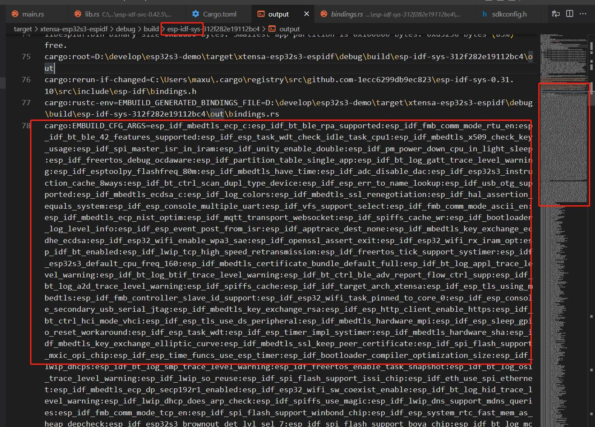
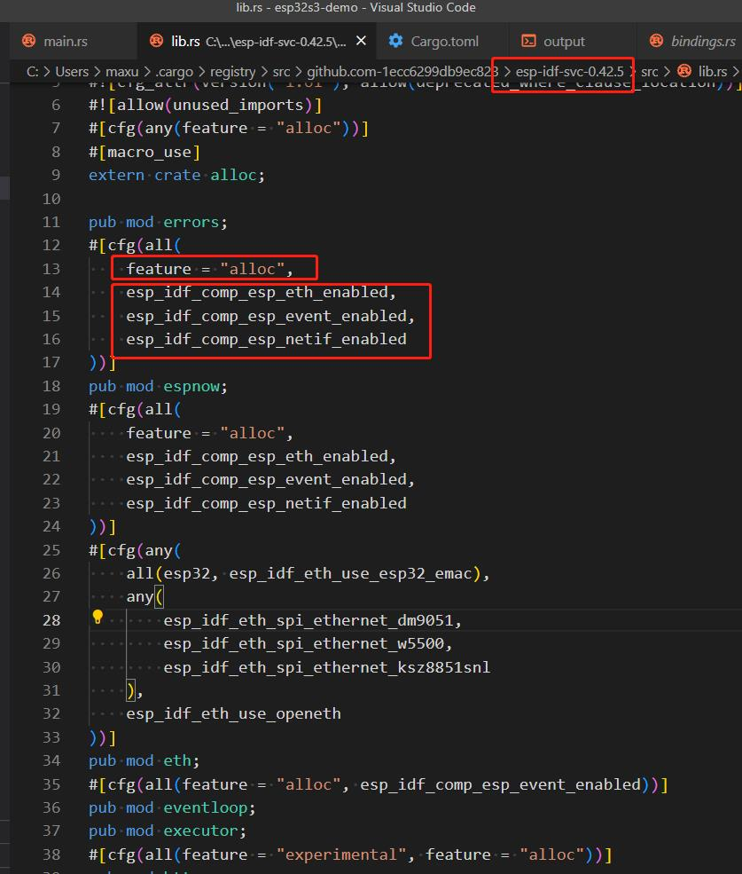
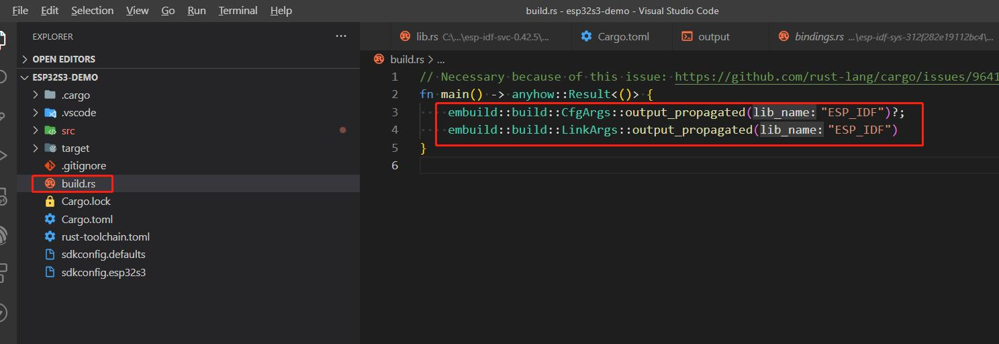
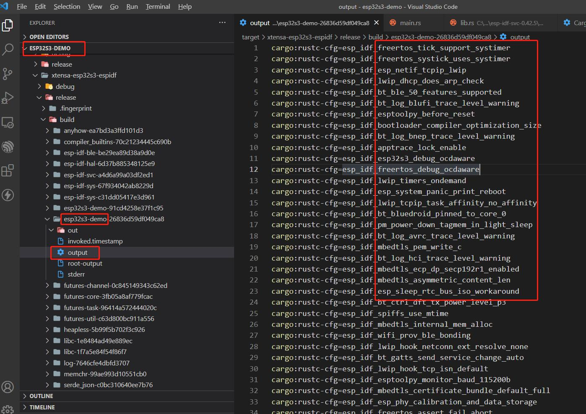

esp-rs项目的编译 关键在于 esp-idf-sys库的编译, 这是 esp-idf 源码 的编译, 编译工具是 embuild, 底层是官方编译链 cmake编译, 这会编译所有的 components,  所有的 sdkconfig 中定义的功能使能的选项, 最终应该会合并成一个, 这应该可以通过 kconfig 工具实现, 可以通过解析这个合并的后的config, 把所有=y的选项解析出来, 以 cargo:rustc-cfg=... 的形式, 输出到rust的编译环境, 这样 esp32的组件库 和 rust库 就可以共享同一套配置了.

rust这边, 通过 features 和 功能选项, 动态引入模块, 选择性地 编译 rust代码

项目中, 在build.rs中, 这行的作用就是 拿到 sys库的配置:

