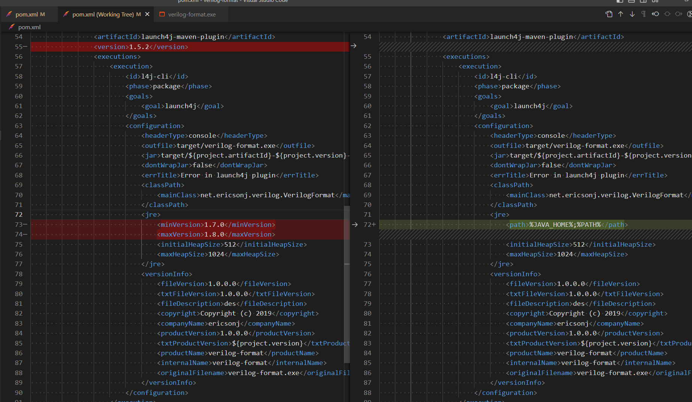

## 安装 与 破解 Quartus II, USB Blaster 驱动, 连接 Modelsim

https://blog.csdn.net/m0_52869979/article/details/123433202

先安装 Quartus II 13.1 官方的安装包

再下载破解程序 并执行

## modelsim-win64-10.4-se 安装 与 破解

https://blog.csdn.net/ssj925319/article/details/115353790

先安装 modelsim-win64-10.4-se 官方安装包

再下载破解程序 并执行

## vscode 编辑 verilog

### 安装 verilog-format

https://github.com/ericsonj/verilog-format

需要修改并编译:

mvn clean package

执行 target\verilog-format.exe 时, 需要确保 有jdk环境

## 安装 ierilog

下载地址 for windows: https://bleyer.org/icarus/

插件安装教程: https://www.youtube.com/watch?v=vN1wzM0NO4c

## AGM项目编译与配置

1. 使用 pio unlock flash
2. 进入烧写模式
3. 在 PlatformIO 中 serial/Custom/Upload LOGIC, 下载 logic 和 bin
4. 进入正常模式

### CustomIP

在 platformio.ini 中:

ip_name = custom_ip
logic_dir = logic

PlatformIO -> serial/Custom/Prepare LOGIC, 会生成 logic目录.

使用 QuartusII 编译 logic\example_board.qpf 项目. (打开, 运行 logic\af_quartus.tcl)

使用 Supra 编译 logic\example_board.proj 项目.
