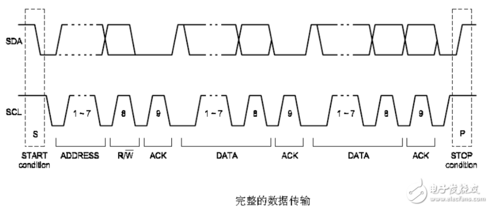

# i2c 笔记

## i2c传输过程

    slave address
        第1个字节: 高7位为slave地址码, 最低1位为读/写控制, 读写控制: 0为写 1为读
        8个时钟周期

    空闲状态
        i2c的两条信号线, scl为高, sda为高

    start信号
        主机发起通信, scl为高期间, sda由高到低的跳变;
        1个时钟周期

    ack信号
        scl为高, sda为低
        如果slave检测到7位slave地址与自己的地址相同, 产生ack信号
        1个时钟周期

    data信号
        MBS优先
        8个时钟周期

    ack信号
        简单说: 1个字节后的第9个脉冲, ACK: scl为高, sda为低 NACK: scl为高, sda为高.
        详细说: 发送方每发送1个字节, 就在其后的1个脉冲期间释放sda, 由接收方反馈一个应答信号: 应答信号是低电平时, 规定为有效应答位(ACK), 表明成功接收了该字节; 应答信号是高电平时, 规定为非应答位(NACK), 表明该字节未成功接收.

    data信号

    .
    .
    .

    stop信号
        scl为高期间, sda由低到高的跳变

## i2c write

    1. slave addr 和 0
    2. 要写入的 reg address
    3. 要写入的 data

    ps: 开始信号, 发送地址+写位, 等待ack, 发送数据(每发送1个byte就会等待1个ack), 停止信号

## i2c read

    1. slave addr 和 0
    2. 要读入的 reg address
    3. slave addr 和 1
    4. 读

    ps: 开始信号, 发送地址+写位, 发送数据(reg address), 停止信号
        开始信号, 发送地址+读位, 读数据(每读完1个byte发送1个ack), 停止信号

## i2c 读写 fm24v10 eeprom

    slave_addr: 1010 A2 A1 A16
        A2 A1, 对应于8pin中的A1 A2, 用于识别同一个总线上的不同fm24v10 有4种选择, A16 是页选择位
        只有不处理A2 A1 pin的话, slave address是: 1010 00 0, 即0x50

    multiple bytes write:
        Start, slave_addr + w, addr msb, addr lsb, data byte, data byte, ...
        example:
            0x50, 0x00, 0x00, 0x01, 0x02, 0x03

    multiple bytes read:
        Start, slave_addr + w, addr msb, addr lsb
        Start, slave_addr ignore X(p s) + r, read ...
        example:
            0x50, 0x00, 0x00
            0x51, read 3 bytes
