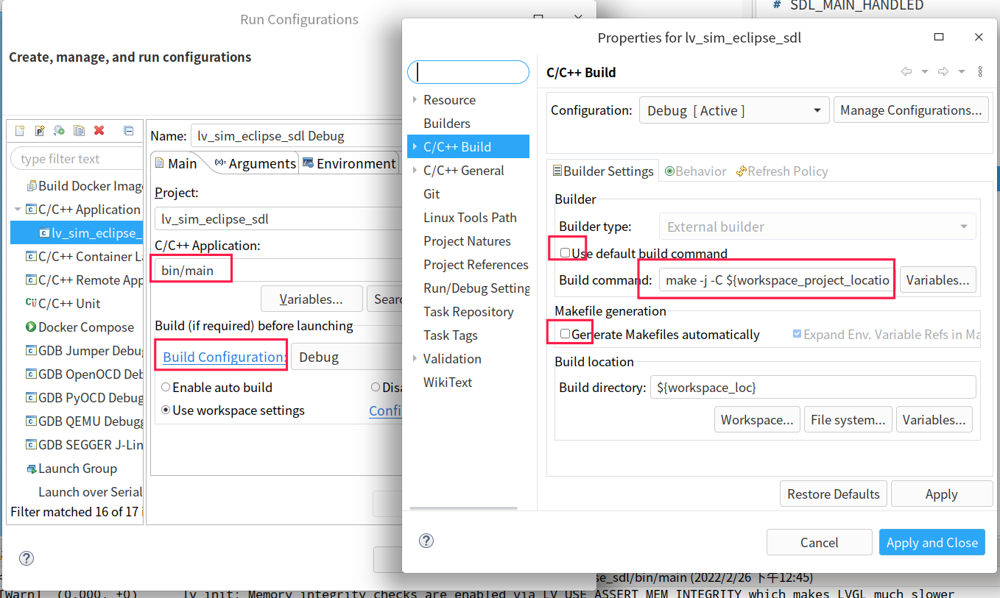

## 环境

官方文档

https://docs.lvgl.io/master/overview/index.html

## simulator on PC

模拟器是为了方便在电脑端开发并验证效果

1. 下载 Eclipse CDT IDE 环境

    https://github.com/gnu-mcu-eclipse/org.eclipse.epp.packages/releases/

2. 安装 SDL2

    On Linux:

        sudo apt-get update && sudo apt-get install -y build-essential libsdl2-dev

3. 下载 eclipse's simulator project:

    git clone --recursive https://github.com/lvgl/lv_sim_eclipse_sdl.git

4. 使用cmake编译这个项目

    cd lv_sim_eclipse_sdl
    mkdir build
    cd build
    cmake ..
    make -j

4. 打开 eclipse CDT, 导入 simulator project

5. 在 "Run Configurations..." 配置编译 "C/C++ Application"

    

    编译命令是:

        make -j -C ${workspace_project_locations}/build

    这样就可以编译并运行了

## 例子

    f746 disco:

        git clone --recursive https://github.com/lvgl/lv-port_stm32f746_disco.git

## lvgl

设置 宽和高.

lv_disp_drv_t disp_drv;
disp_drv.hor_res = LV_HOR_RES_MAX;
disp_drv.ver_res = LV_VER_RES_MAX;

有两种方式设置旋转屏幕:

1. lvgl soft 实现, 这耗时较大

    disp_drv.sw_rotate = 1;
    disp_drv.rotated = LV_DISP_ROT_90;

2. 硬件实现, 速度快, 消耗小

    disp_drv.rotated = LV_DISP_ROT_90; // 这种情况, 这个只用来 确定 分辨率

    并设置 CONFIG_LV_DISPLAY_ORIENTATION

    硬件调用:
    st7735s_set_orientation(uint8_t orientation)
    可能需要 设置屏幕 X.Y对调, X方向从上到下, Y方向从下到上 等等

## GUI Guider

https://www.nxp.com/design/software/development-software/gui-guider:GUI-GUIDER