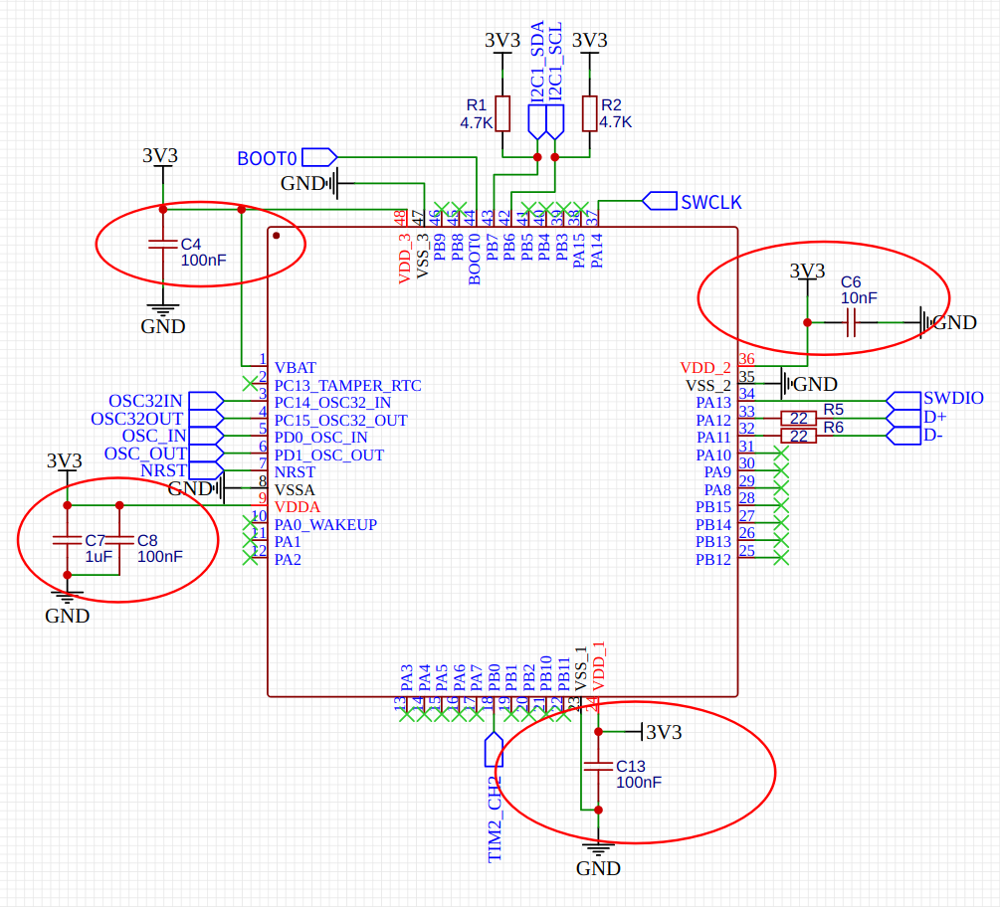
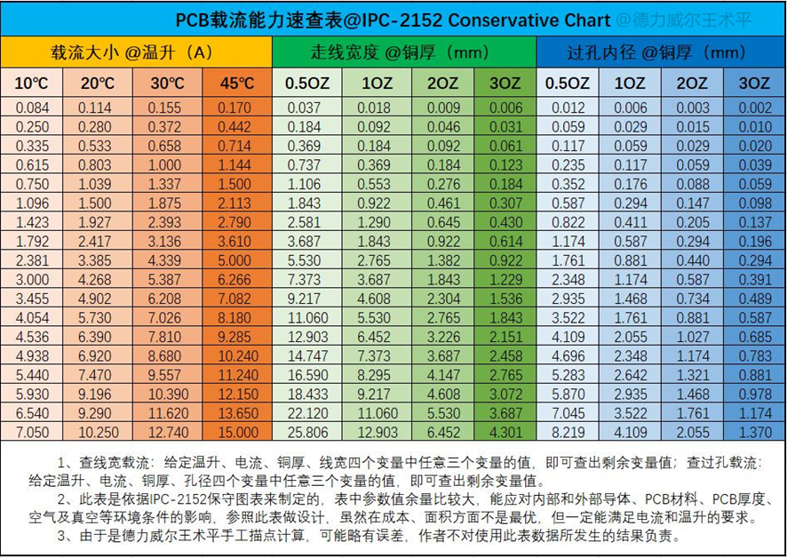

# pcb设计

## 电容选择

32.768KHz晶振 20pf, 8MHz晶振 20pf

MCU 一个1uf, 其它100nf或10nf

一般外设或者传感器的VDD可以加一个100nf的电容, 滤去杂波

## 电阻选择

i2c 上拉电阻: 3.3v与5v, 2.2k 4.7k 10k

## 嘉立创工艺 线宽

[嘉立创官网_工艺参数说明](https://www.jlc.com/portal/vtechnology.html)

铜厚1OZ 的单双面板 对应的最小线宽/线隙 均为 0.1mm(4mil)

焊盘边到线边间距 >= 0.1mm(4mil) (尽量大于此参数)

字符高度 >= 1mm(40mil) (特殊字体 中文 掏空字符可能需更高)

字符线宽 >=0.15mm(6mil) (低于此值可能印不出来)

字符 与 露铜焊盘间隙 >= 0.15mm(6mil)

## 布线注意事项

[极好的模拟/数字混合信号的电路板布局布线注意事项](https://www.mr-wu.cn/mixed-signal-circuit-board-layout-considerations/)

[PCB常用走线宽度](https://www.wpgdadatong.com/cn/blog/detail/70216)

## PCB 线宽

