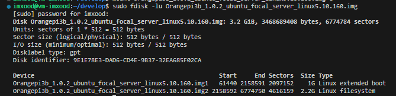
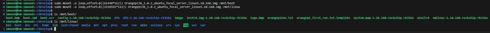
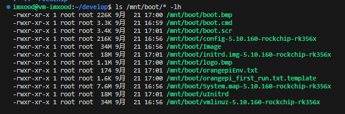

# 安装必要工具

sudo apt install device-tree-compiler git vim genext2fs

## 安装 python2

### 使用 pyenv 安装并管理 python

目的是 不污染系统环境, 只需要 删除某个目录就可以卸载所有 python 环境

```sh
## 自动安装 pyenv 环境

curl https://pyenv.run | bash

## 执行后, 手动添加到 ~/.bashrc, 并执行

export PYENV_ROOT="$HOME/.pyenv"
command -v pyenv >/dev/null || export PATH="$PYENV_ROOT/bin:$PATH"
eval "$(pyenv init -)"
```

### 安装 python2 最新版

pyenv install 2.7.18

### 使用

pyenv global 2.7.18

# 下载

### 准备目录

mkdir ~/develop && cd ~/develop

### 下载 u-boot 源码

git clone https://github.com/rockchip-linux/u-boot.git -b next-dev

### 下载 rkbin 到 u-boot 同级目录

git clone https://github.com/rockchip-linux/rkbin.git

### 下载 linux 内核 源码

git clone https://github.com/rockchip-linux/kernel.git -b develop-5.10

### 下载 编译环境 (Firmware and Tool Binarys)

mkdir -p prebuilts/gcc && cd prebuilts/gcc

git clone https://github.com/rockchip-toybrick/linux-x86.git

# 编译

## 编译 uboot

cd ~/develop/u-boot

./make.sh rk3566

会在当前路径下生成 uboot.img 和 rk356x_spl_loader_v1.18.112.bin 文件

## 编译 linux 源码

```sh
cd ~/develop

git clone https://github.com/rockchip-linux/kernel.git -b develop-5.10

cd ~/develop/kernel

make ARCH=arm64 CROSS_COMPILE=../prebuilts/gcc/linux-x86/aarch64/gcc-linaro-6.3.1-2017.05-x86_64_aarch64-linux-gnu/bin/aarch64-linux-gnu- rockchip_linux_defconfig

# 生成 vmlinux 和 arch/arm64/boot/Image
make ARCH=arm64 CROSS_COMPILE=../prebuilts/gcc/linux-x86/aarch64/gcc-linaro-6.3.1-2017.05-x86_64_aarch64-linux-gnu/bin/aarch64-linux-gnu- -j8 Image

# 生成设备树 arch/arm64/boot/dts/rockchip/rk3566-box-demo-v10.dtb
make ARCH=arm64 CROSS_COMPILE=../prebuilts/gcc/linux-x86/aarch64/gcc-linaro-6.3.1-2017.05-x86_64_aarch64-linux-gnu/bin/aarch64-linux-gnu- -j8 dtbs

ls -alh arch/arm64/boot/dts/rockchip/rk3566-*

```

## 制作镜像文件

mkdir boot

cp arch/arm64/boot/Image boot/

cp arch/arm64/boot/dts/rockchip/rk3566-box-demo-v10.dtb boot/

mkdir boot/extlinux
vi boot/extlinux/extlinux.conf

```conf
label rockchip-kernel-5.10
    kernel /Image
    fdt /rk3566.dtb
    append earlycon=uart8250,mmio32,0xff1a0000 root=PARTUUID=B921B045-1D rootwait rootfstype=ext4 init=/sbin/init
```

genext2fs -b 40960 -B $((1024)) -d boot/ -i 8192 -U boot_rk3566.img

生成的文件: boot_rk3566.img

## 烧写工具

https://doc.embedfire.com/linux/rk356x/quick_start/zh/latest/quick_start/flash_img/flash_img.html

1.2.1.1. 工具获取
镜像的烧录需要使用到烧录工具 RKDevTool 和驱动程序 DriverAssitant

## 分析 uboot

u-boot/include/configs/

evb_rk3568.h
rk3568_common.h
rockchip-common.h

定义了一些配置, 如: 分区, 可参考

```c
// 如果 tftp 和 bootm, 未定义加载地址, 则默认使用该地址
#define CONFIG_SYS_LOAD_ADDR		0x00c00800
```

```sh
# 从tftp下载uImage镜像到 CONFIG_SYS_LOAD_ADDR 这个地址上, 并从该地址处 加载 并运行.
tftp uImage; bootm
```

### uboot 的 bootm 命令

用于把内核加载到指定地址处运行

<!-- 用于启动 在存储器上 指定地址的程序, 这里程序必须是 uImage格式的镜像, 即必须使用 mkimage等工具 未原程序镜像 添加0x40长度的uImage头部信息. -->

## 测试 img 镜像

Orangepi3b_1.0.2_ubuntu_focal_server_linux5.10.160.img

```sh
sudo fdisk -lu Orangepi3b_1.0.2_ubuntu_focal_server_linux5.10.160.img
```

可以看到有两个分区.



```sh
# 挂载分区

sudo mkdir -p /mnt/boot /mnt/linux

# 起始扇区: 61440, 每个扇区 512 bytes
sudo mount -o loop,offset=$((61440*512)) Orangepi3b_1.0.2_ubuntu_focal_server_linux5.10.160.img /mnt/boot
# sudo umount /mnt/boot

# 起始扇区: 2158592, 每个扇区 512 bytes
sudo mount -o loop,offset=$((2158592*512)) Orangepi3b_1.0.2_ubuntu_focal_server_linux5.10.160.img /mnt/linux
# sudo umount /mnt/linux
```





# 使用 orangepi-build 编译

## 下载 orangepi-build

mkdir ~/develop && cd ~/develop

git clone https://github.com/orangepi-xunlong/orangepi-build.git -b next

cd orangepi-build

## 忽略修改被覆盖

vim userpatches/config-default.conf

IGNORE_UPDATES="yes"

## 编译

连续执行 sudo ./build.sh 分别编译 U-boot / Kernel

# 重新编译

## uboot

git clone https://github.com/rockchip-linux/u-boot.git -b next-dev

## 编译工具

git clone https://github.com/rockchip-linux/rkbin.git

git clone https://github.com/rockchip-toybrick/linux-x86.git -b master

## 安装基本依赖

sudo apt-get install build-essential libncurses-dev bison flex libssl-dev libelf-dev genext2fs vim git tree

## ubuntu 22.04 交叉编译工具

wget https://mirrors.tuna.tsinghua.edu.cn/armbian-releases/_toolchain/gcc-arm-11.2-2022.02-x86_64-aarch64-none-linux-gnu.tar.xz

tar -xvf gcc-arm-11.2-2022.02-x86_64-aarch64-none-linux-gnu.tar.xz

<!-- sudo apt install gcc-aarch64-linux-gnu -->

## linux 6.5.8 源码

```sh
wget https://mirrors.tuna.tsinghua.edu.cn/kernel/v6.x/linux-6.5.8.tar.xz

# 加压到了 linux-6.5.8 目录
tar -xvf linux-6.5.8.tar.xz

# 编译
cd linux-6.5.8

# 定制的 ./arch/arm64/configs/rockchip_linux_defconfig

export ARCH=arm64
export CROSS_COMPILE=../gcc-arm-11.2-2022.02-x86_64-aarch64-none-linux-gnu/bin/aarch64-none-linux-gnu-

make rockchip_linux_defconfig

# 生成文件: vmlinux 和 arch/arm64/boot/Image
make -j$(nproc) Image

#
make -j$(nproc) dtbs

mkdir boot

cp arch/arm64/boot/dts/rockchip/rk3566-box-demo.dtb boot/
cp arch/arm64/boot/Image boot/

mkdir boot/extlinux

vi boot/extlinux/extlinux.conf
```

```
label rockchip-kernel-6.5.8
    kernel /Image
    fdt /rk3566.dtb
    append earlycon=uart8250,mmio32,0xfe660000 root=PARTUUID=B921B045-1D rw rootwait rootfstype=ext4 init=/sbin/init
```

genext2fs -b 40960 -B 1024 -d boot/ -i 8192 -U boot_rk3566.img

# 使用 busybox 制作根文件系统

参考: https://www.cnblogs.com/zyly/p/17438770.html

```sh
wget https://busybox.net/downloads/busybox-1.36.1.tar.bz2

tar -xvf busybox-1.36.1.tar.bz2

cd busybox-1.36.1

export ARCH=arm64
export CROSS_COMPILE=aarch64-linux-gnu-

# 使用默认配置
make defconfig

make menuconfig

# 使用 动态编译
Settings --->
    -- Build Options
    [ ] Build static binary (no shared libs)
    [*] Build Shared libbusybox

make -j$(nproc)

# 根文件系统将输出在 rootfs 目录下
make install CONFIG_PREFIX=rootfs
```

这里的 rootfs 是这样的:

```sh
imxood@vm-imxood-pc:~/develop/busybox-1.36.1$ tree -L 1 rootfs/
rootfs/
├── bin
├── lib64
├── linuxrc
├── sbin
└── usr
```

这些文件不足以构成根文件系统, 需要进行完善.

## 添加库文件

cd rootfs
mkdir -p lib ./usr/lib/ ./usr/lib64/

cp -a ../../gcc-arm-11.2-2022.02-x86*64-aarch64-none-linux-gnu/aarch64-none-linux-gnu/libc/lib/\_so* ./lib
cp -a ../../gcc-arm-11.2-2022.02-x86*64-aarch64-none-linux-gnu/aarch64-none-linux-gnu/libc/lib64/\_so* ./lib64/
cp -a ../../gcc-arm-11.2-2022.02-x86*64-aarch64-none-linux-gnu/aarch64-none-linux-gnu/libc/usr/lib/\_so* ./usr/lib/
cp -a ../../gcc-arm-11.2-2022.02-x86*64-aarch64-none-linux-gnu/aarch64-none-linux-gnu/libc/usr/lib64/\_so* ./usr/lib64/

## 构建 etc 目录

```sh
mkdir etc

# 使用 busybox 的默认配置
cp -a ../examples/bootfloppy/etc/* ./etc/

```

### 修改 etc/inittab

这个文件是 init 进程解析的配置文件, 通过这个配置文件决定执行哪个进程, 何时执行

```
# 系统启动时
::sysinit:/etc/init.d/rcS

# 系统启动按下Enter键时
::askfirst:-/bin/sh

# 按下Ctrl+Alt+Del键时
::ctrlaltdel:/sbin/reboot

# 系统关机时
::shutdown:/sbin/swapoff -a
::shutdown:/bin/umount -a -r

# 系统重启时
::restart:/sbin/init
```

以上内容定义了系统启动时, 关机时, 重启时, 按下 Ctrl+Alt+Del 键时执行的进程

### 修改 etc/init.d/rcS 文件

```
#!/bin/sh

# 挂载 /etc/fstab 中定义的所有文件系统
/bin/mount -a

# 挂载虚拟的 devpts 文件系统 用于用于伪终端设备
/bin/mkdir -p /dev/pts
/bin/mount -t devpts devpts /dev/pts

# 使用 mdev 动态管理u盘和鼠标等热插拔设备
/bin/echo /sbin/mdev > /proc/sys/kernel/hotplug

# 扫描并创建节点
/sbin/mdev -s
```

修改 init.d 文件权限: chmod -R 777 etc/init.d/\*

### 修改 etc/fstab

etc/fstab 存放的是文件系统信息. 在系统启动后执行 /etc/init.d/rcS 中的 /bin/mount -a 命令时, 自动挂载这些文件系统

```
# <file system>    <mount point>    <type>    <options>    <dump>    <pass>
proc                  /proc          proc     defaults       0         0
sysfs                 /sys           sysfs    defaults       0         0
tmpfs                 /tmp           tmpfs    defaults       0         0
tmpfs                 /dev           tmpfs    defaults       0         0
```

这里我们挂载的文件系统有三个 proc sysfs 和 tmpfs, 在内核中 proc 和 sysfs 默认都支持, 而 tmpfs 是没有支持的, 我们需要添加 tmpfs 的支持

### 修改 etc/profile

etc/profile 的作用是设置环境变量, 每个用户登录时都会运行它, 将文件内容修改为:

```
# 主机名
export HOSTNAME=zy

# 用户名
export USER=root

# 用户目录
export HOME=/root

# 终端默认提示符
export PS1="[$USER@$HOSTNAME:\$PWD]\# "

# 环境变量
export PATH=/bin:/sbin:/usr/bin:/usr/sbin

# 动态库路径
export LD_LIBRARY_PATH=/lib:/usr/lib:$LD_LIBRARY_PATH
```

## 构建 dev 目录

在 rootfs 目录, 创建 dev 文件夹:

mkdir dev

sudo mknod dev/console c 5 1
sudo mknod dev/null c 1 3

## 构建其他文件

mkdir mnt proc tmp sys root

```sh
tree -L 1
.
├── bin
├── dev
├── etc
├── lib
├── lib64
├── linuxrc
├── mnt
├── proc
├── root
├── sbin
├── sys
├── tmp
└── usr
```

## 制作 ext4 根文件系统 镜像

```sh
cd ~/develop/busybox-1.36.1

mkdir busybox_rootfs

# 创建 300M 的空镜像文件, 具体大小 视情况而定
dd if=/dev/zero of=busybox_ext4_rootfs.img bs=1M count=300

# 格式化为 ext4
mkfs.ext4 busybox_ext4_rootfs.img

sudo mount busybox_ext4_rootfs.img busybox_rootfs

sudo cp -af ./rootfs/* ./busybox_rootfs/

sudo umount busybox_rootfs

rm busybox_rootfs -rf
```

用 e2fsck 修复及检测镜像文件系统, resize2fs 减小镜像文件的大小

```sh
imxood@vm-imxood-pc:~/develop/busybox-1.36.1$ e2fsck -p -f busybox_ext4_rootfs.img
busybox_ext4_rootfs.img: 506/76800 files (0.2% non-contiguous), 26813/76800 blocks

imxood@vm-imxood-pc:~/develop/busybox-1.36.1$ resize2fs -M busybox_ext4_rootfs.img
resize2fs 1.46.5 (30-Dec-2021)
Resizing the filesystem on busybox_ext4_rootfs.img to 26912 (4k) blocks.
The filesystem on busybox_ext4_rootfs.img is now 26912 (4k) blocks long.

imxood@vm-imxood-pc:~/develop/busybox-1.36.1$ ls -alh busybox_ext4_rootfs.img
-rw-rw-r-- 1 imxood imxood 106M 10月 24 01:51 busybox_ext4_rootfs.img
```

最后得到 104MB 的 busybox_ext4_rootfs.img 镜像文件

# 使用 Ubuntu base 构建 rootfs

参考: https://www.cnblogs.com/zyly/p/17442055.html

## 下载 ubuntu-base 23.10

```sh
wget https://repo.huaweicloud.com/ubuntu-cdimage/ubuntu-base/releases/23.10/release/ubuntu-base-23.10-base-arm64.tar.gz

# 创建多级目录
mkdir -p rootfs/ubuntu
```

解压后的文件, 需要保留 ubuntu-base 中的文件权限及所有者, 解压时需要 root 权限或者 sudo 操作, 且使用-p 参数保留权限

```sh
sudo tar -xpvf ubuntu-base-23.10-base-arm64.tar.gz -C rootfs/ubuntu/

cd rootfs
```

### 安装 qemu

qemu-user-static 是一个仿真器, 可以选取 arm64 配置文件仿真开发板运行环境, 然后挂载下载的 ubuntu-base 文件, 从而构建 ubuntu 文件系统

```sh
sudo apt-get install qemu-user-static
```

由于下载的 ubuntu-base 是 aarch64 架构的, 因此需要拷贝 qemu-aarch64-static 到 ubuntu/usr/bin/ 下

```sh
sudo cp /usr/bin/qemu-aarch64-static ubuntu/usr/bin/
```

### 设置 ubuntu23 的软件源

```sh
sudo vim ubuntu/etc/apt/sources.list
```

```
deb http://mirrors.huaweicloud.com/ubuntu-ports/ mantic main multiverse restricted universe
deb http://mirrors.huaweicloud.com/ubuntu-ports/ mantic-backports main multiverse restricted universe
deb http://mirrors.huaweicloud.com/ubuntu-ports/ mantic-proposed main multiverse restricted universe
deb http://mirrors.huaweicloud.com/ubuntu-ports/ mantic-security main multiverse restricted universe
deb http://mirrors.huaweicloud.com/ubuntu-ports/ mantic-updates main multiverse restricted universe
deb-src http://mirrors.huaweicloud.com/ubuntu-ports/ mantic main multiverse restricted universe
deb-src http://mirrors.huaweicloud.com/ubuntu-ports/ mantic-backports main multiverse restricted universe
deb-src http://mirrors.huaweicloud.com/ubuntu-ports/ mantic-proposed main multiverse restricted universe
deb-src http://mirrors.huaweicloud.com/ubuntu-ports/ mantic-security main multiverse restricted universe
deb-src http://mirrors.huaweicloud.com/ubuntu-ports/ mantic-updates main multiverse restricted universe
```

### 设置 DNS

为了可以联网更新软件, 我们拷贝本机的 dns 配置文件到根文件系统

```sh
sudo cp /etc/resolv.conf ubuntu/etc/resolv.conf
```

然后在/etc/resolv.conf 文件中添加 dns:

```sh
sudo vim ubuntu/etc/resolv.conf
```

```
nameserver 8.8.8.8
nameserver 114.114.114.114
```

### 挂载/卸载 ubuntu-base 文件系统

在 rootfs 目录下创建挂载脚本 mnt_ubuntu.sh

`sudo vim mnt_ubuntu.sh`

```sh
#!/bin/bash
mnt() {
    echo "MOUNTING"
    sudo mount -t proc /proc ${2}proc
    sudo mount -t sysfs /sys ${2}sys
    sudo mount -o bind /dev ${2}dev
    sudo mount -o bind /dev/pts ${2}dev/pts
    sudo chroot ${2}
}
umnt() {
    echo "UNMOUNTING"
    sudo umount ${2}proc
    sudo umount ${2}sys
    sudo umount ${2}dev/pts
    sudo umount ${2}dev
}

if [ "$1" == "-m" ] && [ -n "$2" ] ;
then
    mnt $1 $2
elif [ "$1" == "-u" ] && [ -n "$2" ];
then
    umnt $1 $2
else
    echo ""
    echo "Either 1'st, 2'nd or both parameters were missing"
    echo ""
    echo "1'st parameter can be one of these: -m(mount) OR -u(umount)"
    echo "2'nd parameter is the full path of rootfs directory(with trailing '/')"
    echo ""
    echo "For example: ch-mount -m /media/sdcard/"
    echo ""
    echo 1st parameter : ${1}
    echo 2nd parameter : ${2}
fi
```

给脚本执行权限

```sh
sudo chmod +x mnt_ubuntu.sh
```

挂载 ubuntu-base 文件系统

```sh
mnt_ubuntu.sh -m ubuntu/
```

更新软件包仓库, 安装一些工具

```sh
apt update

apt install net-tools ethtool ifupdown psmisc nfs-common htop vim rsyslog iputils-ping language-pack-en-base sudo network-manager systemd openssh-sftp-server
```

安装桌面环境

```sh
# 需要3个G?
apt install xubuntu-desktop

sudo add-apt-repository multiverse

# (可选的安装一些软件包, 如 媒体播放器?)
sudo apt install xubuntu-restricted-extras
```

## 系统设置

### 修改密码

```sh
passwd root
```

### 设置主机名称和IP

```sh
echo "rk3566" > /etc/hostname
echo "127.0.0.1 localhost" >> /etc/hosts
echo "127.0.0.1 rk3566" >> /etc/hosts
```

### 配置DHCP

配置了网络DHCP, 这样系统启动以后就会自动设置好网络.

网卡eth0:

```sh
echo auto eth0 > /etc/network/interfaces.d/eth0
echo iface eth0 inet dhcp >> /etc/network/interfaces.d/eth0
```

无线网卡wlan:

```sh
echo auto wlan0 > /etc/network/interfaces.d/wlan0
echo allow-hotplug wlan0 >> /etc/network/interfaces.d/wlan0
echo iface wlan0 inet dhcp >> /etc/network/interfaces.d/wlan0
```

在实际测试中网口必须接入网线系统才能正常启动, 就是在不联网的情况下, 每次开机都要等待很久, 卡在网络连接上5分钟, 这里我们可以修改下面这个文件:

```sh
vim /lib/systemd/system/networking.service
```

```
TimeoutStartSec=2sec
```

### 修改系统重启 默认等待时间

重启开发板的时候, 如果有进程没有结束, 系统就会等待, 默认等待时间很长, 导致重启速度慢.

我们可以修改默认等待时间:

```sh
vim /etc/systemd/system.conf
```

```
#DefaultTimeoutStartSec=90s
DefaultTimeoutStopSec=2s
#DefaultTRestartSec=100ms
```

## 卸载文件系统

```sh
exit
./mnt_ubuntu.sh -u ubuntu/
```

# 制作根文件系统镜像

创建空镜像文件

```sh
dd if=/dev/zero of=ubuntu_ext4_rootfs.img bs=1M count=6144
mkfs.ext4 ubuntu_ext4_rootfs.img
```

挂载镜像文件到 ubuntu_rootfs

```sh
mkdir ubuntu_rootfs
sudo mount ubuntu_ext4_rootfs.img ubuntu_rootfs
```

将ubuntu的文件复制到该空文件夹中

```sh
sudo cp -af ./ubuntu/* ./ubuntu_rootfs/
```

卸载

```sh
umount ubuntu_rootfs
```

```sh
ls -alh ubuntu_ext4_rootfs.img
rw-rw-r-- 1 imxood imxood 6.0G 10月 25 00:40 ubuntu_ext4_rootfs.img
```


此时就得到了 ext4 根文件系统镜像 ubuntu_ext4_rootfs.img

用 e2fsck 修复及检测镜像文件系统, resize2fs 减小镜像文件的大小

```sh
e2fsck -p -f ubuntu_ext4_rootfs.img
resize2fs -M ubuntu_ext4_rootfs.img

du -sh ubuntu_ext4_rootfs.img

3.9G	ubuntu_ext4_rootfs.img
```

/home/imxood/develop/rootfs/ubuntu_ext4_rootfs.img
