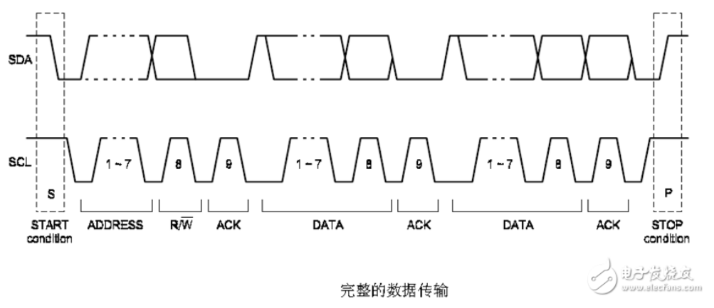
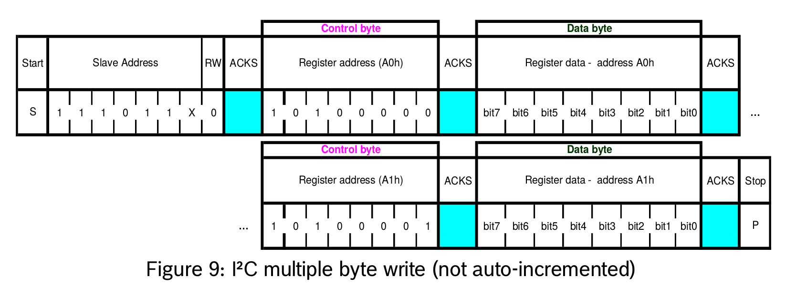
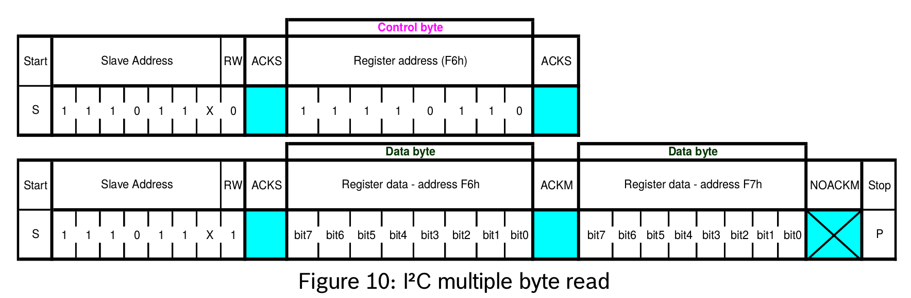

# i2c 笔记

## i2c传输过程

    空闲
        scl为高, sda为高

    start信号
        主机发起通信, scl为高, sda产生下降沿
        1个时钟周期

    slave address
        第1个字节: 7位为slave地址码，1位为读/写控制, 读写控制: 0为读 1为写
        8个时钟周期

    ack信号
        scl为高, sda为低
        如果slave检测到7位slave地址与自己的地址相同, 产生ack信号
        1个时钟周期

    data信号
        MBS优先
        8个时钟周期

    ack信号

    data信号

    .
    .
    .

    stop信号
        scl为高, sda产生上升沿

## i2c write

    1. slave addr 和 0
    2. 要写入的 reg address
    3. 要写入的 data

## i2c read

    1. slave addr 和 0
    2. 要读入的 reg address, 然后产生一个stop信号或者一个start信号
    3. slave addr 和 1
    4. 读
