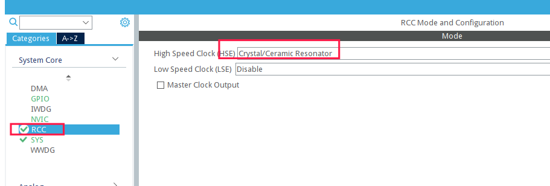
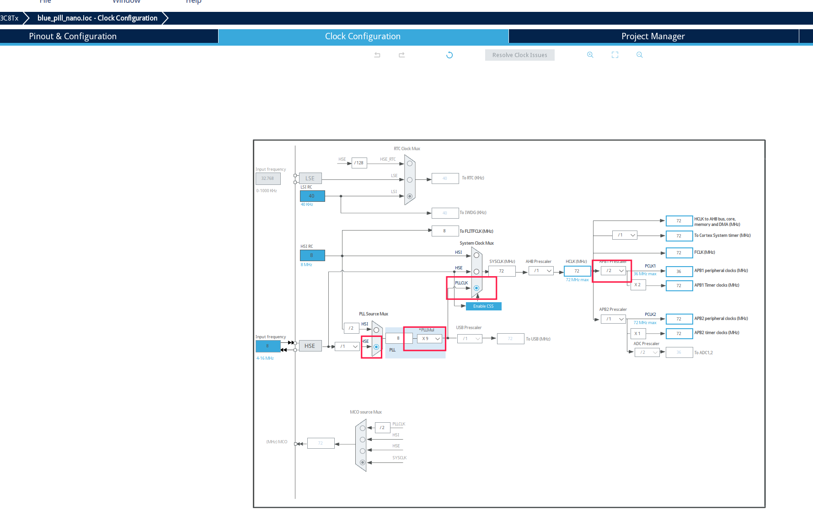
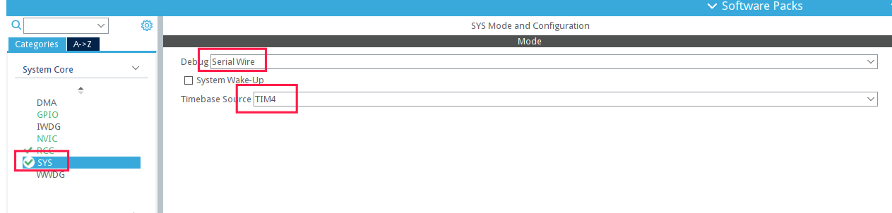
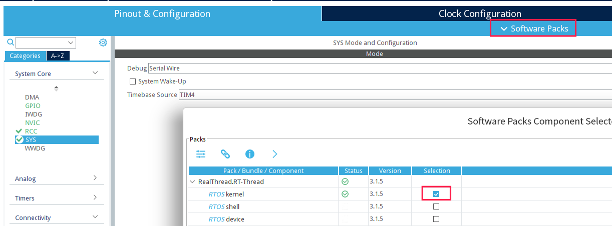
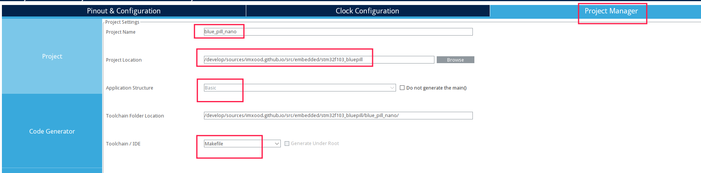
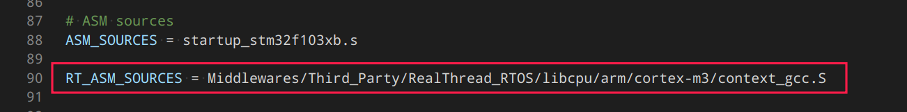
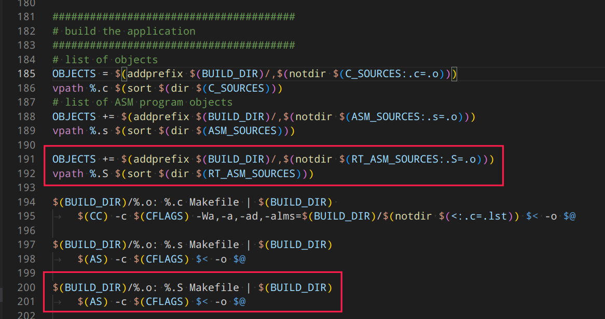
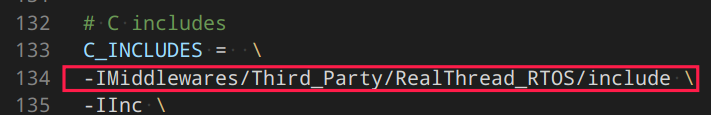
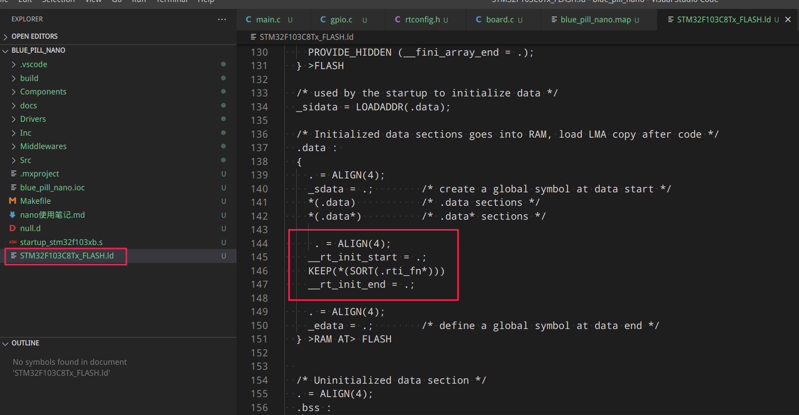
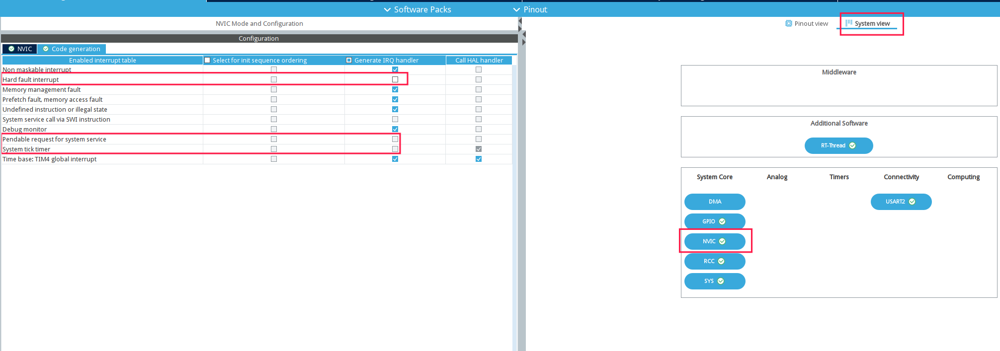

## 在 stm32cubemx 中添加软件包

https://www.rt-thread.org/download/cube/RealThread.RT-Thread.pdsc

## 基本配置

设置时钟:

设置 Debug 模式为 SW方式, 设置 时间基为 Tim4(随意选的一个)

添加 rtt nano 包

生成项目, 这里使用的是 gcc + Makefile

## 修改一些文件

Makefile

修改链接脚本, 使 rt 的初始化可以正常被执行

去掉几个默认生成的中断函数

## ws2812 控制

可以参考: https://www.cnblogs.com/dongxiaodong/p/14362196.html

