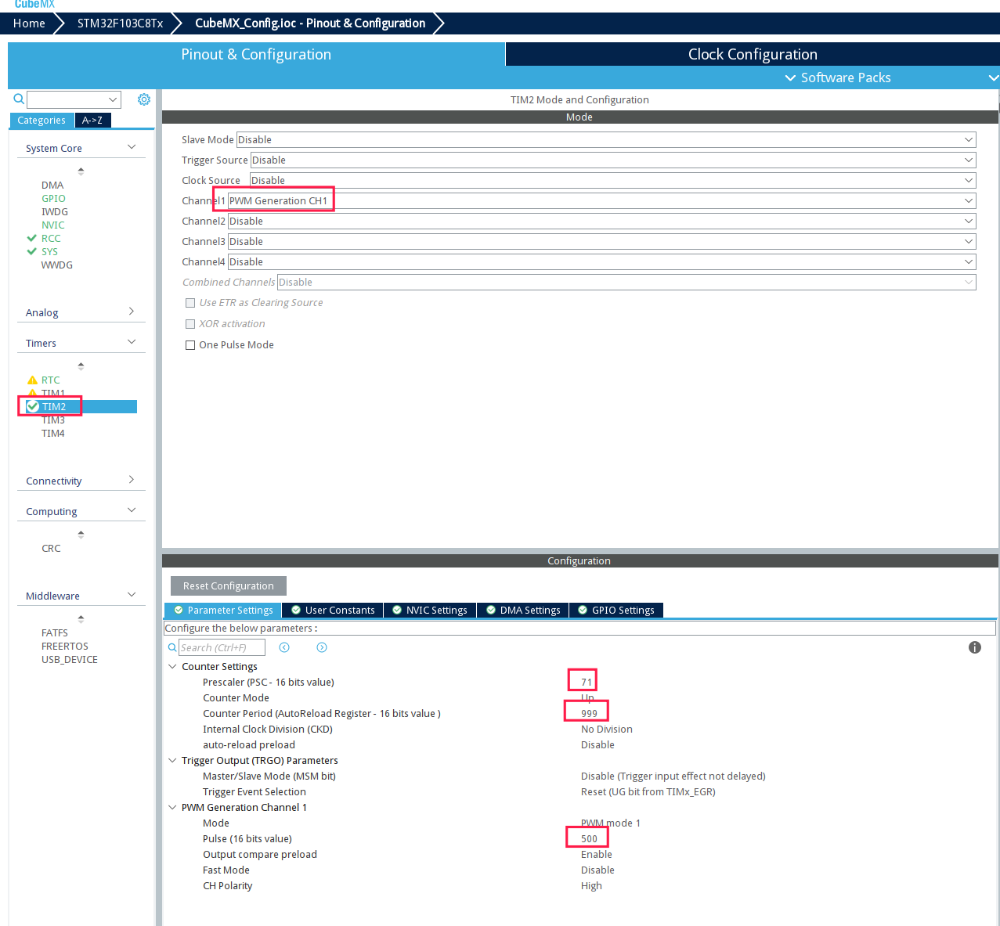

# STM32 PWM 配置记录

## 说明

- 本页记录 `STM32F103 Bluepill` 使用 `STM32CubeMX` 配置 PWM 输出的最小流程.
- 适合快速回忆定时器参数, 输出频率和占空比之间的关系.

## CubeMX 配置示意



## 核心参数

- `PSC` / `Prescaler`: 定时器预分频, 先把输入时钟降到目标范围.
- `ARR` / `Period`: 自动重装值, 决定 PWM 周期长度.
- `CCR` / `Pulse`: 比较值, 决定高电平持续时间.
- `Channel`: 选择具体输出通道, 例如 `TIMx_CH1`.

常用估算公式:

```text
PWM 频率 = timer_clk / ((PSC + 1) * (ARR + 1))
占空比 = CCR / (ARR + 1)
```

## 最小配置步骤

1. 选择一个定时器通道, 模式设为 `PWM Generation CHx`.
2. 根据目标频率设置 `Prescaler` 和 `Counter Period`.
3. 设置 `Pulse` 作为默认占空比.
4. 检查输出引脚是否映射到正确的 GPIO 复用功能.
5. 生成代码后, 在初始化完成后调用 `HAL_TIM_PWM_Start()`.

## 调试排查

- 没有波形时, 先检查 GPIO 复用是否正确, 以及是否真的启动了 PWM 通道.
- 频率不对时, 先确认 `APB` 定时器时钟, 再检查 `PSC` 和 `ARR`.
- 占空比异常时, 重点核对 `Pulse` 与 `Period` 的比值.
- 若示波器看到恒高或恒低, 通常是 `CCR` 设置越界或通道未启动.

## 相关文档

- [PWM 通用入口](../pwm笔记.md)
- [Stm32 开发环境](./stm32开发环境.md)
