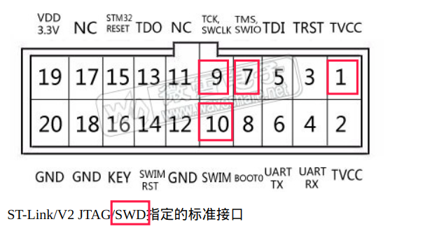
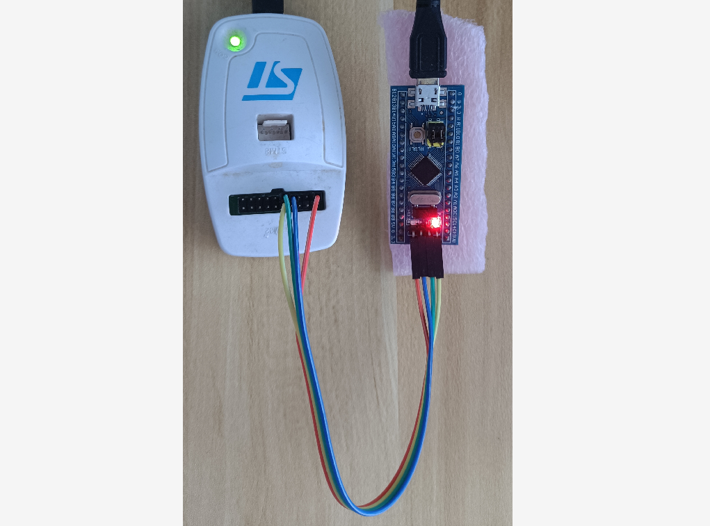
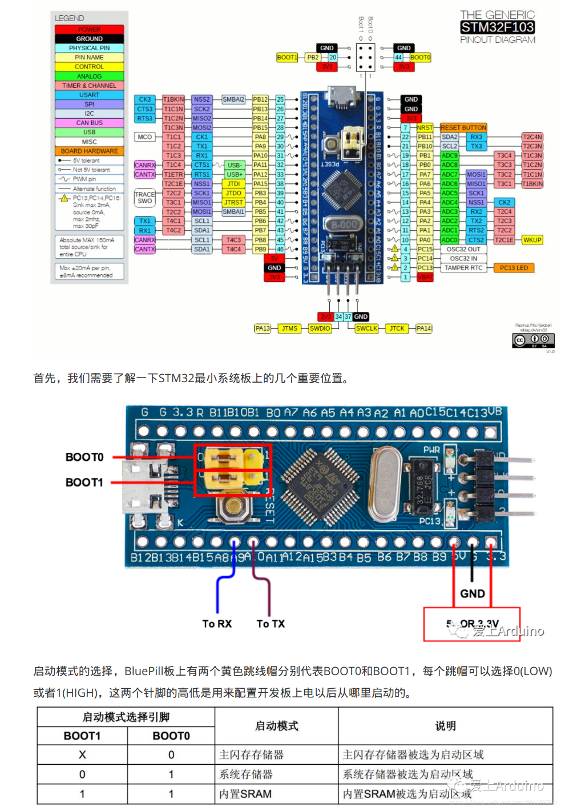

# STM32笔记

## 时钟选择

查询 STM32F1/F7中文参考手册, "2.2 存储器组织结构", 查看使用的外设挂载在哪个总线上, 总线的速度可以通过 STM32CUBEMX 软件中查看到

## windows 开发环境搭建

### 安装软件包管理工具choco

	administrator权限打开powershell, 执行:
		Set-ExecutionPolicy Bypass -Scope Process -Force; iex ((New-Object System.Net.WebClient).DownloadString('https://chocolatey.org/install.ps1'))

	使用choco安装(admin权限):
		make - 构建工具
		openocd - debug server
		gcc-arm-embedded - 编译工具链

	choco install make openocd gcc-arm-embedded

	需要设置环境变量?

### 安装非choco管理的软件

	这下面的在choco中没有找到, 需要手动安装:

		stm32cubemx:
			https://www.st.com/zh/development-tools/stm32cubemx.html

		stlink 驱动, 调试使用
			https://my.st.com/content/my_st_com/zh/products/development-tools/software-development-tools/stm32-software-development-tools/stm32-utilities/stsw-link009.html

### 使用 cmsisdap 调试 stm32

    创建文件 dap-stm32.cfg, 添加以下内容:

		interface cmsis-dap
		transport select swd
		source [find target/stm32f1x.cfg]

    烧写程序:
        openocd -f dap-stm32.cfg -c "program build/stm32f103rct6.bin 0x8000000 reset exit"

	用vscode调试, 安装插件: 1.c/c++ 2.cortex-debug

	打开 launch.json, 新添加一项调试配置:

		{
			"name": "Cortex Debug",
			"cwd": "${workspaceRoot}",
			"executable": "build/stm32f103rct6.elf",
			"request": "launch",
			"type": "cortex-debug",
			"servertype": "openocd",
			"configFiles": [
				"dap-stm32.cfg"
			]
		}

## 2022.0624 -- stm32f103 bluepill openocd

硬件接口:

openocd 调试命令:

openocd -f interface/stlink.cfg -f board/stm32f103c8_blue_pill.cfg

## bluepill

## 使用 rt-thread

git clone https://github.com/RT-Thread/rt-thread.git

cd bsp/stm32/stm32f103-blue-pill

根据模板生成独立项目:

scons --dist

cd bsp/stm32/stm32f103-blue-pill/dist/stm32f103-blue-pill

生成 vscode 代码提示的配置:

scons --target=vsc

编译:

scons -j10

烧写:

openocd -f interface/stlink.cfg -f board/stm32f103c8_blue_pill.cfg -c "program rtthread.bin 0x8000000 reset exit"

## arm none eabi gcc

使用最新版本的, 下载地址: https://developer.arm.com/tools-and-software/open-source-software/developer-tools/gnu-toolchain/downloads

运行 gdb 时, 会遇到 依赖库找不到的问题, 根据报错信息 安装就行, 其中有一个没办法:
找不到libpython3.6m.so.1.0, 可以源码编译, 这里是一个hack的解决方法:
ln -s /usr/lib/x86_64-linux-gnu/libpython3.7m.so.1.0 /usr/lib/x86_64-linux-gnu/libpython3.6m.so.1.0

## vscode 断点调试

使用默认生成的 cortex-debug launch配置, 稍加修改,

"executable": "./rt-thread.elf",
"servertype": "openocd",
"configFiles": [
	"interface/stlink.cfg",
	"board/stm32f103c8_blue_pill.cfg"
]

## 添加通过编译器添加一个宏

最好的方式是:

在项目路径下的 /SConscript 文件中, 主要是如下代码:

objs = []
group = DefineGroup('Defines', [], depend = [''], CPPDEFINES = ['BSP_USING_PWM2_CH1'])
objs += group
Return('objs')

## 生成 vsc 的代码提示

scons --target=vsc

每一次 scons 的配置文件改变以后, 如果头文件或者是Define有改变, 则需要重新生成
