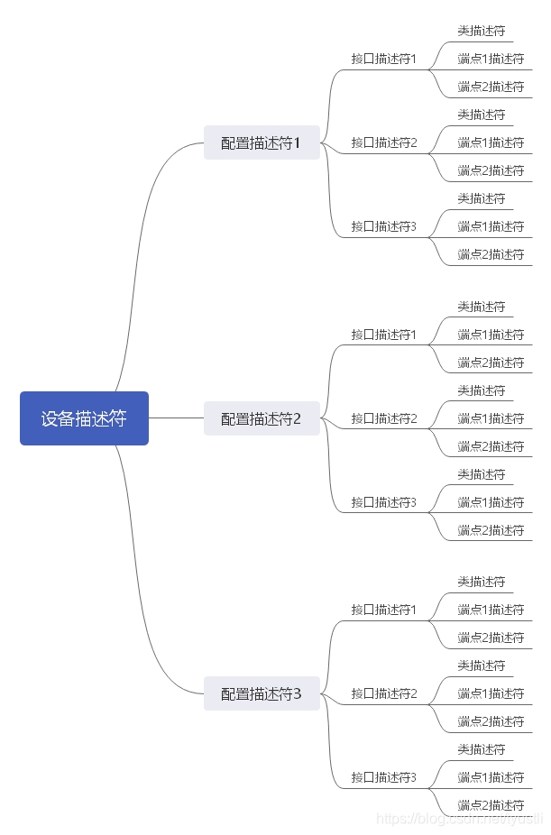
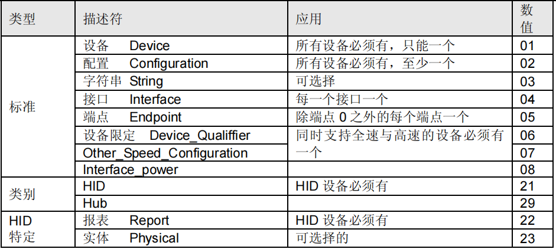
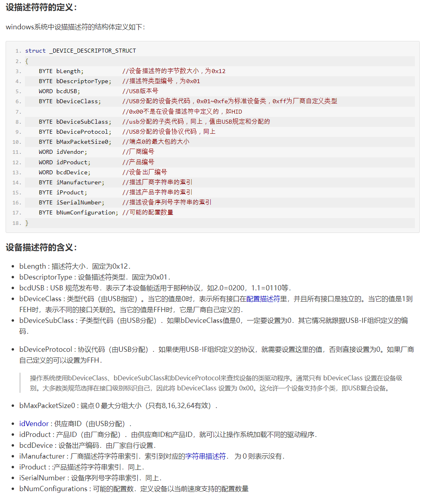
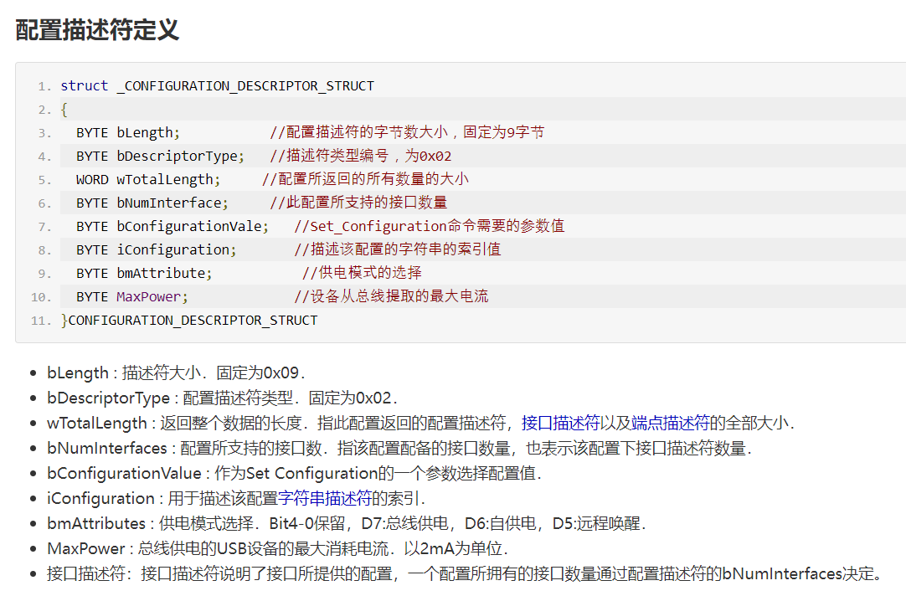
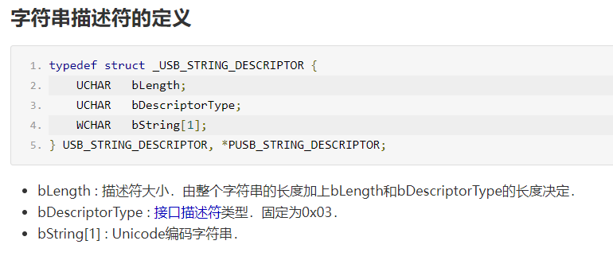
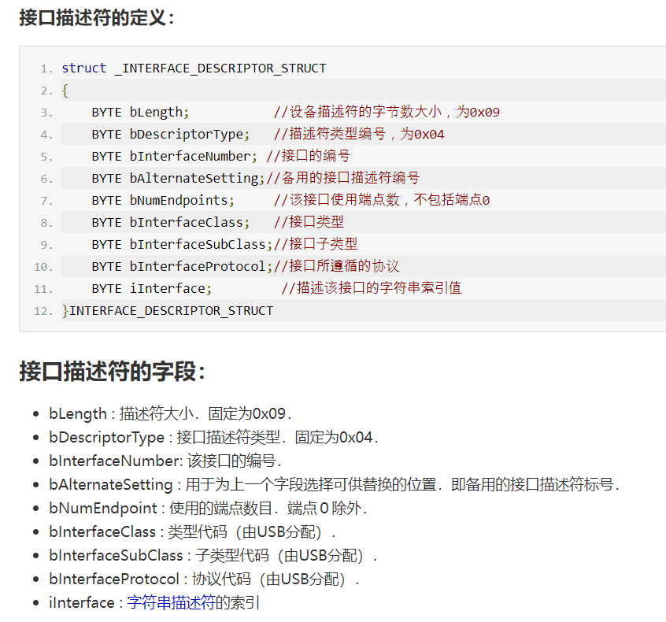
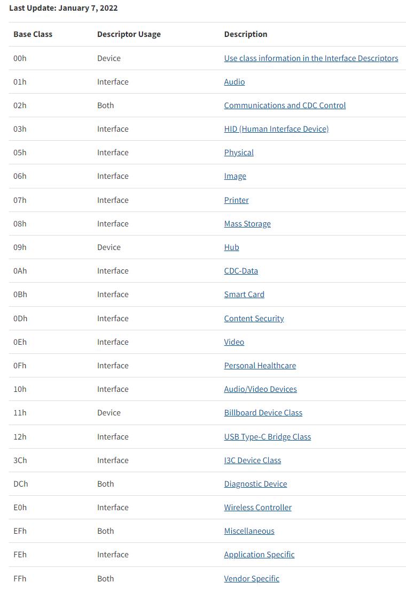
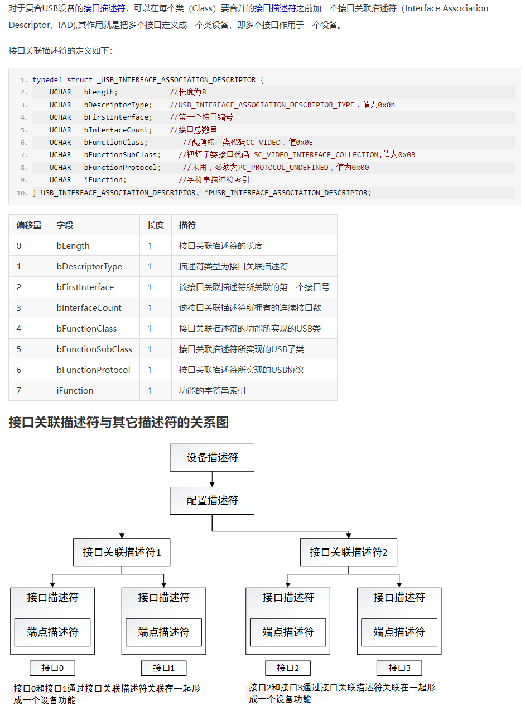
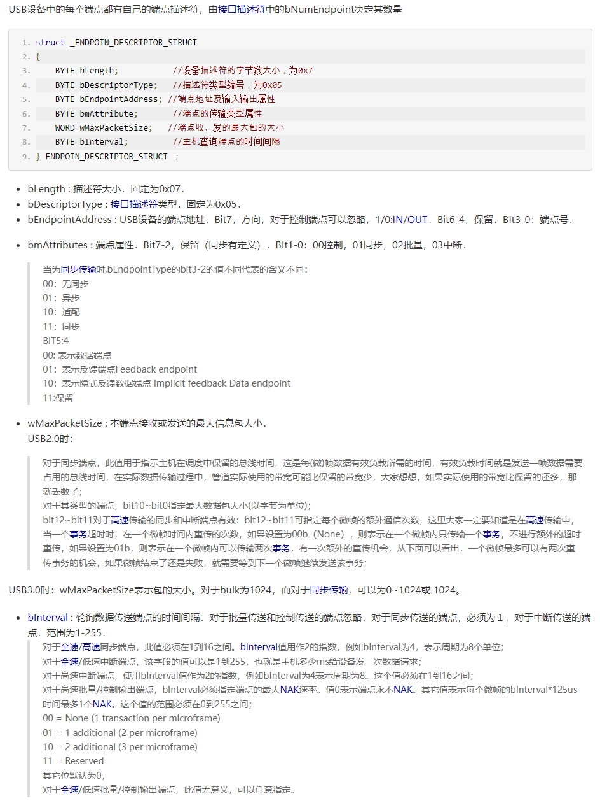

# USB 协议

需要什么可以在官方文档上搜索关键字: https://www.usb.org/documents

下面很多截图来自: USB中文网 https://www.usbzh.com

## USB 描述符

## USB 描述符

## 设备描述符

### 配置描述符

### 字符串描述符

### 接口描述符

### 接口类定义

https://www.usb.org/defined-class-codes

### 接口关联描述符

### 端点描述符

