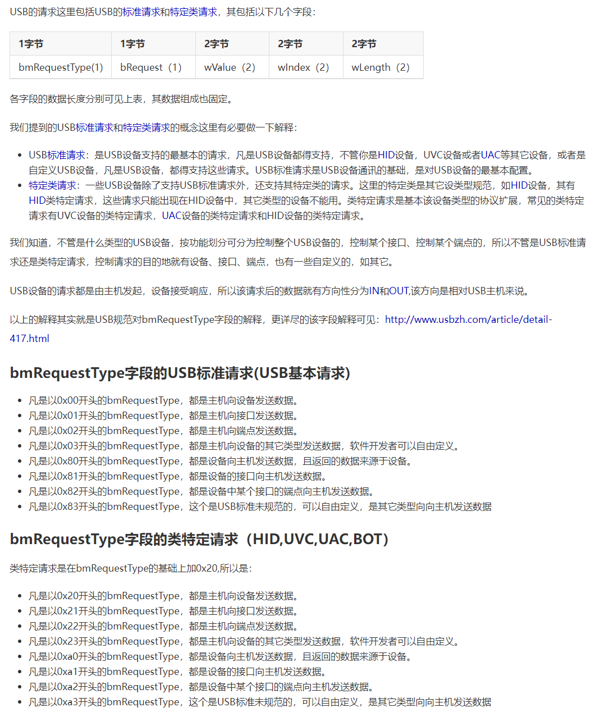
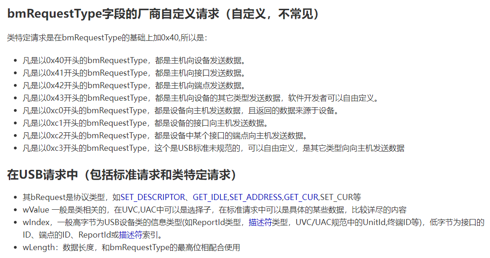
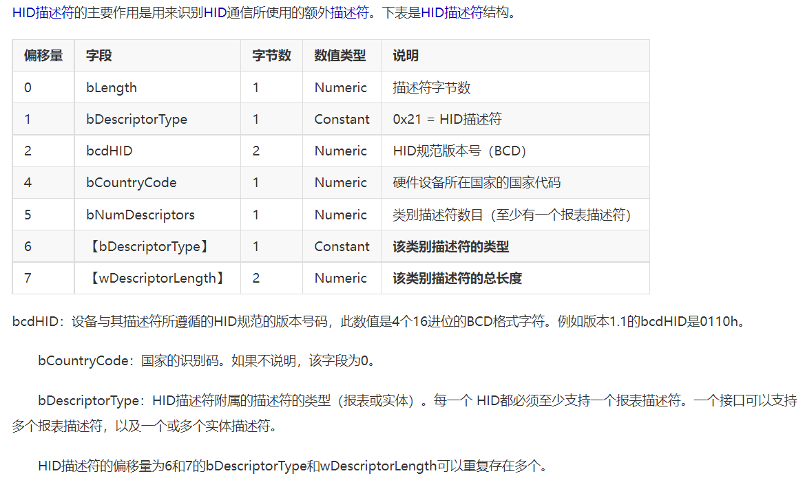

# USB 用法笔记

1. 写好各种描述符后, 设备正常运行

2. 上位需要有相应的驱动, 因为每一个驱动对应一个设备, 上位机操作的是设备. 没有的话, 无法 Open usb device.

    1> 使用 zadig 安装驱动.

    2> 使用 WinCID

    3> 上面是我喜欢的方式, 其它的, 不知道..., 略.


## WinCID

关键是三个描述符的解析, 就可以实现:

``` c
#define WCID_VENDOR_CODE 0x17

// WCID, 微软 WinUSB
const uint8_t WCID[] = {
    0x12,
    0x03,
    'M', 0x00,        /* wcChar0 */
    'S', 0x00,        /* wcChar1 */
    'F', 0x00,        /* wcChar2 */
    'T', 0x00,        /* wcChar3 */
    '1', 0x00,        /* wcChar4 */
    '0', 0x00,        /* wcChar5 */
    '0', 0x00,        /* wcChar6 */
    WCID_VENDOR_CODE, /* bVendorCode */
    0x00,             /* bReserved */
};

uint8_t WINUSB_ExtendedCompatId_Descritpor[] = {
    0x28, 0x00, 0x00, 0x00, /* dwLength */
    0x00, 0x01,             /* bcdVersion */
    0x04, 0x00,             /* wIndex */
    0x01,                   /* bCount */
    0, 0, 0, 0, 0, 0, 0,    /* Reserved */
    /* WCID Function  */
    0x00, /* bFirstInterfaceNumber */
    0x01, /* bReserved */
    /* CID */
    'W', 'I', 'N', 'U', 'S', 'B', 0x00, 0x00,
    /* sub CID */
    0x00, 0x00, 0x00, 0x00, 0x00, 0x00, 0x00, 0x00,
    0, 0, 0, 0, 0, 0, /* Reserved */
};

uint8_t WINUSB_ExtendedProperty_InterfaceGUID_Descritpor[] = {
    ///////////////////////////////////////
    /// WCID property descriptor
    ///////////////////////////////////////
    0x8e, 0x00, 0x00, 0x00, /* dwLength */
    0x00, 0x01,             /* bcdVersion */
    0x05, 0x00,             /* wIndex */
    0x01, 0x00,             /* wCount */

    ///////////////////////////////////////
    /// registry propter descriptor
    ///////////////////////////////////////
    0x84, 0x00, 0x00, 0x00, /* dwSize */
    0x01, 0x00, 0x00, 0x00, /* dwPropertyDataType */
    0x28, 0x00,             /* wPropertyNameLength */
    /* DeviceInterfaceGUID */
    'D', 0x00, 'e', 0x00, 'v', 0x00, 'i', 0x00,  /* wcName_20 */
    'c', 0x00, 'e', 0x00, 'I', 0x00, 'n', 0x00,  /* wcName_20 */
    't', 0x00, 'e', 0x00, 'r', 0x00, 'f', 0x00,  /* wcName_20 */
    'a', 0x00, 'c', 0x00, 'e', 0x00, 'G', 0x00,  /* wcName_20 */
    'U', 0x00, 'I', 0x00, 'D', 0x00, 0x00, 0x00, /* wcName_20 */
    0x4e, 0x00, 0x00, 0x00,                      /* dwPropertyDataLength */
    /* {1D4B2365-4749-48EA-B38A-7C6FDDDD7E26} */
    '{', 0x00, '1', 0x00, 'D', 0x00, '4', 0x00, /* wcData_39 */
    'B', 0x00, '2', 0x00, '3', 0x00, '6', 0x00, /* wcData_39 */
    '5', 0x00, '-', 0x00, '4', 0x00, '7', 0x00, /* wcData_39 */
    '4', 0x00, '9', 0x00, '-', 0x00, '4', 0x00, /* wcData_39 */
    '8', 0x00, 'E', 0x00, 'A', 0x00, '-', 0x00, /* wcData_39 */
    'B', 0x00, '3', 0x00, '8', 0x00, 'A', 0x00, /* wcData_39 */
    '-', 0x00, '7', 0x00, 'C', 0x00, '6', 0x00, /* wcData_39 */
    'F', 0x00, 'D', 0x00, 'D', 0x00, 'D', 0x00, /* wcData_39 */
    'D', 0x00, '7', 0x00, 'E', 0x00, '2', 0x00, /* wcData_39 */
    '6', 0x00, '}', 0x00, 0x00, 0x00,           /* wcData_39 */
};
```

请求:

``` c
// Setup包的处理
if (SetupReqCode == WCID_VENDOR_CODE) {
    printf("WCID_VENDOR_CODE\n");
    switch (pSetupReqPak->wIndex) {
        case 0x04:
            pDescr = WINUSB_ExtendedCompatId_Descritpor;
            len = WINUSB_ExtendedCompatId_Descritpor[0];
            printf("0x04, SetupReqLen: %u, len: %u\n", SetupReqLen, len);
            break;

        case 0x05:
            pDescr = WINUSB_ExtendedProperty_InterfaceGUID_Descritpor;
            len = WINUSB_ExtendedProperty_InterfaceGUID_Descritpor[0];
            printf("0x05, SetupReqLen: %u, len: %u\n", SetupReqLen, len);
            break;

        default:
            errflag = 0xff;
            break;
    }

    // 请求的数据长度 大于 实际需要的数据长度 更大
    if (SetupReqLen > len)
        SetupReqLen = len;
    len = (SetupReqLen >= DevEP0SIZE) ? DevEP0SIZE : SetupReqLen;
    memcpy(pEP0_DataBuf, pDescr, len);
    pDescr += len;
}

// 字符串描述符
case USB_DESCR_TYP_STRING: {
    // 描述符索引
    switch ((pSetupReqPak->wValue) & 0xff) {

        ...

        case 0xEE:
            pDescr = WCID;
            len = WCID[0];
            printf("USB_DESCR_TYP_STRING WCID, SetupReqLen: %u, len: %u\n", SetupReqLen, len);
            break;

        ...
    }
    break;
}
```

## USB 协议

需要什么可以在官方文档上搜索关键字: https://www.usb.org/documents

下面很多截图来自: USB中文网 https://www.usbzh.com

### USB标准请求、类特定请求总结





### USB 描述符


### USB 描述符


### 设备描述符


#### 配置描述符


#### 字符串描述符


#### 接口描述符


#### HID描述符



#### 接口类定义

https://www.usb.org/defined-class-codes


#### 接口关联描述符


#### 端点描述符


