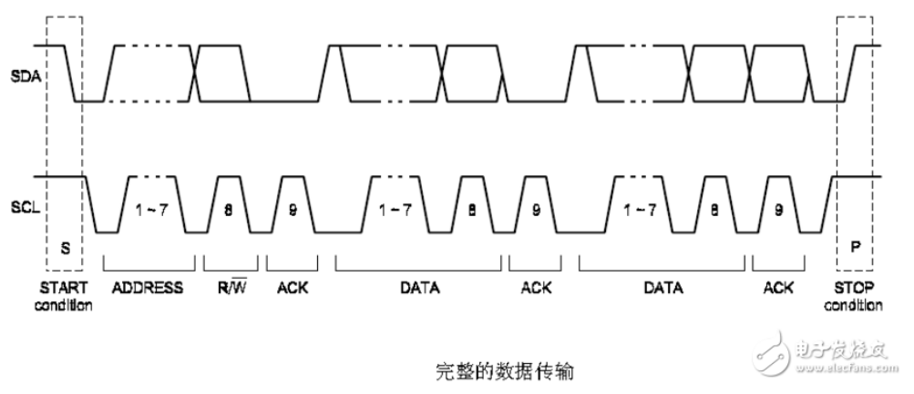
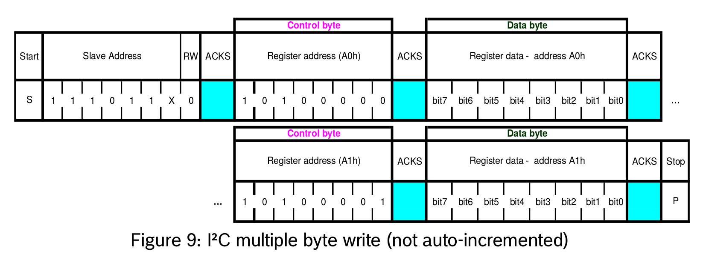
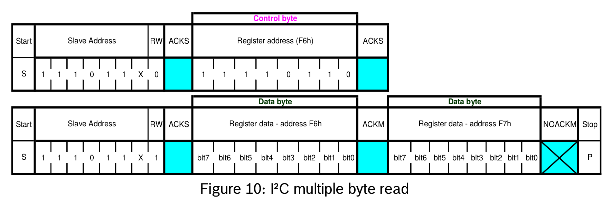

# 基本通信协议 笔记

## 说明

- 本页整理嵌入式开发中常见的 I2C, SPI 等基础通信协议概念与读写流程示例.
- 适合作为总线时序, 应答机制和 EEPROM 访问方式的速查入口.

## i2c 协议

    开始信号: SCL在高电平期间, 数据线由高变为低
    停止信号: SCL在高电平期间, 数据线由低变为高
    应答信号:
        主机写从机时, 每写完一个字节, 从机在下一个时钟周期将数据线拉低, 以告诉主机操作有效.
        主机读从机时, 每读完一个字节, 主机在下一个时钟周期将数据线拉低, 以告诉从机操作有效, 最后一个字节不发应答，直接发停止信号

    注: 时钟线为高电平期间的数据线上的电平改变都被认为是起始和停止信号，所以数据改变必须要在时钟为低电平时改变

## 基本过程

i2c芯片EEPROM FM24V10

    设备地址: 0x50

    初始化

        ...

    设置速度, 设置主模式

        i2c_config(SPEED|MASTER)

    向i2c_dev, 从设备地址dev_addr, 从设备的起始地址0x0001处, 写数据0x02 0x03

        buf[] = [0x00, 0x01, 0x02, 0x03]
        write(i2c_dev, dev_addr, buf, 4)

    从i2c_dev, 从设备地址dev_addr, 从设备的起始地址0x0001处, 读数据

        buf[] = [0x01, 0x00]
        write(i2c_dev, dev_addr, buf, 2)

        buf[2] = [0x00]
        read(i2c_dev, dev_addr, buf, 2)

## I2C 补充时序图

### I2C 写流程

1. 发送从设备地址和写标记.
2. 发送目标寄存器地址.
3. 连续写入数据字节.

### I2C 读流程

1. 先发送从设备地址和写标记.
2. 发送目标寄存器地址, 然后发出 `restart` 或 `stop`.
3. 再发送从设备地址和读标记.
4. 连续读取数据, 最后一个字节不应答并结束通信.

## spi协议

spi芯片EEPROM FM25V10

    设备地址: 0x50

    写使能:
    buf[] = [0x06]
    write(spi_dev, buf)

    从0x000000, 写0x01 0x02:
    buf[] = [0x02 0x00 0x00 0x00 0x01 0x02]
    write(spi_dev, buf)

    从0x000000, 读两个字节:
    buf[] = [0x03 0x00 0x00 0x00 0xff 0xff]
    write(spi_dev, buf)
