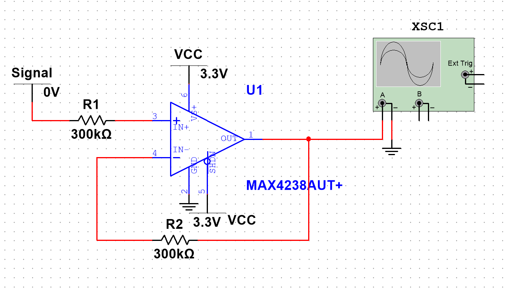

## 比例运算放大电路为什么要加平衡电阻

https://www.zhihu.com/zvideo/1632270957531435008?playTime=0.0

## ADC数字地DGND、模拟地AGND的谜团！(AD的文章)

https://www.analog.com/media/cn/technical-documentation/evaluation-documentation/MT-031_cn.pdf

## 同向放大器

1k 10.305uV
10k 10.295uV
100k 0(205.46nV) 1uV(1.205uV) 10uV(10.203uV) 100uV(100.185uV) 999uV(999.006uV)
300k 0(4.565nV) 1uV(1.004uV) 10uV(9.999uV) 100uV(99.945uV) 999uV(998.406uV)
500k 0(-197.049nV) 1uV(802.027nV) 10uV(9.793uV) 100uV(99.703uV) 999uV(997.806uV)
1000k 0(-705.21nV) 1uV(292.798nV)

故选择 100k 较为合适
