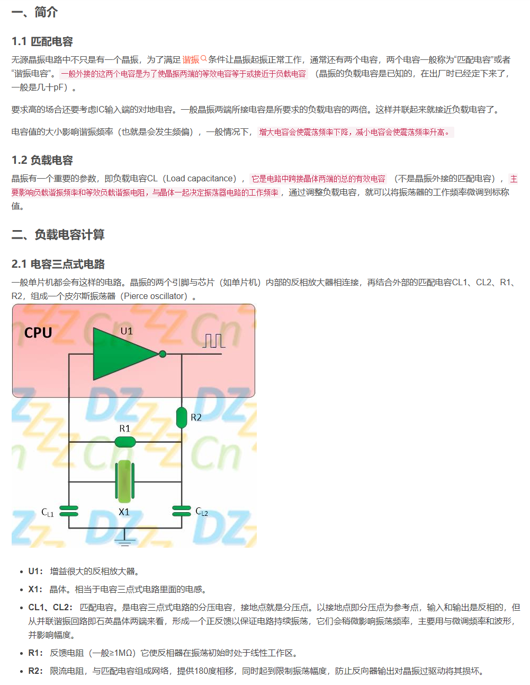
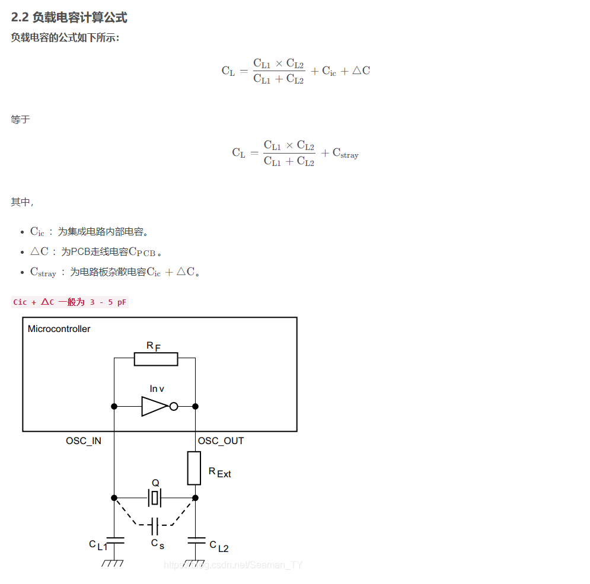
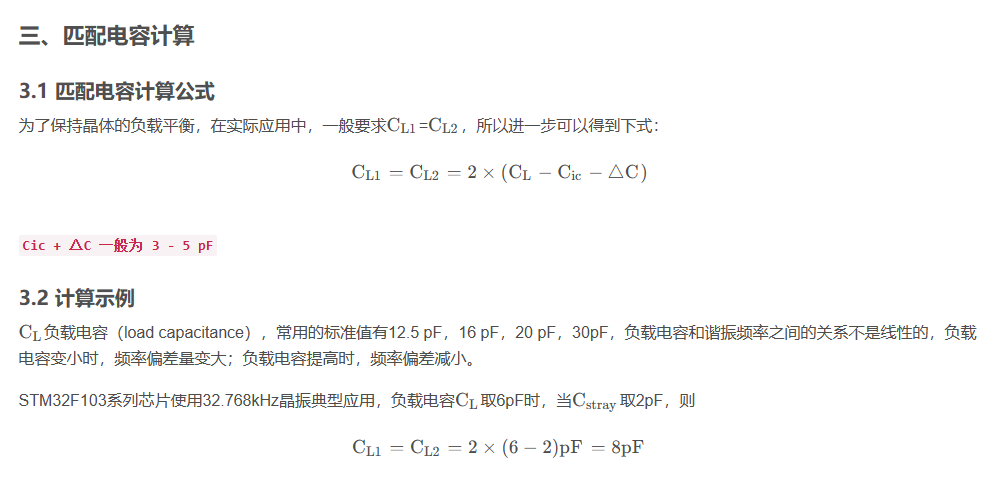
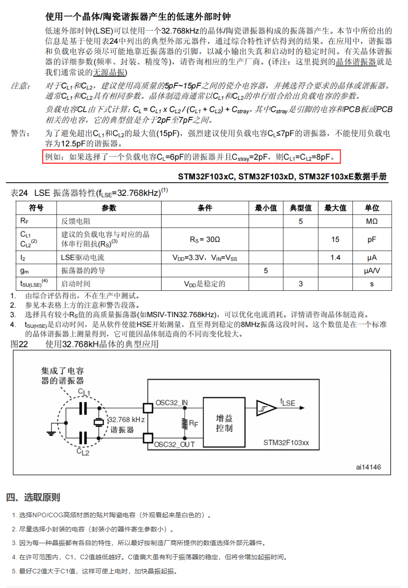
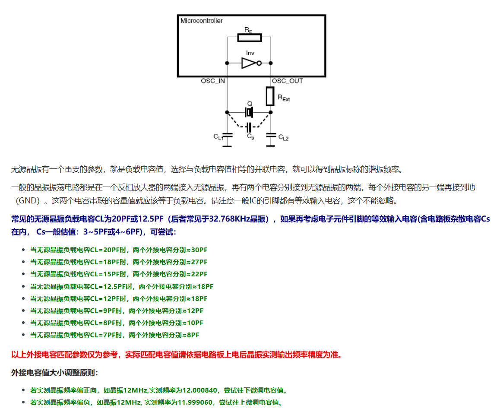

# 无源晶振

晶振匹配详细介绍: https://blog.csdn.net/qq_36347513/article/details/121246522

## 负载电容值CL匹配方法及说明

参考: https://www.genuway.com/3959.html

bilibli: https://www.bilibili.com/video/BV1bF411x7Kq/?spm_id_from=333.337.search-card.all.click&vd_source=4b8e4607ee8739eb33686a58fbd4c3a5

