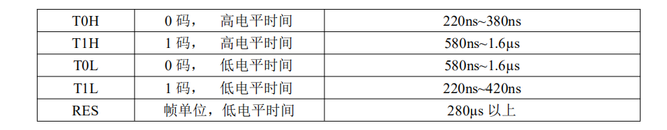
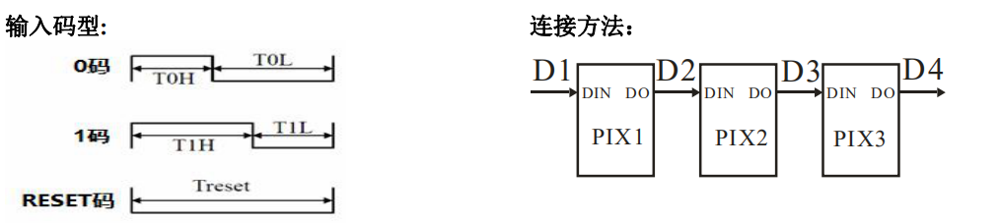
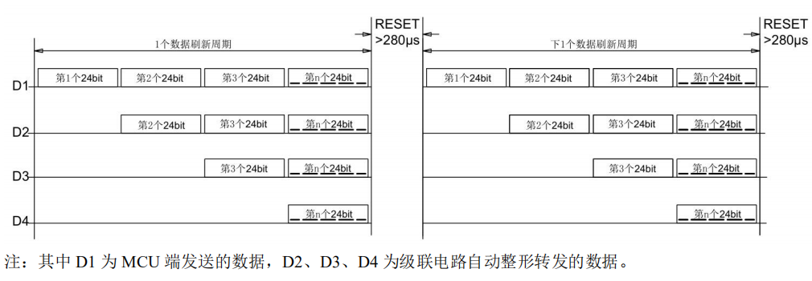
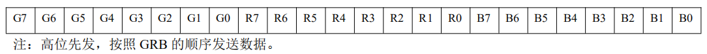
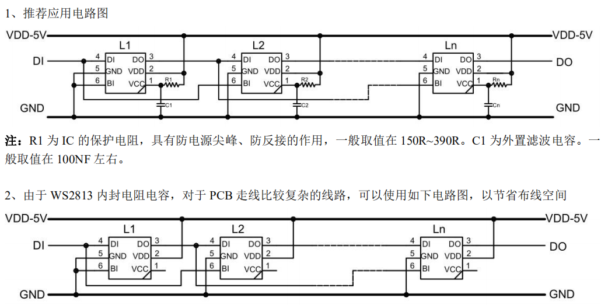

# ws2812 使用笔记

## 芯片手册

[立创商城 -- ws2813 芯片手册 --  由于ws2813手册是中文的,且兼容ws2812](https://item.szlcsc.com/235391.html)

数据发送速度可达800Kbps

数据协议采用单线归零码的通讯方式，像素点在上电复位以后，DIN端接受从控制器传输过来的数据，首先
送过来的24bit数据被第一个像素点提取后，送到像素点内部的数据锁存器，剩余的数据经过内部整形处理电路整
形放大后通过DO端口开始转发输出给下一个级联的像素点，每经过一个像素点的传输，信号减少24bit。

### 数据传输时间

### 时序波形

### 数据传输方法

### 24bit 数据结构

### 典型应用电路图

## STM32F7 控制 ws2812

### PWM + DMA

数据发送速度是800kHz, 表示 ws2812 的输入频率为800kHz, 我用的是 TIM3 PWM CH1, 使用内部时钟, 即TIM3所属总线APB1的CLOCK, 速度为108mHz, 为了得到800kHz, 108mHz = 0.8mHz * 5 * 27, 设置 TIM3 的预分频 prescaler 为 5-1, 设置 自动重载值 ARR 为 27-1, 所以 PWM 的 PULSE的取值范围是 0~26, 根据 ws2812 的"数据传输时间", 可以计算得: 0码的占空比大约为 $220 / (220 + 580)\approx0.275$, 1码的占空比大约为 $580 / (220 + 580)\approx0.725$, 所以设置 0码的 Pulse 为 $0.275 * 27 \approx 7$, 1码的 Pulse 为 19.

    PWM参数:

        CH Polarity: 空闲时刻的电平状态
            "High" 表示空闲为高, 所以有效电平为"Low", 即低电平有效
            "Low" 表示空闲为低, 所以有效电平为"High", 即高电平有效

            输出比较极性的指的是你在比较匹配之后输出口输出的极性

        Mode:
            PWM Mode 1, CNT<CRRx为有效电平
            PWM Mode 2, CNT>CRRx为有效电平

        当向上递增时, 设置 CH Polarity 为 "High", 选择 "PWM Mode 1", 则: High为有效电平, CNT < CRRx 时 为High

    配置好了以后别忘了, 启动PWM:
        HAL_TIM_PWM_Start(&htimX, TIM_CHANNEL_X);
