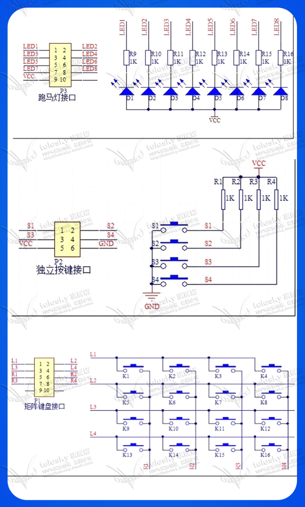

# 4x4 键盘矩阵

## 说明

- 本页记录 `4x4` 矩阵键盘的基本接线方式, 扫描思路和调试要点.
- 这类模块常用于菜单输入, 数字输入和低成本本地控制面板.

## 模块示意

## 基本原理

- 4 根行线 + 4 根列线组合成 `16` 个按键位置.
- 通过轮流驱动行线或列线, 读取另一侧电平变化, 就可以判断哪个键被按下.
- 相比每个按键单独占一个 GPIO, 矩阵键盘能明显节省引脚资源.

## 常见扫描流程

1. 先将所有列线配置为输入, 行线逐个输出有效电平.
2. 每次只拉低或拉高一行, 再读取所有列线状态.
3. 如果某一列出现有效变化, 即可根据“当前行 + 当前列”定位按键.
4. 对全部行循环扫描, 就能得到完整按键状态.

## 调试要点

- 要处理按键抖动, 否则一次按下可能被识别成多次触发.
- 若支持长按或组合键, 需要在扫描结果之上再做状态机处理.
- 接线前先确认模块排针顺序, 不同厂家标注可能不完全一致.
- 若列线始终无变化, 优先检查 GPIO 模式, 上拉下拉配置和扫描时序.

## 适用场景

- 简单密码输入或功能菜单选择.
- 仪器, 控制面板, 工业设备的人机输入界面.
- 与 `LCD`, `数码管`, `蜂鸣器` 搭配组成低成本本地交互方案.

## 相关文档

- [模块与扩展器件总览](../单片机模块.md)
- [Arduino 接口笔记](../arduino.md)
