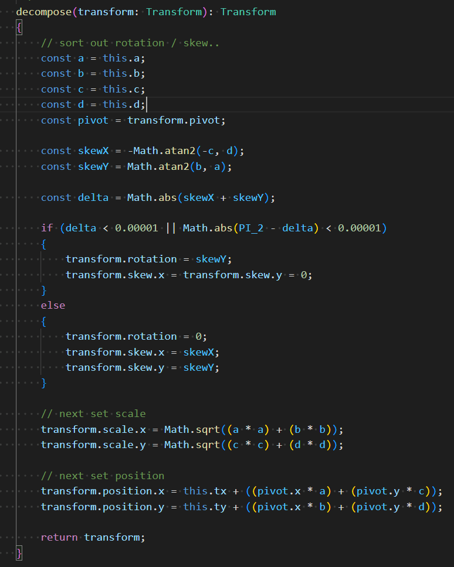

## 通过 Dom 坐标 映射到 pixijs view 上, 结果位置保存在 point 中

只是简单的 通过 当前 Dom 坐标 减去 Canvas Dom 的位置, 再考虑到 resolution 分辨率 之后 的 坐标.
得到 这个点 的 Canvas 坐标. 这属于 全局坐标

```ts
const point = new Point();
this.viewport.options.events.mapPositionToPoint(
    point,
    event.clientX,
    event.clientY
);
return point;
```

## Display Object 的 worldTransform 属性

当前 Display Object 的 worldTransform, 是相对于 父元素 的 transform

## Display Object 的 toLocal / toGlobal 函数

toLocal, 用于把 世界坐标系 转换成 本地坐标系, 可以用于 判断 点击的位置 是否 在指定物体内.

toGlobal, 用于把 本地坐标系 的坐标 转换到 世界坐标系

## pixi.js transform

每一个 display object 都有一个 transform 对象

Transform 对象中 主要包含 local transform / world transform / position / scale / pivot / skew 这些信息

本地坐标系 指的是 local transform, 表示的是 相对于 父对象的 平移 缩放 旋转.

世界坐标系 指的是 world transform, 表示的是 相对于 Canvas 的 平移 缩放 旋转.

每当 display object 的 position scale privot skew 改变时, 都将引起 本地坐标系 的变化, 即 local transform 会改变,

同时, 这也将引起 世界坐标系 (即 world transform) 发生改变.

## Matrix 的 decompose 函数

参考 https://zhuanlan.zhihu.com/p/367163308 后面对 decompose 的解释

应用一个 matrix 到当前的 transform 上, 就是: 把矩阵中的变换 转换成 skew / rotation / scale / position,

但是原来的 transform 的 pivot 会保持不变

使用 点 [pivot.x, pivot.y] 应用 该矩阵 就得到了 position, 这里猜测:

<!-- pivot 表示 position 的偏移量的话, 计算 position 时, 会 -->


