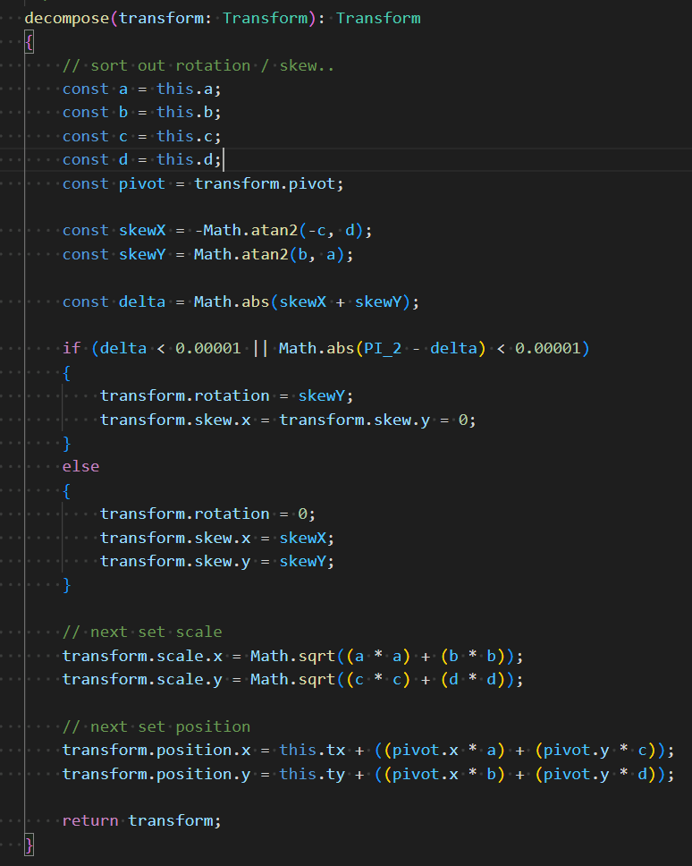

# PixiJS 笔记

## 给 stage 绑定事件

```js
PIXI.extensions.remove(PIXI.InteractionManager);

app = new PIXI.Application({
    antialias: true,
    backgroundColor: 0xffffff,
    view: canvas,
});

const { renderer, stage } = app;

renderer.addSystem(EventSystem, "events");

stage.interactive = true;
stage.hitArea = renderer.screen;

stage.addEventListener(
    "wheel",
    (wheel_event: Event) => {
        // e.preventDefault();
    },
    { passive: false }
);
```

## 通过 Dom 坐标 映射到 PixiJS view 上

只是简单地通过当前 Dom 坐标减去 Canvas Dom 的位置, 再考虑 `resolution` 分辨率之后的坐标.
得到这个点的 Canvas 坐标. 这属于全局坐标.

```ts
const point = new Point();
this.viewport.options.events.mapPositionToPoint(
    point,
    event.clientX,
    event.clientY
);
return point;
```

## Display Object 的 `worldTransform` 属性

当前 `Display Object` 的 `worldTransform`, 是相对于父元素的 transform.

## Display Object 的 `toLocal` / `toGlobal` 函数

`toLocal` 用于把世界坐标系转换成局部坐标系, 可以用于判断点击的位置是否在指定物体内.

`toGlobal` 用于把局部坐标系的坐标转换到世界坐标系.

## PixiJS transform

每一个 display object 都有一个 `transform` 对象.

`Transform` 对象中主要包含 `local transform` / `world transform` / `position` / `scale` / `pivot` / `skew` 这些信息.

本地坐标系指的是 `local transform`, 表示的是相对于父对象的平移, 缩放, 旋转.

世界坐标系指的是 `world transform`, 表示的是相对于 Canvas 的平移, 缩放, 旋转.

每当 display object 的 `position` / `scale` / `pivot` / `skew` 改变时, 都将引起本地坐标系的变化, 即 `local transform` 会改变.

同时, 这也将引起世界坐标系, 即 `world transform`, 发生改变.

## Matrix 的 `decompose` 函数

参考: https://zhuanlan.zhihu.com/p/367163308

应用一个 matrix 到当前的 transform 上, 就是把矩阵中的变换转换成 `skew` / `rotation` / `scale` / `position`.

但是原来的 transform 的 `pivot` 会保持不变.

使用点 `[pivot.x, pivot.y]` 应用该矩阵就得到了 `position`.


