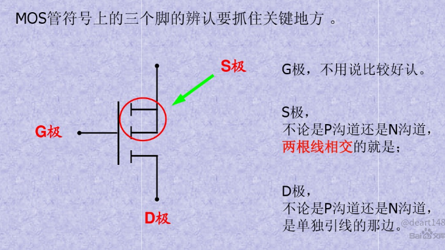
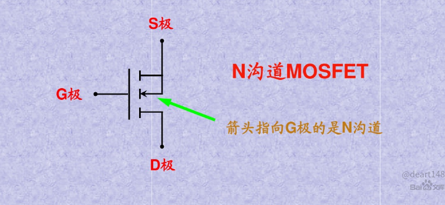
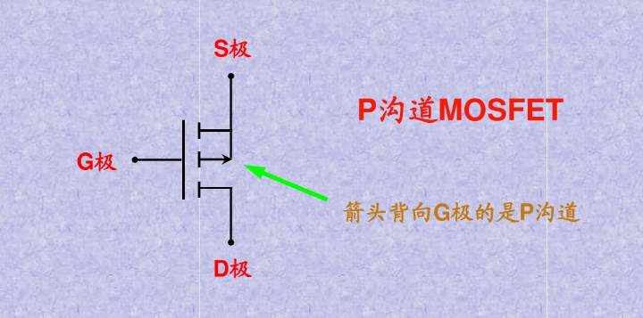
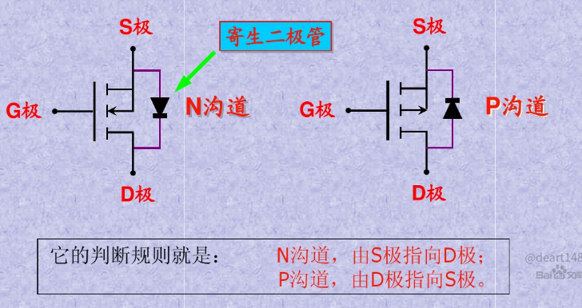
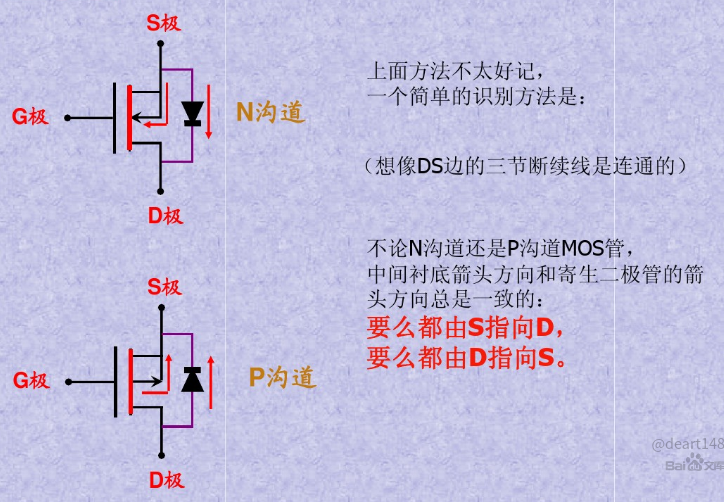
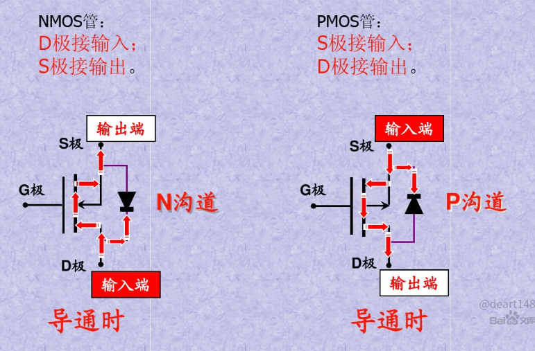
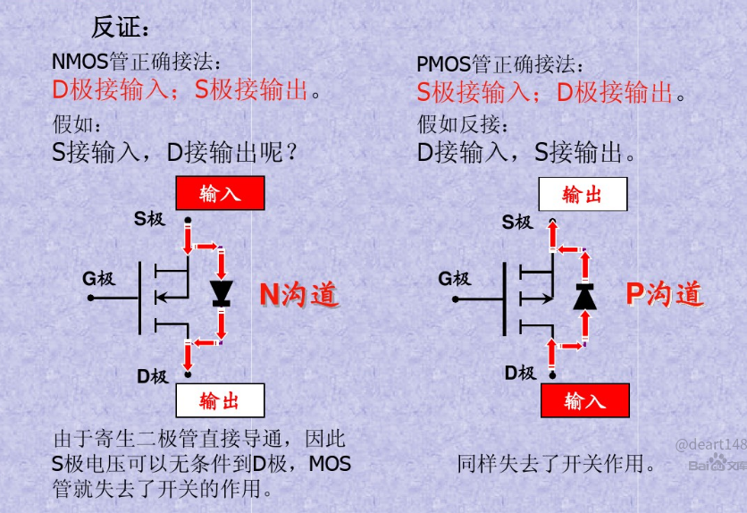
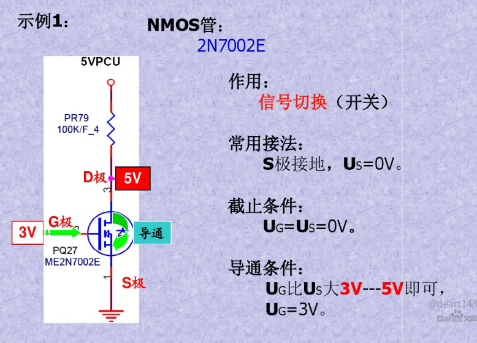
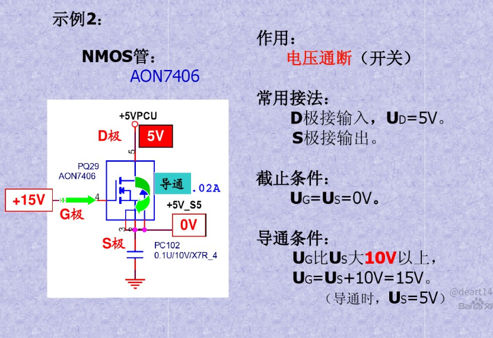
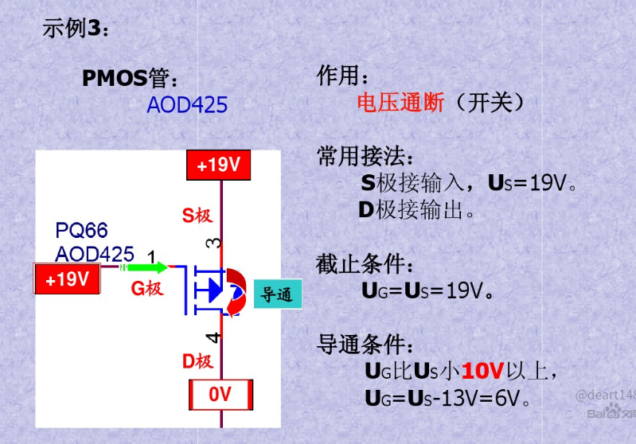

# MOS管

参考: [MOS管原理,非常详细](https://wenku.baidu.com/view/fc0a7d2eccbff121dd3683b2.html)

参考: [超低内阻mos管-MOS总结](https://blog.csdn.net/weixin_32821257/article/details/112181812)

## 三个极怎么判定

## 是N沟道还是P沟道

## 寄生二极管的方向如何判定

## MOS管用作开关时在电路中的连接方法

## 应用

## 使用场景

一般主板上使用最多的是**增强型MOS管**

**NMOS最多, 一般多用在信号控制上**

其次是**PMOS, 多用在电源开关等方面**

**耗尽型几乎不用**

## 与三极管的区别

三极管是电流控制, MOS管是电压控制, 主要有如下的区别:

1. 只容许从信号源取少量电流的情况下, 选用MOS管；在信号电压较低, 有容许从信号源取较多电流的条件下, 选用三极管.

2. MOS管是单极性器件(靠一种多数载流子导电), 三极管是双极性器件(既有多数载流子, 也要少数载流子导电).

3. 有些MOS管的源极和漏极可以互换运用, 栅极也可正可负, 灵活性比三极管好.

4. MOS管应用普遍, 可以在很小电流和很低电压下工作.

5. MOS管输入阻抗大, 低噪声, MOS管较贵, 三极管的损耗大.

6. MOS管常用来作为电源开关, 以及大电流开关电路、高频高速电路中, 三极管常用来数字电路开关控制.
