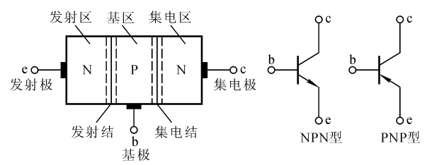
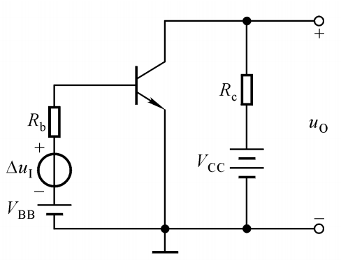
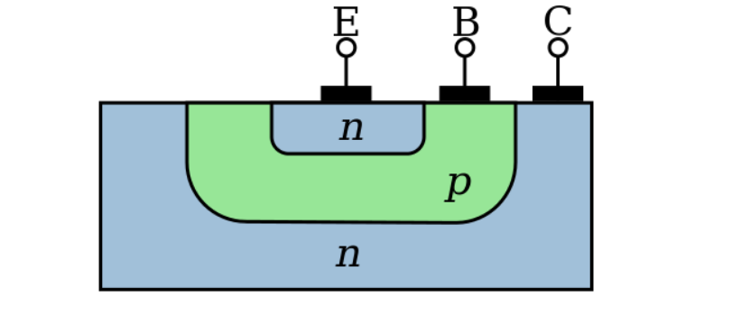
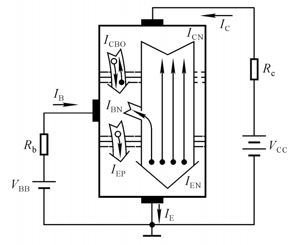
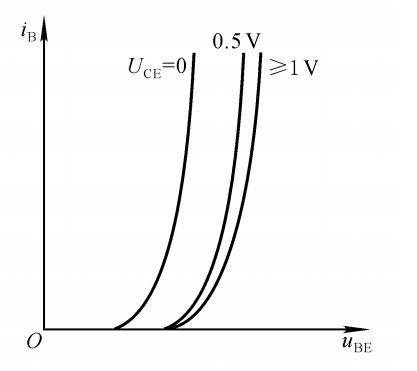
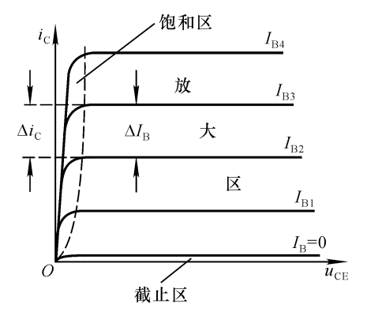
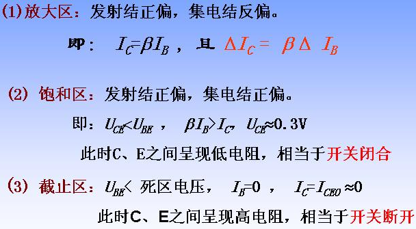

# 三极管

## 箭头方向

**箭头只能从P到N，所以根据箭头指向即可确定三极管是PNP型还是NPN型**

## 基本共射放大电路

$\Delta u_{I}$ 表示输入信号, $\Delta u_{O}$ 表示输出信号

基极 发射极 输入信号 构成输入回路, 集电极,发射极输出信号构成输出回路.

## 三极管内部电流

NPN管特点: 1. ``上层的发射极掺杂浓度很高``, 2. ``中间的基极很薄, 掺杂浓度很低``, 3. ``下层的集电极面积很大``

## 三极管的输入输出特性

## 三极管输出特性

## 为什么小电流Ib能控制大电流Ic的大小, 以及放大电路的原理

参考: [张云 - 三极管的动画](http://blog.sciencenet.cn/blog-729147-1041542.html)

这里的三极管是双极型晶体管, 模电的放大电路和数电的简单逻辑电路里面都会用到.
有集电极c、基极b、发射极e、以及两个PN结：集电结和发射结. 集电极面积比较大, 基极厚度薄而且载流子浓度比较低.

下图是个NPN型的三极管:

当发射结正偏时, 电荷分布会发生变化, 发射结宽度会变窄;相当于给电子打开了一扇e到b的大门

集电结反偏时, 电荷分布会也发生变化, 集电结宽度会变宽. 相当于打开了阻碍电子从c级跑出去的大门, 如下方动画所示:

b级会接一个大电阻RB限制电流Ib的大小, 跑到b极的那些多余的电子就只好穿越集电结, 形成电流Ic, 如下方动画所示：

如果基极电压翻倍, 电荷分布会继续发生变化, 发射结宽度会变得更窄, 这扇大门变得更宽了, 将会有更多的电子跑到b级. 如下方动画所示:

由于RB是大电阻, Ib就算翻倍了也还是很小, 所以更多的电子会穿越集电结, 让Ic也翻倍. 如下方动画所示:

两个直流电源是可以合并到一起的, 再加上小信号ui和两个电容, 就得到了放大电路, 如下图所示:

如果电阻大小合适, 这个放大电路能够将小信号$u_i$放大成相位相反的大信号$u_{CE}$, 如下方动画所示:

红色为输入端, $u_i$的变化会影响$U_{BE}$, 把发射结看成一个小电阻, 红色的Q点就会沿黑线运动, 然后画出$i_B$的图像;
根据$i_C$=$\Beta i_B$,画出$i_C$的图像, 纵坐标从$\mu A$变成了$mA$;
而输出端有$U_{CE}=U_{CC}-I_CR_C$, 当$U_{CC}$、$R_C$不变时, $U_{CE}$与$I_C$反相
