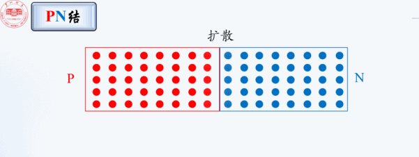
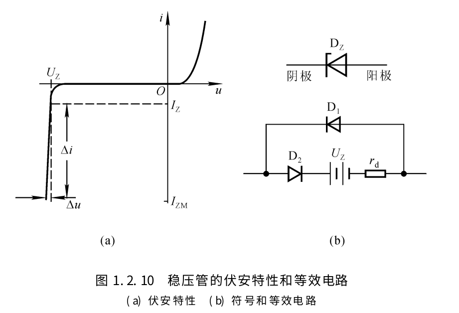
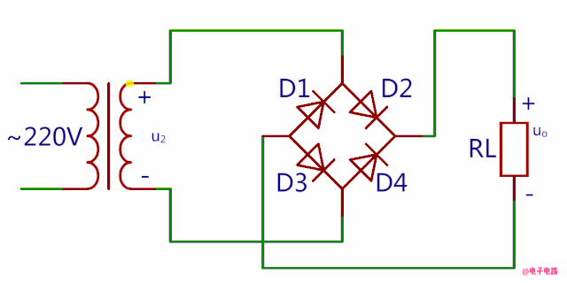
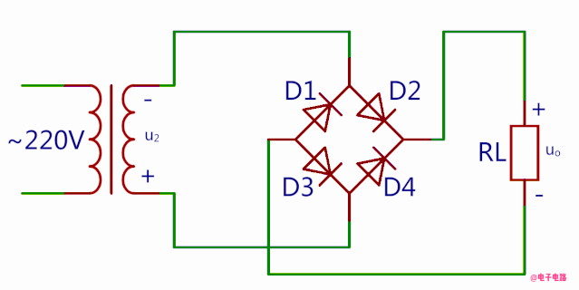
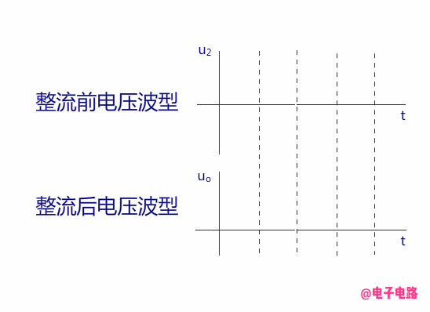

# 二极管

## N型半导体 和 P型半导体

在N型半导体中掺入五价元素, 在与周围的硅原子形成共价键后, 还多出一个电子, 多出的电子不受共价键的约束, 只需很少的能量就成为自由电子. N型半导体中, 自由电子是多子, 空穴是少子

在P型半导体中掺入三价元素, 在与周围的硅原子形成共价键后, 会就产生了一个空位, 当硅原子的外层电子填补空位时, 硅原子的共价键中便产生一个空穴. P型半导体中, 空穴是多子, 自由电子是少子

## PN结

[二极管 工作原理 How does a Diode work](https://www.bilibili.com/video/BV15T4y1L796)

[张云 - PN结的动画](http://blog.sciencenet.cn/blog-729147-1033899.html)

P型半导体和N型半导体构成PN结后, N区的电子(多子)会扩散到P区, 和P区的空穴结合, 于是N区产生了正离子, P区产生了负离子, 正离子和负离子之间形成了内电场, 内电场会阻碍扩散运动, 内电场也会让P区的电子(少子)向N区漂移

慢慢地, 当N区的电子浓度降低, 扩散运动减弱, 但是由于内电场是在不断增强, 所以漂移运动在不断增强, 直到扩散运动和漂移运动达到平衡

在无外电场和外部激发下, 参与扩散的多子与参与漂移的少子 数目相同, 从而达到动态平衡, 形成的这个内电场区域称之为PN结, 或: 阻挡层、耗尽层、空间电荷区.

## PN结 的 正向电压

## PN结 的 反向电压

在低掺杂的情况下, 耗尽层较宽, 当加很小的反向电压, 相当于是增强了内电场, 于是就加剧了少子的漂移运动, 同时多子的扩散作用也会加剧, 所以耗尽层会变窄, 并达到新的平衡.

在高掺杂的情况下, 耗尽层很窄, 当加很小的反向电压, 就会加剧少子的漂移运动, 在耗尽层形成很强的电场, 而直接破坏共价键, 使价电子脱离共价键的束缚, 产生电子-空穴对, 使电流急剧增大.

在很低的反向电压时, 就引起电流急剧增大, 这被称为齐纳击穿, 如果反向电压继续增大, 新产生的电子-空穴对被电场加速后又撞出其它的价电子, 载流子雪崩式倍增, 就产生了雪崩击穿.

## 为什么在掺杂浓度高的区域 空间电荷区更窄

结合的 N型半导体 和 P型半导体, 原子的密度应该是一样的, 只是掺杂的元素浓度不同.

因为N区电子与P区空穴结合才形成了N区正离子和P区的负离子, 这些正负离子是成对出现的, 如果掺杂浓度不同, 那么产生相同数量的正负离子数量所需的体积就不同. 掺杂浓度越高, 所需体积就越少, 所以 在掺杂浓度高的区域 空间电荷区更窄

## 稳压管工作原理

齐纳二极管又叫稳压二极管

稳压二极管的伏安特性, 如图.

正向偏置状态下, 稳压二极管表现为普通二极管的伏安特性, 即正向特性为指数曲线.
当反向电压增大到一定数值时则击穿, 击穿区的曲线很陡, 几乎平行于纵轴, 表现为很好的稳压特性

## 整流管工作原理

原理:

二极管整流利用了它具有单向导电性, 也就是电流只能从正极流向负极, 而不能从负极流向正极.

只有二极管两端加正向电压并且大于一定值时, 二极管才会导通, 导通后电阻很小, 相当于一根导线.

而在二极管两端加反向电压时, 二极管因为内部PN结的关系, 反向电流很小, 可以忽略不计, 可以看作是截止状态.

### 半波整流电路

参考: [二极管整流电路工作原理图解](https://www.diangon.com/thread-34486-1-1.html)

半波整流电路:

半波整流电路波形:

220V/50Hz交流电经过变压器输出U2, U2也是正弦交流电压, 大小和方向不断变化.

当正半周流过二极管时, A点电位处于高电平, B点电位处于低电平, 二极管处于正向偏置, 此时二极管导通.

当负半周流向二极管时, A点电位低于B点电位, 二极管反偏, 处于截至状态, 没有电流流过.

产生的波形只在一个方向上变化, 称这种为脉动直流电

### 桥式整流电路

参考: [秒懂桥式整流工作原理(动画)](https://www.eet-china.com/mp/a10091.html)

变压器u2正半周时电流通路:

变压器u2负半周时电流通路:

整个周期电流通路是这样的:

桥式整流电路输出波形与全波整流电路的一样, 也是全波波形, 所以整流后输出电压是整流前的0.9倍

总结:

- 画图时要注意4只整流二极管连接方法.
- 电源变压器次级线圈不需要抽头.
- 每一个半周交流输入电压期间, 有2只整流二极管同时串联导通, 另外2只整流二极管截止.
- 桥式整流电路输出波形是全波波形

## TVS 瞬态抑制二极管

bilibli: https://www.bilibili.com/video/BV1bF411x7Kq/?spm_id_from=333.337.search-card.all.click&vd_source=4b8e4607ee8739eb33686a58fbd4c3a5

### 主要参数

1. Vrwm截止电压

在Vrwm下, 认为TVS是不工作的, 即是不导通的. 要求Vrwm要大于工作电压, 否则工作电压大于Vrwm会导致TVS反向漏电流增大, 接近导通, 或者雪崩击穿, 影响正常电路工作. 通常选取截止电压为工作电压的1.1~1.2倍.

2. IR漏电流

漏电流, 也称待机电流. 对于同功率和同电压的TVS, 在VRWM≤10V时, 双向TVS漏电流是单向TVS漏电流的2倍. 漏电流主要带来了功率的损耗, 或者是在模拟信号中, 会影响AD信号的采样值, 所以TVS的漏电流越小越好.

3. VBR击穿电压

击穿电压, 指在V-I特性曲线上, 在规定的脉冲直流电流IT或接近发生雪崩的电流条件下测得TVS两端的电压.

4. IPP峰值脉冲电流, VC钳位电压

IPP及VC是衡量TVS在电路保护中抵抗浪涌脉冲电流及限制电压能力的参数. 对于同型号TVS, 在相同IPP下的VC越小, 说明TVS的钳位特性越好.

IPP可能很大, 如: 20A

TVS钳位电压应小于后级被保护电路 可承受的瞬态安全电压, VC与TVS的雪崩击穿电压及IPP都成正比. TVS的 箝位电压Vc不能大于被防护电路可以承受的 电压Vmax, 否则会对电路造成损坏.

5. 结电容CI

结电容是TVS中的寄生电容, 在高速IO端口保护需要重点关注, 过大的结电容可能会影响信号的质量. 所以漏电流越小越好.

### 一个管子的示例 SMF6.0CA

https://item.szlcsc.com/1600216.html

反向0~6.0V 处于截止 时 泄露电流为 800uA

反向关断电压为 6V, 反向击穿电压为7V, 钳位电压约为 10.3V, 峰值脉冲电流约为 19.4A
