# 晶体管

## 二极管

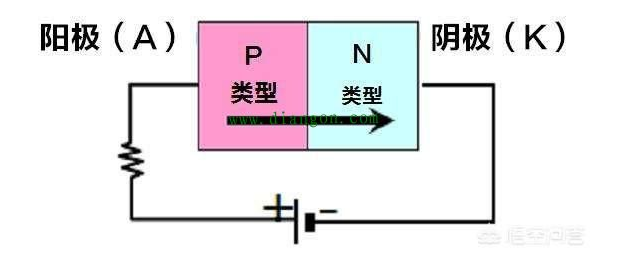

系统性学习: [如何从0到1了解二极管](https://zhuanlan.zhihu.com/p/46585242)

### 稳压管工作原理

齐纳二极管又叫稳压二极管

稳压二极管的伏安特性, 如图.

正向偏置状态下, 稳压二极管表现为普通二极管的伏安特性, 即正向特性为指数曲线.
当反向电压增大到一定数值时则击穿, 击穿区的曲线很陡, 几乎平行于纵轴, 表现为很好的稳压特性

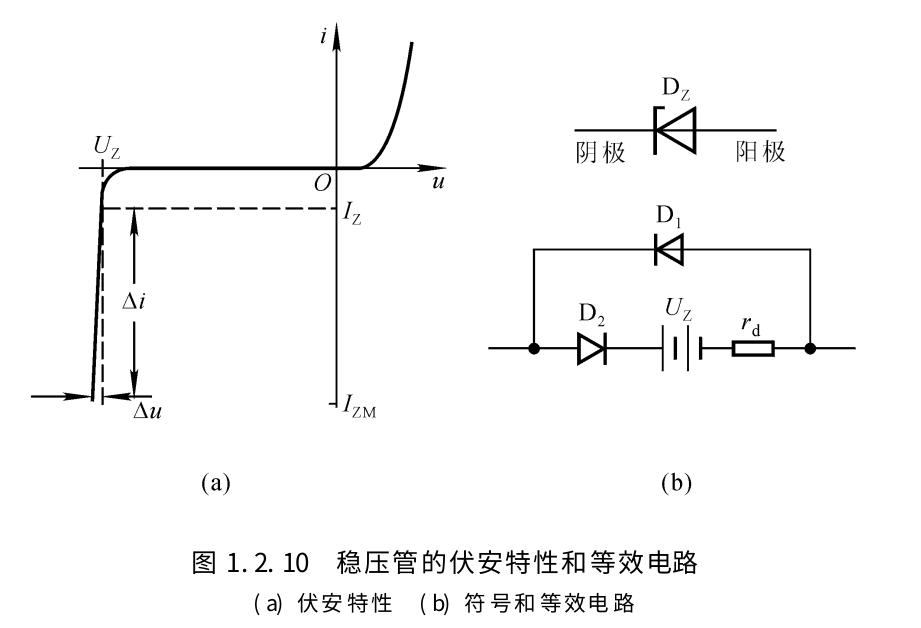

### 整流管工作原理

原理:

二极管整流利用了它具有单向导电性, 也就是电流只能从正极流向负极, 而不能从负极流向正极. 只有二极管两端加正向电压并且大于一定值时, 二极管才会导通, 导通后电阻很小, 相当于一根导线.
而在二极管两端加反向电压时, 二极管因为内部PN结的关系, 反向电流很小, 可以忽略不计, 可以看作是截止状态.

#### 半波整流电路

参考: [二极管整流电路工作原理图解](https://www.diangon.com/thread-34486-1-1.html)

半波整流电路:
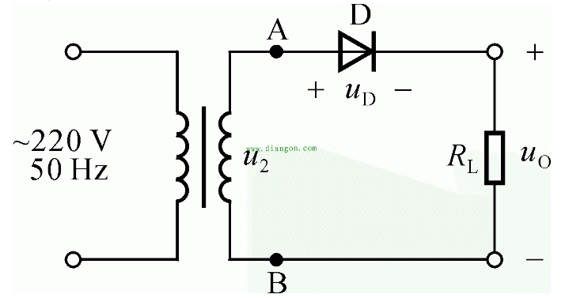

半波整流电路波形:
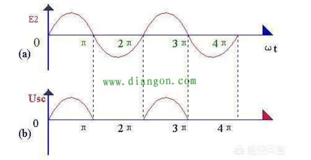

220V/50Hz交流电经过变压器输出U2, U2也是正弦交流电压, 大小和方向不断变化. 当正半周流过二极管时, A点电位处于高电平, B点电位处于低电平, 二极管处于正向偏置, 此时二极管导通, 当负半周流向二极管时, A点电位低于B点电位, 二极管反偏, 处于截至状态, 没有电流流过. 产生的波形只在一个方向上变化, 称这种为脉动直流电

#### 桥式整流电路

参考: [秒懂桥式整流工作原理(动画)](https://www.eet-china.com/mp/a10091.html)

变压器u2正半周时电流通路:
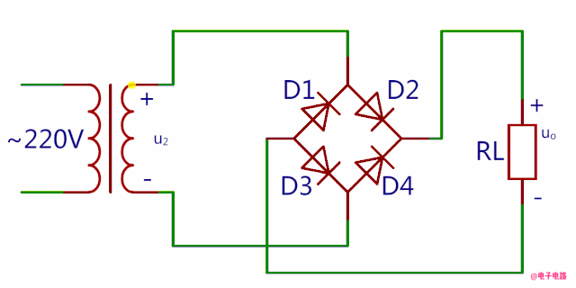

变压器u2负半周时电流通路:
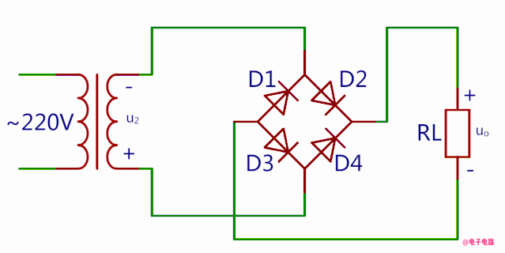

整个周期电流通路是这样的:
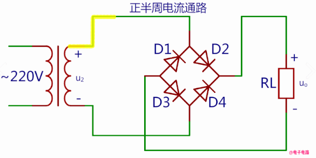

桥式整流电路输出波形与全波整流电路的一样, 也是全波波形, 所以整流后输出电压是整流前的0.9倍
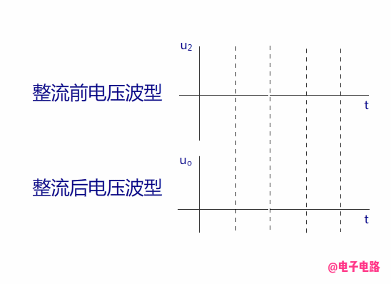

总结:

（1）画图时要注意4只整流二极管连接方法.
（2）电源变压器次级线圈不需要抽头.
（3）每一个半周交流输入电压期间, 有2只整流二极管同时串联导通, 另外2只整流二极管截止.
（4）桥式整流电路输出波形是全波波形

## 三极管

参考: [三极管的动画](http://blog.sciencenet.cn/blog-729147-1041542.html)

### 用几个动画简单的解释下: 为什么小电流Ib能控制大电流Ic的大小, 以及放大电路的原理

这里的三极管是双极型晶体管, 模电的放大电路和数电的简单逻辑电路里面都会用到.
有集电极c、基极b、发射极e、以及两个PN结：集电结和发射结. 集电极面积比较大, 基极厚度薄而且载流子浓度比较低.

下图是个NPN型的三极管:
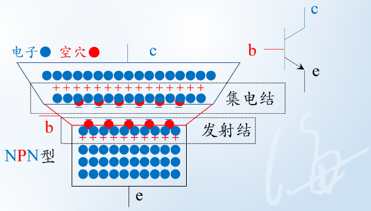

当发射结正偏时, 电荷分布会发生变化, 发射结宽度会变窄;相当于给电子打开了一扇e到b的大门

集电结反偏时, 电荷分布会也发生变化, 集电结宽度会变宽. 相当于打开了阻碍电子从c级跑出去的大门, 如下方动画所示:
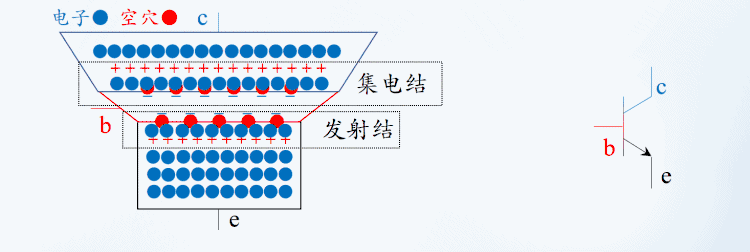

b级会接一个大电阻RB限制电流Ib的大小, 跑到b极的那些多余的电子就只好穿越集电结, 形成电流Ic, 如下方动画所示：
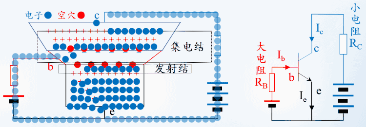

如果基极电压翻倍, 电荷分布会继续发生变化, 发射结宽度会变得更窄, 这扇大门变得更宽了, 将会有更多的电子跑到b级. 如下方动画所示:
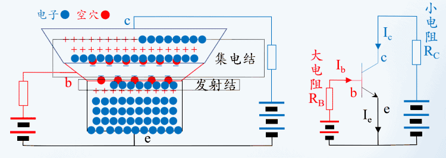

由于RB是大电阻, Ib就算翻倍了也还是很小, 所以更多的电子会穿越集电结, 让Ic也翻倍. 如下方动画所示:
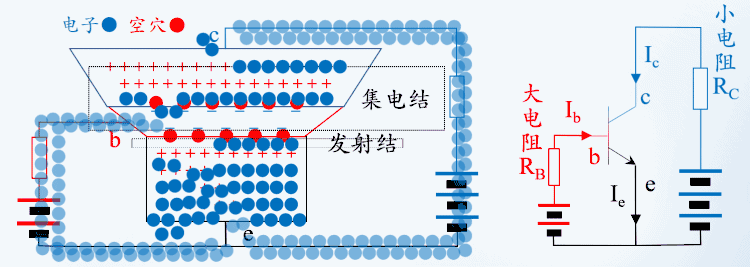

两个直流电源是可以合并到一起的, 再加上小信号ui和两个电容, 就得到了放大电路, 如下图所示:
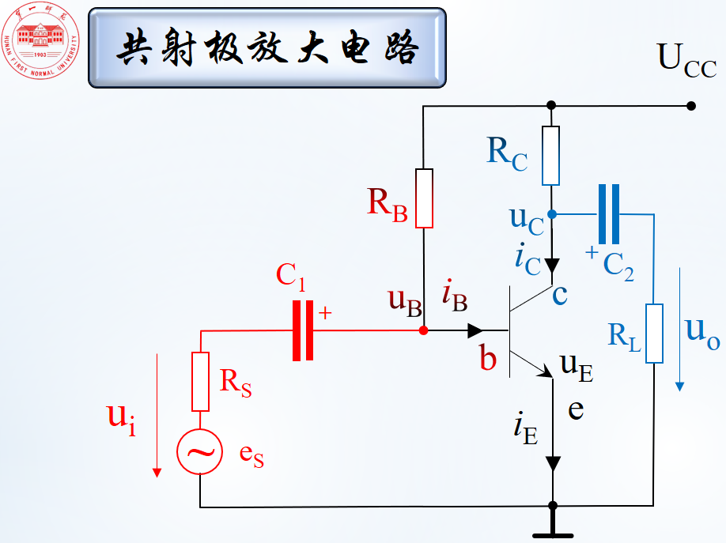

如果电阻大小合适, 这个放大电路能够将小信号ui放大成相位相反的大信号uCE, 如下方动画所示:
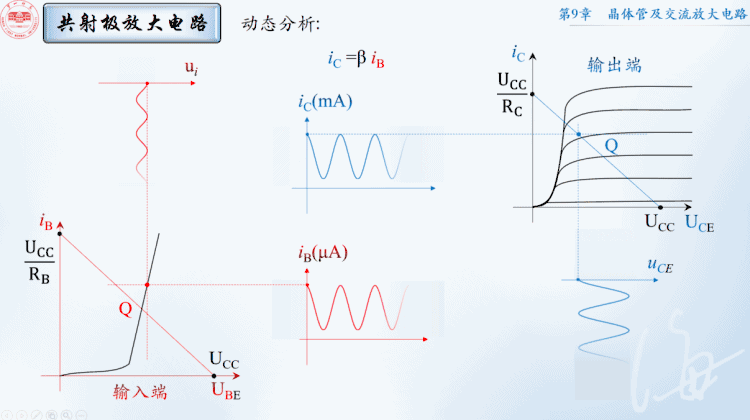
红色为输入端, ui的变化会影响UBE, 把发射结看成一个小电阻, 红色的Q点就会沿黑线运动, 然后画出iB的图像;
根据iC=βiB,画出iC的图像, 纵坐标从μA变成了mA;
而输出端有UCE=UCC-ICRC, 当UCC、RC不变时, UCE与IC反相

动画的不足之处:
1. 水箱的比喻容易让人产生一种误解, 认为IC最大, 其实IE才是最大的电流
2. 动画里完全忽略了电子的热运动速度, 那个速度远大于电压作用下电子的漂移速度
3. 动画里并没有体现出能级、能带、费米分布等内容
