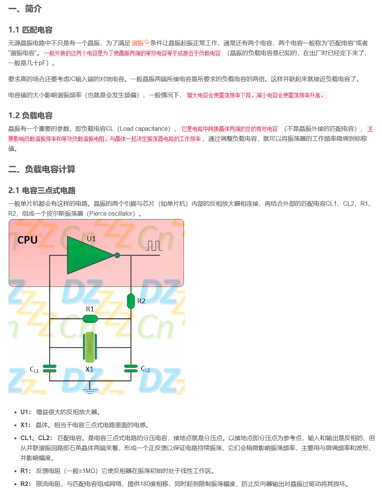
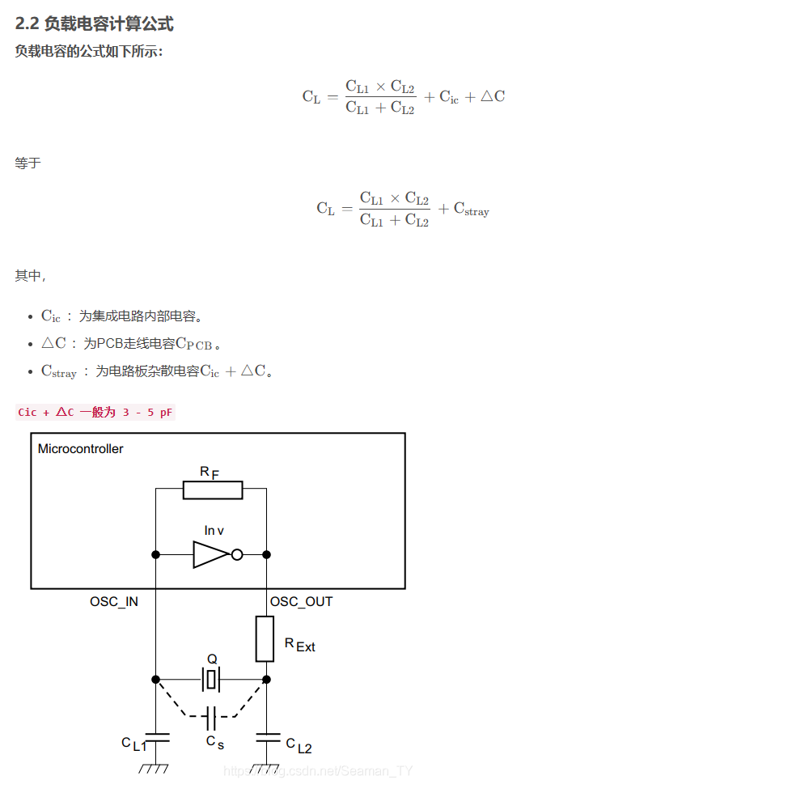
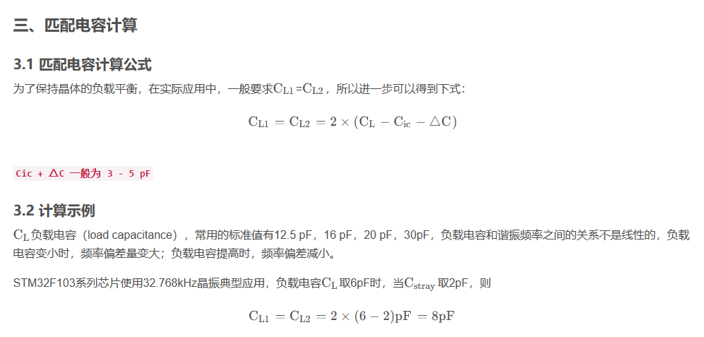
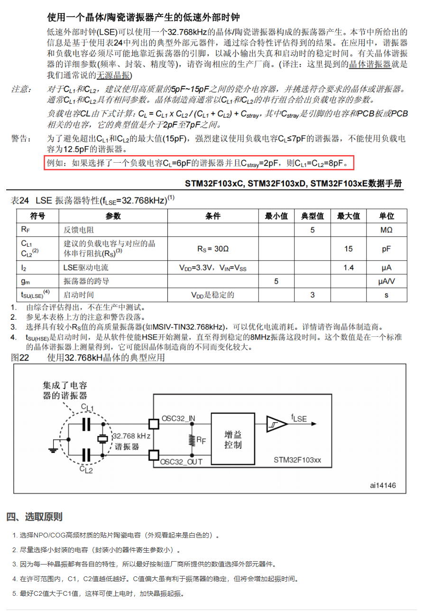
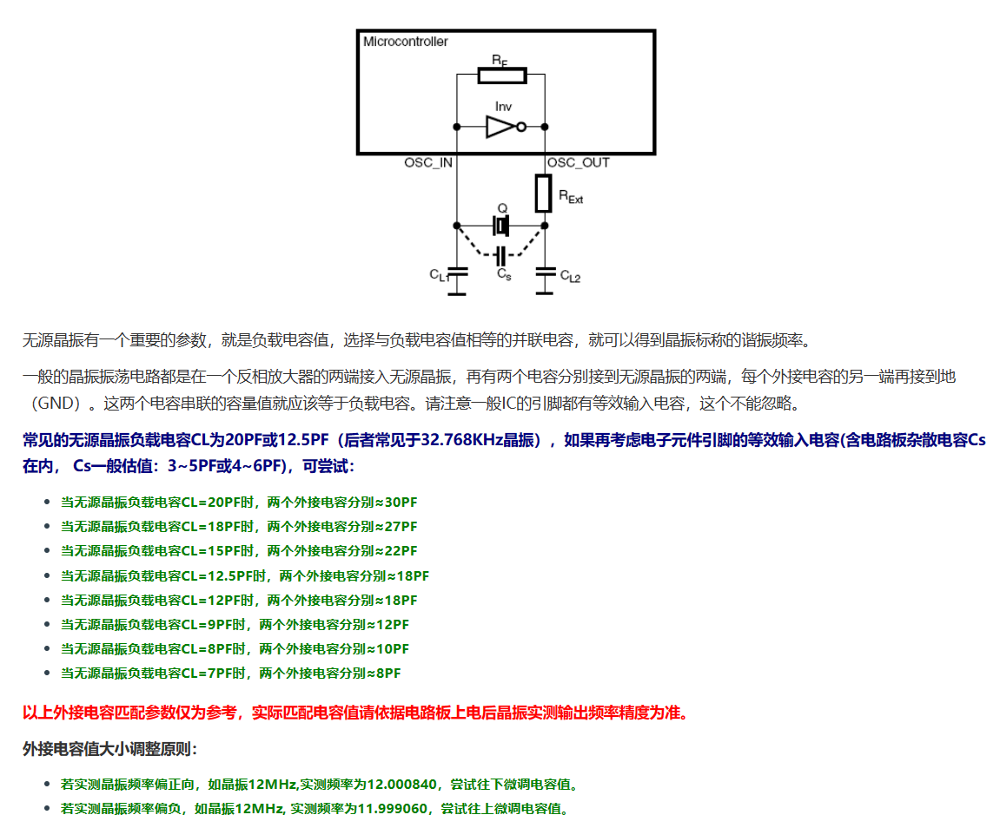

# 晶振

## 文档说明

- 本文档用于收纳晶振的基础理解与负载电容匹配问题.
- 更偏 MCU 接入与板级布局的内容, 后续可继续扩展为应用专题.

## 无源晶振

晶振匹配介绍:

- https://blog.csdn.net/qq_36347513/article/details/121246522

## 负载电容值 CL 匹配

参考:

- https://www.genuway.com/3959.html
- https://www.bilibili.com/video/BV1bF411x7Kq/

## 设计经验

- 负载电容较大的谐振器, 往往需要更大的驱动能力.
- 低功耗产品通常更偏向负载电容更小的方案.
- 实际板级设计时, 还需要同时关注走线长度, 接地完整性, 干扰源距离等问题.
