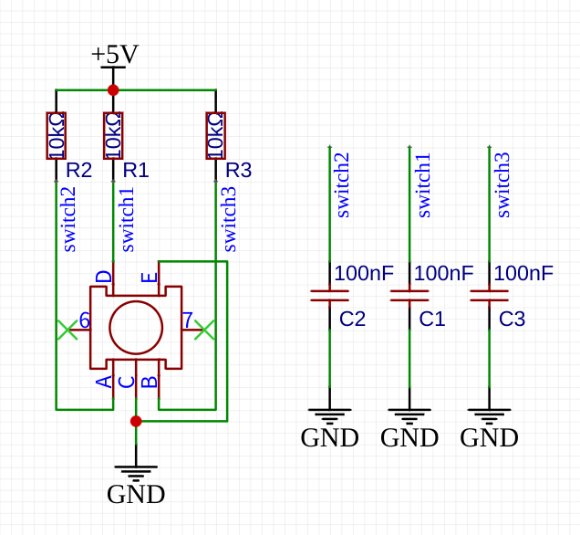
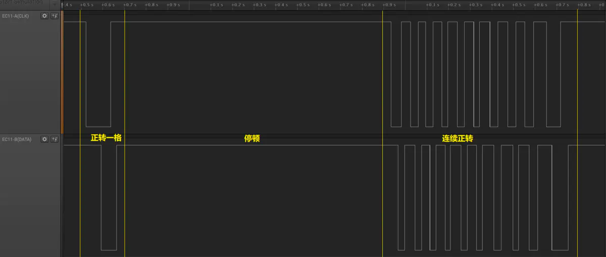
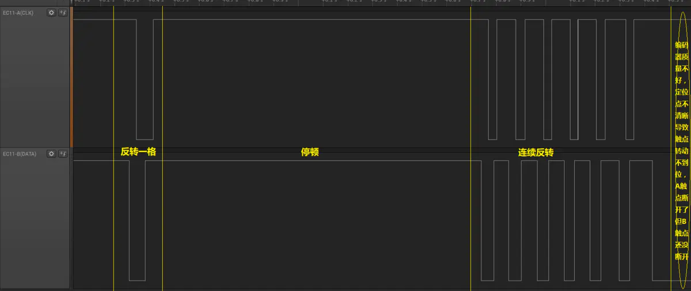

# EC11旋转编码器

https://www.jianshu.com/p/41fa67ecb248

## 原理图



## 使用

1. 当按钮按下时, D 可以读取到低电平

2. 当旋转旋钮时, A 和 B 会产生脉冲信号

      A 的状态发生改变后
            如果 B 的当前状态 等于 A 的当前状态, 则为 逆时针
            如果 B 的当前状态 不等于 A 的当前状态, 则为 顺时针


信号:

```
A      +-----+     +-----+     +-----+
             |     |     |     |
             |     |     |     |
             +-----+     +-----+
B         +-----+     +-----+     +-----+
                |     |     |     |
                |     |     |     |
                +-----+     +-----+

 +--------------------------------------->
                CW direction
```

## 接线

```
      +--------+              +---------------------------------+
      |        |              |                                 |
      |      A +--------------+ GPIO_A (internal pull up)       |
      |        |              |                                 |
+-------+      |              |                                 |
|     | |  GND +--------------+ GND                             |
+-------+      |              |                                 |
      |        |              |                                 |
      |      B +--------------+ GPIO_B (internal pull up)       |
      |        |              |                                 |
      +--------+              +---------------------------------+
```

GPIO_A 上拉输入
GPIO_B 上拉输入

## 时序

参考资料: https://www.jianshu.com/p/41fa67ecb248

一定位一脉冲EC11时序图

正转一格-->停顿-->连续正转-->停:



反转一格-->停顿-->连续反转-->停:



若将EC11的A端视为时钟，B端视为数据，整个EC11就可以视为根据时钟脉冲输出信号的同步元件。可以看做数据在时钟的边沿处输出（时钟线检测边沿，数据线检测电平，这个思路编程最简单）

正转时，在时钟线的下降沿处，数据线为高电平。或在时钟线的上升沿处，数据线为低电平;
反转时，在时钟线的下降沿处，数据线为低电平。或在时钟线的上升沿处，数据线为高电平。

可以不严谨的简单总结为时钟的下降沿处A、B反相为正转，同相为反转
