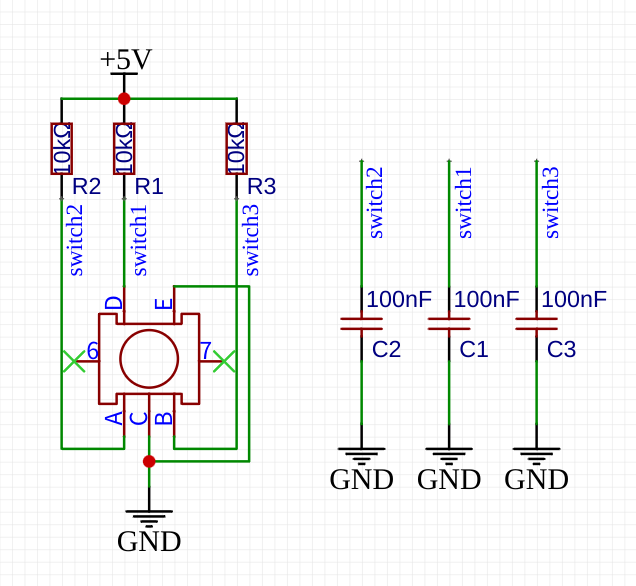
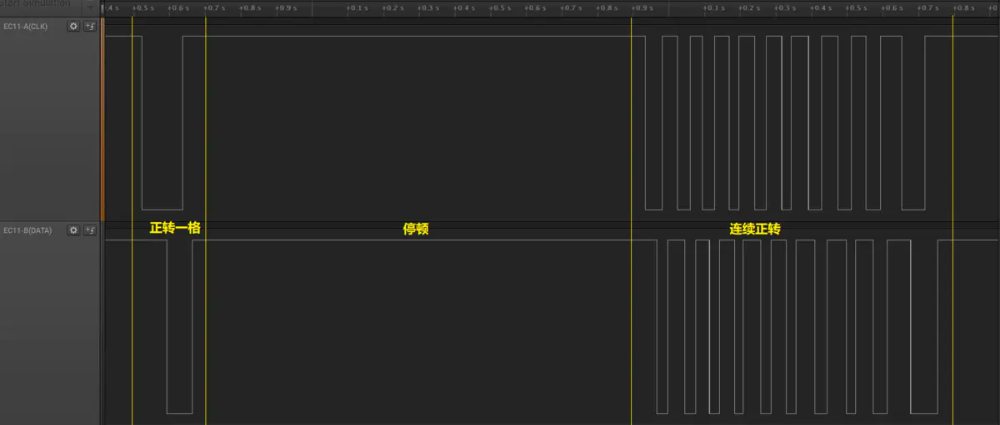
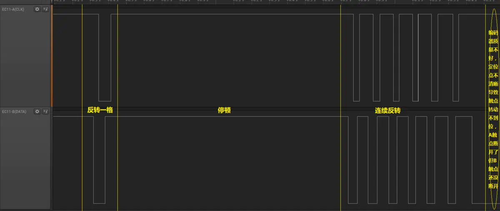

# EC11 旋转编码器

## 说明

- 本页记录 `EC11` 旋转编码器的原理图, 接线方式和方向判定思路.
- 适合做菜单旋钮, 参数调节和本地人机输入时的硬件上手记录.

## 参考资料

- <https://www.jianshu.com/p/41fa67ecb248>

## 原理图



## 基本使用

1. 当按钮按下时, `D` 可以读取到低电平.
2. 当旋转旋钮时, `A` 和 `B` 会产生相位错开的脉冲信号.
3. 只要在 `A` 的边沿采样 `B` 的电平, 就可以判断旋转方向.

常用判断思路:

- `A` 状态变化后, 若 `B` 当前状态等于 `A`, 记为逆时针.
- `A` 状态变化后, 若 `B` 当前状态不等于 `A`, 记为顺时针.

## 信号理解

```text
A      +-----+     +-----+     +-----+
             |     |     |     |
             |     |     |     |
             +-----+     +-----+
B         +-----+     +-----+     +-----+
                |     |     |     |
                |     |     |     |
                +-----+     +-----+

 +--------------------------------------->
                CW direction
```

## 接线

```text
      +--------+              +---------------------------------+
      |        |              |                                 |
      |      A +--------------+ GPIO_A (internal pull up)       |
      |        |              |                                 |
+-------+      |              |                                 |
|     | |  GND +--------------+ GND                             |
+-------+      |              |                                 |
      |        |              |                                 |
      |      B +--------------+ GPIO_B (internal pull up)       |
      |        |              |                                 |
      +--------+              +---------------------------------+
```

- `GPIO_A` 上拉输入.
- `GPIO_B` 上拉输入.

## 时序理解

一定位一脉冲 `EC11` 时序图:

- 正转一格 -> 停顿 -> 连续正转 -> 停:



- 反转一格 -> 停顿 -> 连续反转 -> 停:



可以把 `A` 视为时钟, `B` 视为数据:

- 正转时, 在时钟下降沿处, 数据线为高电平; 或在时钟上升沿处, 数据线为低电平.
- 反转时, 在时钟下降沿处, 数据线为低电平; 或在时钟上升沿处, 数据线为高电平.

一个便于记忆的经验总结是:

- 在时钟下降沿处, `A / B` 反相时可视为正转.
- 在时钟下降沿处, `A / B` 同相时可视为反转.

## 使用建议

- 软件上要做去抖动, 否则一格旋转可能被识别成多次抖动触发.
- 若同时使用按压功能, 还要单独处理按键消抖和长按逻辑.
- 如果旋转方向和预期相反, 可以优先对调 `A` / `B` 两路接线或调整软件判断逻辑.
