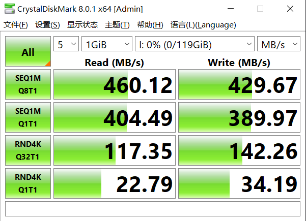
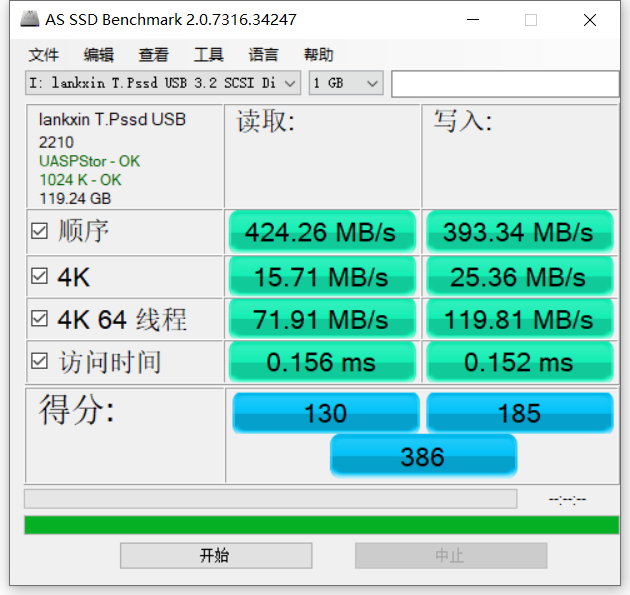
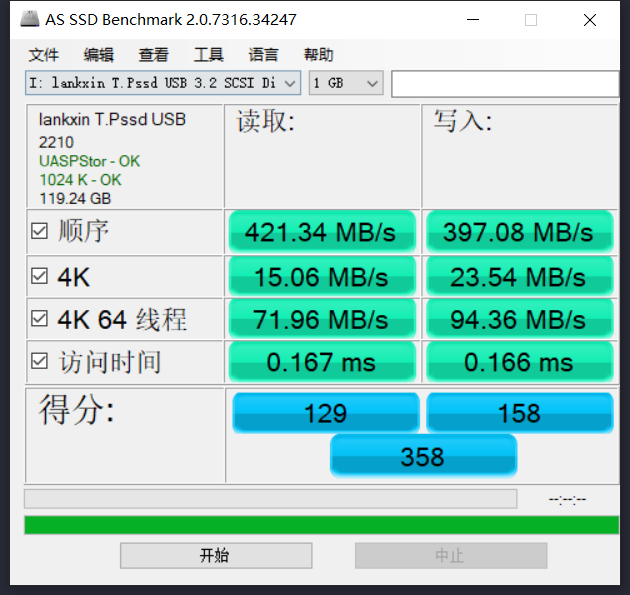
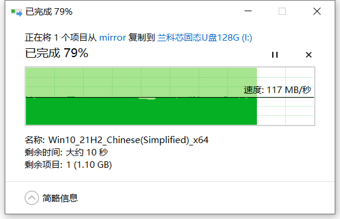

# 兰科芯128G U盘

## 说明

- 本页记录一款 `128G` U 盘的拆解与简单使用观察.
- 当前内容以外观, 拆解照片和使用场景记录为主, 更适合作为设备档案页.
- 若后续继续补测速, 主控和颗粒信息, 这页可以进一步升级成完整评测记录.

## 外观与拆解

### 当前可记录的信息

- 容量标称为 `128G`.
- 已保留拆解照片, 便于后续回看结构和器件布局.
- 暂未系统记录主控型号与闪存颗粒编号.

## 使用场景

### 机械硬盘到 U 盘的数据迁移

- 适合临时备份, 小规模文件迁移和现场资料拷贝.
- 若数据重要, 仍建议配合校验和或二次备份.

### 手机转接使用

- 在手机上通过 `USB -> Type-C` 转接头使用时, 观察到的速度大约在 `30M ~ 50M`.
- 这类场景更依赖手机接口规格, 转接头质量和文件类型.

## 建议补充的测试项

### 1. 基础信息

- 主控型号.
- 闪存颗粒信息.
- 实际可用容量.

### 2. 性能测试

- 顺序读写测速.
- 随机读写测速.
- 小文件与大文件混合拷贝表现.

### 3. 稳定性测试

- 长时间连续写入后的掉速情况.
- 发热表现.
- 在 Windows, Linux, Android 下的兼容性.

## 使用建议

- 这类设备页更适合做“硬件档案 + 现场观察”记录, 不必强行写成通用知识页.
- 若后续测得完整参数, 可把“照片记录”和“性能评测”拆成两个小节长期维护.
- 如果只是查接口和转接器兼容性, 建议与其它移动存储设备页统一比较维度.

## 相关文档

- [硬件总览](../README.md)
