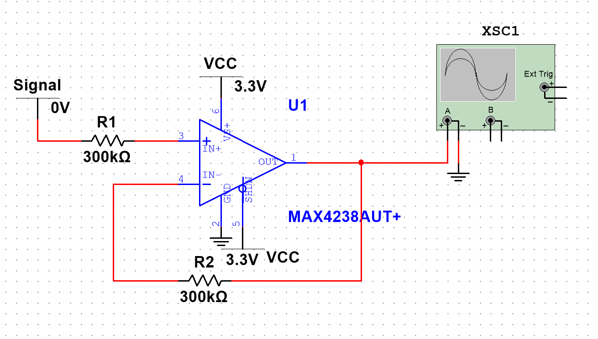

# 运算放大器

## 文档说明

- 本文档用于收纳运放相关基础应用笔记.
- 当前内容偏向模拟前端与板级调试经验, 后续可继续扩展为反相, 同相, 差分, 仪表放大器等专题.

## 常见关注点

- 放大倍数是否稳定.
- 输入失调, 噪声和带宽是否满足要求.
- 单电源 / 双电源供电条件是否匹配.
- ADC 前端的地线与参考电压处理是否合理.

## 比例运算放大电路中的平衡电阻

参考:

- <https://www.zhihu.com/zvideo/1632270957531435008>

理解要点:

- 平衡电阻常用于减小输入偏置电流带来的误差影响.
- 在高阻值网络里, 这类误差往往更需要关注.

## ADC 数字地 DGND 与模拟地 AGND

参考:

- <https://www.analog.com/media/cn/technical-documentation/evaluation-documentation/MT-031_cn.pdf>

使用建议:

- ADC 前端要优先考虑模拟地回流路径.
- 若数字地噪声较大, 可能会直接影响采样稳定性和分辨率表现.

## 同向放大器

部分测试记录:

- `1k`: `10.305uV`
- `10k`: `10.295uV`
- `100k`: `0(205.46nV) 1uV(1.205uV) 10uV(10.203uV) 100uV(100.185uV) 999uV(999.006uV)`
- `300k`: `0(4.565nV) 1uV(1.004uV) 10uV(9.999uV) 100uV(99.945uV) 999uV(998.406uV)`
- `500k`: `0(-197.049nV) 1uV(802.027nV) 10uV(9.793uV) 100uV(99.703uV) 999uV(997.806uV)`
- `1000k`: `0(-705.21nV) 1uV(292.798nV)`

当前记录结论:

- 在这组测试条件下, `100k` 是相对合适的选择.

## 后续可补主题

- 反相放大器与同相放大器的差异.
- 差分放大与共模抑制.
- 运放选型中的 GBW, SR, 输入偏置电流.
- 低噪声前端与 ADC 驱动设计.
