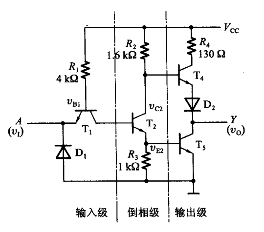
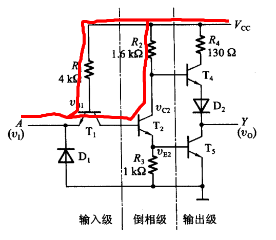

基本的门电路

触发器/RS触发器/D触发器/边沿性D触发器 工作原理
锁存器 工作原理

## TTL触发器

参考自: 数字电子技术基础 - 3.5.2  TTL反相器的电路结构和工作原理

### 分析

设 $V_{CC}$ 为5v, 输入信号: $V_{IH} = 3.4V$, $V_{IL} = 0.2V$. 开启电压: $V_{ON}=0.7V$.

#### $v_I=V_{IL}=0.2V$

$T_1$ 的发射结必然导通. 导通后 $T_1$ 的基极电位被钳在 $v_{B1} = V_{IL} + V_{ON} = 0.9V$, $i_B = (V_{CC} - v_B) / R_1 = 1.025mA$. 根据 $T_1$ 的集电极回路, 可以计算 $T_1$ 的最大饱和电流为: $5v / 1.6k\Omega = 3.125mA$, 由于$\beta$一般在几十到几百, $3.125 / 1.025 \approx 3$远小于正常值, 因此 $T_1$ 工作在饱和状态, 所以 $v_{b2}$ 小于 $v_{b1}$, 所以 $T_2$ 截至, $v_{b5} = 0$, $T_5$ 截至. $T_2$ 截至, $r_{ce2}$ 很大, 所以 $v_{c2} \approx 5V$, $v_{b4} \approx 5V$, $T_4$ 导通, $v_e4 \approx 4.3V$, 经过D2后, $v_o \approx 4.3V - 0.7V = 3.6V$

#### $v_I=V_{IH}=3.4V$
