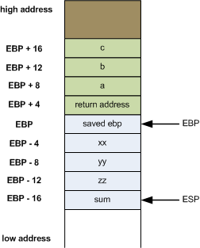

# nasm 学习笔记

非常详细的入门教程: https://cs.lmu.edu/~ray/notes/nasmtutorial

nasm官方pdf: https://www.nasm.us/xdoc/2.14.02/nasmdoc.pdf

ps: 学习nasm笔记, 有所疏漏, 在所难免

## 找了下常见寄存器的缩写, 以及常见寄存器的解释, 辅助理解, 并不是nasm的内容

    AX  累加寄存器, Accumulator register
    BX  基寄存器,   Base register
    CX  计数寄存器, Count register
    DX  数据寄存器, Data register

    CS(Code Segment): 代码段寄存器
    DS(Data Segment): 数据段寄存器
    SS(Stack Segment): 堆栈段寄存器
    ES(Extra Segment): 附加段寄存器

    eax 是"累加器"（accumulator）, 它是很多加法乘法指令的缺省寄存器
    ebx 是"基地址"（base）寄存器, 在内存寻址时存放基地址
    ecx 是计数器（counter）， 是重复（REP）前缀指令和LOOP指令的内定计数器
    edx 则总是被用来放整数除法产生的余数

## 跳转指令

## 传送指令

## 寄存器立即数

In this tutorial we only care about the integer registers and the xmm registers.

16个 64bit 整型寄存器:

    R0  R1  R2  R3  R4  R5  R6  R7  R8  R9  R10  R11  R12  R13  R14  R15
    RAX RCX RDX RBX RSP RBP RSI RDI

使用下面的names访问 lowest 32-bits of each register

    R0D R1D R2D R3D R4D R5D R6D R7D R8D R9D R10D R11D R12D R13D R14D R15D
    EAX ECX EDX EBX ESP EBP ESI EDI

使用下面的names访问 lowest 16-bits of each register

    R0W R1W R2W R3W R4W R5W R6W R7W R8W R9W R10W R11W R12W R13W R14W R15W
    AX  CX  DX  BX  SP  BP  SI  DI

使用下面的names访问 lowest 8-bits of each register

    R0B R1B R2B R3B R4B R5B R6B R7B R8B R9B R10B R11B R12B R13B R14B R15B
    AL  CL  DL  BL  SPL BPL SIL DIL

由于历史原因, R0 ~ R3 的 bit15 ~ bit8 被命名:

    AH  CH  DH  BH

有16 XMM registers, 每一个 128 bits wide:

    XMM0 ... XMM15

## 理解函数调用过程

    1. 从左到右, 参数被传递到寄存器, 传递的顺序是:

        对于整型或指针: rdi, rsi, rdx, rcx, r8, r9
        对于浮点型, xmm0, xmm1, xmm2, xmm3, xmm4, xmm5, xmm6, xmm7

    2. 额外的参数 pushed stack 中,从右向左, 在call函数完成后被弹出

    3. 在参数 pushed 之后, 开始执行 call 指令, call会将函数的返回地址push到栈中, 所以当被调用的函数获取控制(即进入函数内部), 返回地址是在[rsp]中, 第一块内存(函数体开头)是从[rsp+8]开始

    4. 在执行call之前, 栈指针rsp必须被对齐到16个字节, 由于执行call时, 在栈顶中放入返回地址
        所以当一个函数获取控制时, rsp未被分配, 这需要你自己做出额外的空间, 比如: push 一些空间, 或 sub rsp, 8

    5. 要求被调用函数保存的寄存器是: rbp, rbx, r12, r13, r14, r15, 其它的寄存器都可以被被调用函数自由更改

    6. 被调用者也应该保存XMCSR和x87控制字的控制位, 但是x87指令在64位代码中很少用, 所以你一般不需要担心这个

    7. 整形被返回在rax或rdx:rax寄存器中, 浮点型被返回在xmm0 or xmm1:xmm0寄存器中

## 伪指令

伪指令并不是真正的X86机器指令, 伪指令包括:

    DB, DW, DD, DQ, DT, DO, DY and DZ

    their uninitialized counterparts RESB

    RESW, RESD, RESQ, REST, RESO, RESY and RESZ

    the INCBIN command

    the EQU command

    TIMES prefix

## 声明初始化变量

    DB, DW, DD, DQ, DT, DO, DY and DZ

    ps: DT, DO, DY and DZ  do not accept numeric constants as operands

```nasm
; examples:
    db 0x55 ; just the byte 0x55
    db 0x55,0x56,0x57 ; three bytes in succession
    db ’a’,0x55 ; character constants are OK
    db ’hello’,13,10,’$’ ; so are string constants
    dw 0x1234 ; 0x34 0x12
    dw ’a’ ; 0x61 0x00 (it’s just a number)
    dw ’ab’ ; 0x61 0x62 (character constant)
    dw ’abc’ ; 0x61 0x62 0x63 0x00 (string)
    dd 0x12345678 ; 0x78 0x56 0x34 0x12
    dd 1.234567e20 ; floating−point constant
    dq 0x123456789abcdef0 ; eight byte constant
    dq 1.234567e20 ; double−precision float
    dt 1.234567e20 ; extended−precision float
```

## 声明未初始化的变量

    RESB, RESW, RESD, RESQ, REST, RESO, RESY and RESZ 用于一个module的BSS段, 声明未初始化的存储空间

## 定义常量

    message db ’hello, world’
    msglen equ $-message

    ps: '$'被确定在第一次定义的时候, 而不是在引用的时候

## TIMES: 重复指令或数据

    既可以用于常量, 也可以用于表达式

    zerobuf: times 64 db 0

    buffer: db ’hello, world’
            times 64−$+buffer db ' '

    times 100 resb 1 and resb 100, 汇编组装时间不同, 功能相同

## 有效地址

```nasm

wordvar dw 123
        mov ax, [wordvar]
        mov ax, [wordvar+1]
        mov ax, [es:wordvar+bx]

        mov eax, [ebx*2+ecx+offset]
        mov ax, [bp+di+8]

        mov ax, [dword eax+3]
        mov ax, [byte eax+offset]

```

## INCBIN: 包含额外的二进制文件

    incbin "file.dat" ; include the whole file
    incbin "file.dat",1024 ; skip the first 1024 bytes
    incbin "file.dat",1024,512

## 条件指令

在算术或逻辑指令或者比较指令之后, 处理器设置或清除它的状态标志flags, 最有趣的flags是:

    s (sign)
    z (zero)
    c (carry)
    o (overflow)

条件指令有三种格式:

    j for conditional jump
    cmov for conditional move
    set for conditional set

比如:

    1.  cmp x, y        ; 比较x和y
        je  LABEL       ; 相等就跳转至标号LEVEL
    2.  cmovl  x, y     ; 如果x小于y,则 mov x, y
    3.  setc x          ; 最后最后一个操作有进位标志"carry", 就x=1, 否则x=0

条件后缀:

    s ns z nz c nc o no p np pe po e ne l nl le nle g ng ge nge a na ae nae b nb be nbe

## 一个简单的程序: 解析命令行参数

@import "test_cmd_args.nasm"

## 分析c源文件转成masn, 非nasm的过程, 以此学习函数调用过程

此处相关链接: https://eli.thegreenplace.net/2011/02/04/where-the-top-of-the-stack-is-on-x86

对目标文件汇编, 32位: gcc -S -m32 -o z.s disassembly.c

这个程序很到位, 看了很容易懂~

```c
; filename: disassembly.c

int foobar(int a, int b, int c)
{
    int xx = a + 2;
    int yy = b + 3;
    int zz = c + 4;
    int sum = xx + yy + zz;

    return xx * yy * zz + sum;
}

int main()
{
    return foobar(77, 88, 99);
}

```



```nasm
_foobar:
    ; ebp must be preserved across calls. Since
    ; this function modifies it, it must be
    ; saved.
    ;
    push    ebp

    ; From now on, ebp points to the current stack
    ; frame of the function
    ;
    mov     ebp, esp

    ; Make space on the stack for local variables
    ;
    sub     esp, 16

    ; eax <-- a. eax += 2. then store eax in xx
    ;
    mov     eax, DWORD PTR [ebp+8]
    add     eax, 2
    mov     DWORD PTR [ebp-4], eax

    ; eax <-- b. eax += 3. then store eax in yy
    ;
    mov     eax, DWORD PTR [ebp+12]
    add     eax, 3
    mov     DWORD PTR [ebp-8], eax

    ; eax <-- c. eax += 4. then store eax in zz
    ;
    mov     eax, DWORD PTR [ebp+16]
    add     eax, 4
    mov     DWORD PTR [ebp-12], eax

    ; add xx + yy + zz and store it in sum
    ;
    mov     eax, DWORD PTR [ebp-8]
    mov     edx, DWORD PTR [ebp-4]
    lea     eax, [edx+eax]
    add     eax, DWORD PTR [ebp-12]
    mov     DWORD PTR [ebp-16], eax

    ; Compute final result into eax, which
    ; stays there until return
    ;
    mov     eax, DWORD PTR [ebp-4]
    imul    eax, DWORD PTR [ebp-8]
    imul    eax, DWORD PTR [ebp-12]
    add     eax, DWORD PTR [ebp-16]

    ; The leave instruction here is equivalent to:
    ;
    ;   mov esp, ebp
    ;   pop ebp
    ;
    ; Which cleans the allocated locals and restores
    ; ebp.
    ;
    leave
    ret
```
