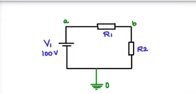

## 用法

    ngspice ex01.cir

    ngspice 1 -> listing
            * title: simple circuit

        2 : .global gnd
        4 : v1 a 0 100v
        5 : r1 a b 10
        6 : r2 b 0 10
        7 : .end
    ngspice 2 ->

