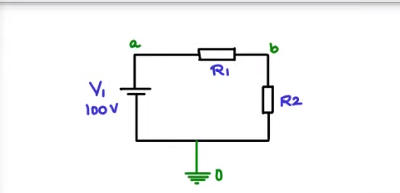

# SPICE 示例 ex01

## 说明

- 通过一个最简单的分压电路演示 `ngspice` 的基本加载方式.
- 适合用于快速验证网表语法和仿真命令是否可用.

## 电路目标

- 输入一个直流电压源.
- 用两个电阻组成最小分压网络.
- 观察中间节点电压是否符合预期.

## 电路示意



## 运行

```sh
ngspice ex01.cir
```

## 关键网表

```spice
* title: simple circuit
.global gnd
v1 a 0 100v
r1 a b 10
r2 b 0 10
.end
```

## 如何理解结果

- 节点 `b` 位于两个相等电阻中间, 理论上应得到一半电压.
- 这个例子若能跑通, 说明最小网表格式, 电源, 电阻和求解流程都基本正常.

## 调试提示

- 启动后可使用 `listing` 查看已加载网表.
- 如果这个例子可以跑通, 再继续扩展更多器件和分析指令会更稳妥.
- 若运行失败, 优先检查文件路径, 网表语法和 `ngspice` 是否正确安装.
