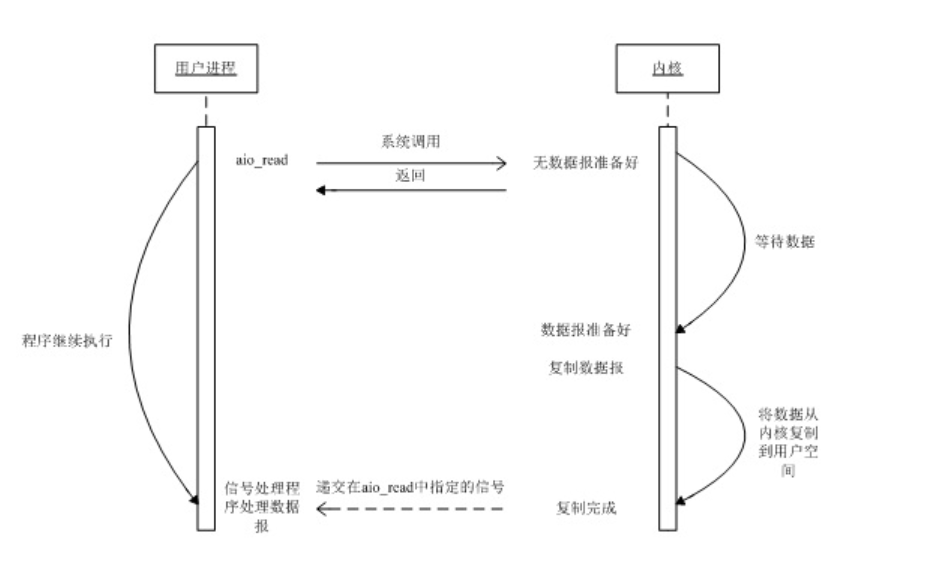
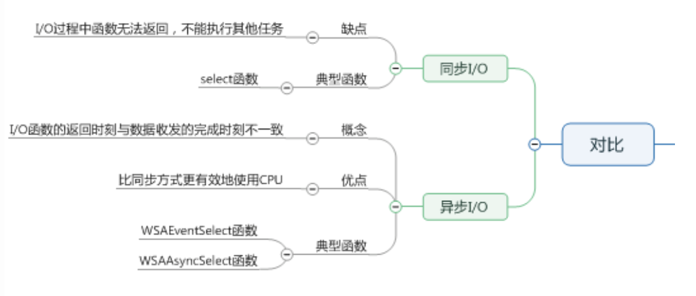

windows 异步通知 IO模型 与 重叠 IO模型

参考自: https://www.cnblogs.com/weekbo/p/9875756.html
https://zhuanlan.zhihu.com/p/36344554

# 同步IO 与 异步IO

对设备的读写 都可以看做是 对文件的读写, 对文件读写 一般都需要经过 内核态 和 用户态 的切换.

同步IO的特点：

    同步IO指的是用户进程触发I/O操作并等待或者轮询的去查看I/O操作是否就绪。
    同步IO的执行者是IO操作的发起者。
    同步IO需要发起者进行内核态到用户态的数据拷贝过程，所以这里必须有个阻塞

异步IO的特点：

    异步IO是指用户进程触发I/O操作以后就立即返回，继续开始做自己的事情，而当I/O操作已经完成的时候会得到I/O完成的通知。
    异步IO的执行者是内核线程，内核线程将数据从内核态拷贝到用户态，所以这里没有阻塞

## 异步IO 工作机制

告知内核启动某个操作, 并让内核在整个操作 (包括将数据从内核复制到我们自己的缓冲区) 完成后通知我们

我们调用aio_read函数 (POSIX异步I/O函数以aio_或lio_开头), 给内核传递描述符、缓冲区指针、缓冲区大小(与read相同的三个参数)和文件偏移(与lseek类似), 并告诉内核当整个操作完成时如何通知我们。该系统调用立即返回, 并且在等待I/O完成期间, 我们的进程不被阻塞

## 异步IO 与 同步IO 对比

