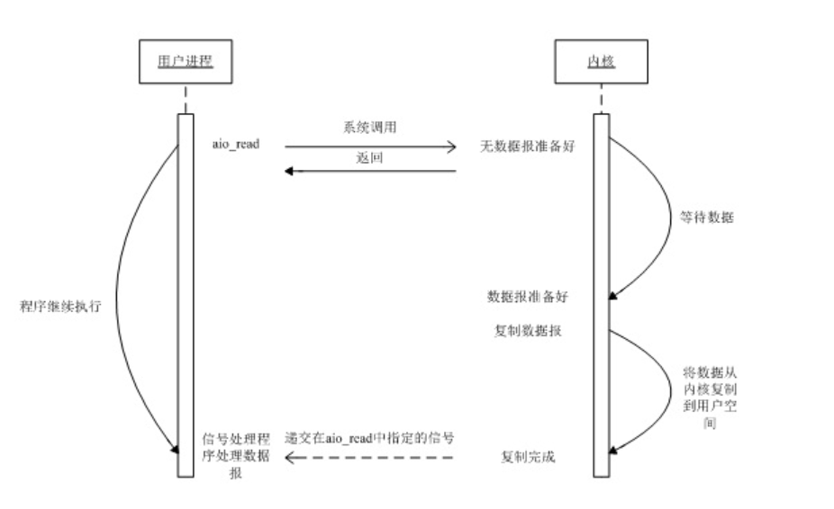
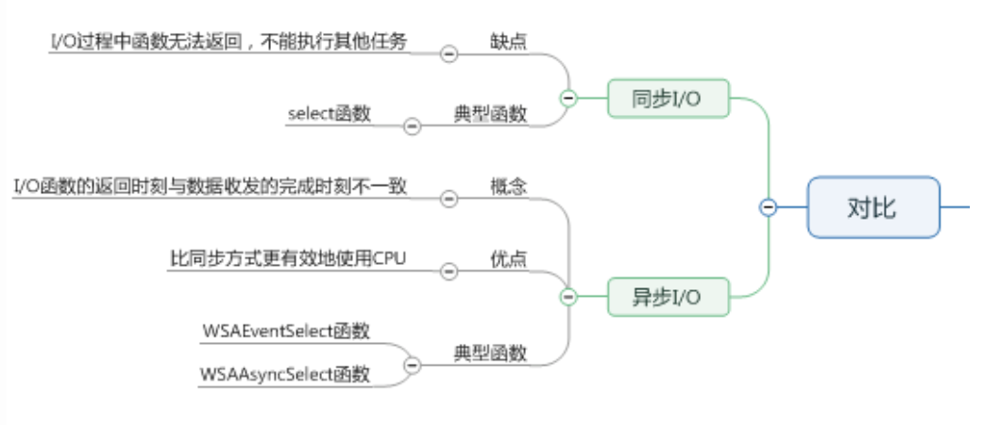

# Windows 异步通知 IO 模型与重叠 IO 模型

## 说明

- 本页用于区分同步 IO, 异步 IO, 以及 Windows 场景下常被一起讨论的通知模型与重叠 IO.
- 当前内容更偏概念速记和图示理解, 还没有展开到 IOCP 等更完整的工程化实现.

## 参考

- https://www.cnblogs.com/weekbo/p/9875756.html
- https://zhuanlan.zhihu.com/p/36344554

## 同步 IO 与 异步 IO

对设备的读写都可以看做是对文件的读写, 对文件读写一般都需要经过内核态和用户态的切换.

同步 IO 的特点:

- 用户进程触发 I/O 操作后, 需要等待或轮询 I/O 是否就绪.
- I/O 操作的发起者同时承担了等待和配合拷贝的职责.
- 因为涉及从内核态到用户态的数据拷贝, 所以调用方通常会感受到阻塞.

异步 IO 的特点:

- 用户进程触发 I/O 操作后立即返回, 可以继续处理自己的逻辑.
- 内核在整个 I/O 完成后再通知用户进程.
- 数据由内核负责从内核态拷贝到用户态缓冲区, 调用方不需要在等待阶段持续阻塞.

## 异步 IO 工作机制

核心思路是: 告知内核启动某个操作, 并让内核在整个操作完成后通知应用.

例如调用 `aio_read` 这类 POSIX 异步 I/O 接口时, 需要给内核传递描述符, 缓冲区指针, 缓冲区大小和文件偏移, 并指定操作完成后的通知方式. 调用返回后, 进程在等待 I/O 完成期间不需要被阻塞.

## 异步 IO 与同步 IO 对比

## 备注

- 如果继续深入 Windows 网络与高并发模型, 通常还需要继续看 `Overlapped I/O`, `Completion Port`, `WSARecv` / `WSASend` 等 API 组合方式.
