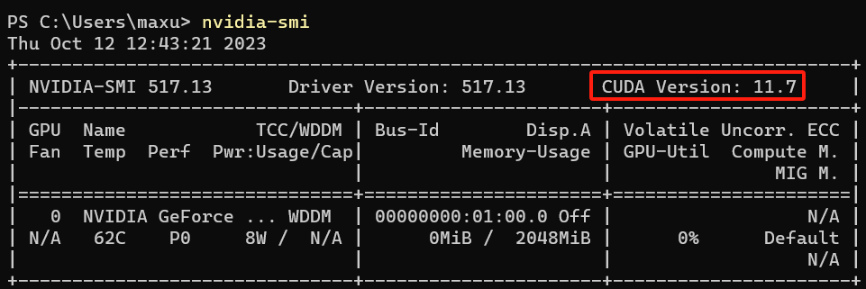

https://huggingface.github.io/candle/guide/installation.html

## Windows11 安装 Cuda

执行 `nvidia-smi` 查看支持的 Cuda 版本

[下载 Cuda](https://developer.nvidia.com/cuda-toolkit-archive)

执行安装.

还需要把 编译器cl.exe 的路径添加到环境变量中:

D:\Program Files\Microsoft Visual Studio\2022\Community\VC\Tools\MSVC\14.37.32822\bin\Hostx64\x64
