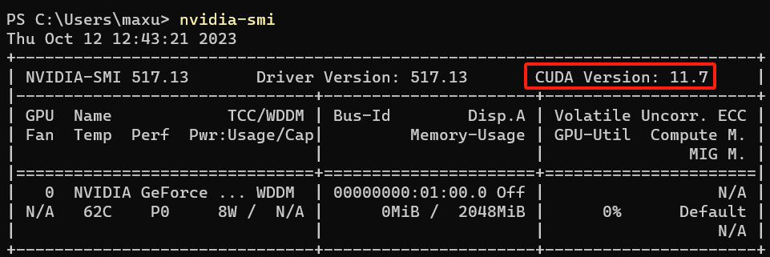

# Candle

## 说明

- `Candle` 是 Hugging Face 推出的 Rust 机器学习推理框架.
- 本页当前记录 Windows + CUDA 环境的最小安装注意点.

## 参考

- 官方安装指南: https://huggingface.github.io/candle/guide/installation.html

## Windows 11 安装 CUDA

1. 执行 `nvidia-smi` 查看当前驱动支持的 CUDA 版本.



2. 到 CUDA 归档页面下载匹配版本的安装包.

- [下载 CUDA](https://developer.nvidia.com/cuda-toolkit-archive)

3. 完成安装后, 再确认 `nvcc` 与 CUDA 运行库是否已正确进入环境.

## MSVC 编译器路径

在 Windows 上编译部分依赖时, 还需要确保 `cl.exe` 所在目录已加入 `PATH`.

示例路径:

```text
D:\Program Files\Microsoft Visual Studio\2022\Community\VC\Tools\MSVC\14.37.32822\bin\Hostx64\x64
```

## 后续可补

- `candle-core` / `candle-nn` 的最小示例.
- CPU 与 CUDA 特性切换方式.
- Windows 与 Linux 的差异化安装记录.
