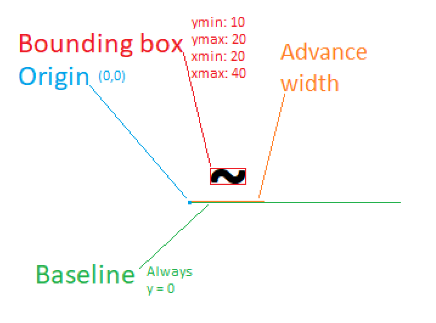

Fontdue 字体库

基本用法:

``` rust
// Read the font data.
    let font = PATH;
    // Setup the configuration for how the font will be parsed.
    let settings = fontdue::FontSettings {
        scale: SIZE,
        ..fontdue::FontSettings::default()
    };
    // Parse it into the font type.
    let font = fontdue::Font::from_bytes(font, settings).unwrap();
    // Rasterize and get the layout metrics for the character at a size.
    let (metrics, bitmap) = font.rasterize(CHARACTER, SIZE);
```




