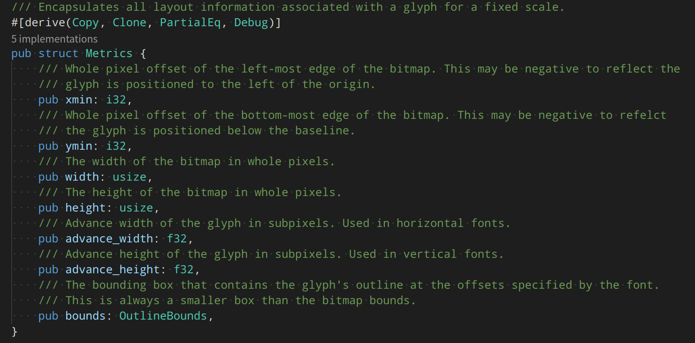

## ttf 基本知识

摘录自: https://www.modb.pro/db/175187

1. Baseline, Origin和Layout

基线(Baseline)是一条假想的线，用于在呈现文本时“引导”字形。它可水平 可垂直。位于基线上的一个虚拟点被称为笔位置(Pen Position)或原点(Origin)，用来定位字形


对于水平布局(Horizontal Layout)来说，字形只是被放置在基线上，通过从左至右或从右至左地增加笔位置来呈现文本。相邻两个笔位置之间水平距离被称为步进宽度(Advance Width)，步进宽度由具体的字形来决定，从图中也可以发现不同字母的步进宽度是不同的


对于垂直布局(Vertical Layout)来说，字形以基线为中心，基线两侧字形等宽

2. Ascent，Descent 和Bounding Box

从基线到字体轮廓最高点的距离叫做Ascent，中文貌似最贴合的翻译叫做“上坡度”，从基线到字体轮廓最低点的距离叫做Descent，也可以叫做“下坡度”，一般来说Ascent是正值，Descent是负值


边界框(Bounding Box)是一个虚拟框，它被用来尽可能紧密地围住字形，边界框有四个参数：xMin，yMin，xMax和yMax。在FreeType API中边界框也被简称为bbox。如下图中 蓝框就是每个字形的边界框


3. Bearings 和 Advances

3个轴承(Bearings)的概念:

(1) 左侧轴承(Left Side Bearing)，它指的是从当前笔位置到字形边界框左侧边缘的水平距离。大多情况下水平布局字形的左侧轴承是正数，垂直布局字形的左侧轴承是负数。左侧轴承也被称为X轴承(bearingX)或被简写为lsb

(2) 顶部轴承(Top Side Bearing)也被称为Y轴承(bearingY)，它是指当前笔位置到字形边界框顶部的垂直距离，水平布局字形的顶部轴承通常是正数，垂直布局通常是负数。

(3) 右侧轴承(Right Side Bearing)简称rsb，它仅用于水平布局，用于描述字形边界框右侧和步进宽度之间的距离，大多情况下为正数。

步进宽度(Advance Width)指的是两个相邻笔位置(Pen Position)之间的水平距离，对于水平布局来说，步进宽度总是正数，对于垂直布局而言总是零。步进宽度在FreeType API中也被称为advanceX。除了步进宽度，还有步进高度(Advance Height)的概念，它指的是两个相邻笔位置之间的垂直距离，也常被称为advanceY。对水平布局来说它总为零，对垂直布局来说总为正数。

还有两个简单的度量：字形宽度(Glyph Width)和字形高度(Glyph Height)。

### ttf 总的分析


先从水平方向上来看，粉色的线是基线，基线上的两个实心小黑块是笔位置。相邻两个笔位置之间的水平距离就是步进宽度advanceX，从图中可以看出：左侧轴承lsb + 字符宽度Width + 右侧轴承rsb = 步进宽度advanceX。

再从纵向上来看，Ascent + |Descent| = 字符高度Height，对于单个字形而言，顶部轴承和Ascent是一样的。图中的蓝色方框就是字形的边界框，边界框的四个参数xMin，xMax，yMin和yMax也用蓝色标注出来了。

另外，图中箭头的方向也有含义，字体布局中默认向右和向上的方向为正，这和我们常见的坐标轴方向是一样的。所以上图中除去Descent为负值，其他度量都为正值，这也是|Descent|要加绝对值的原因

接下来看看垂直布局下字符的字形度量：


垂直布局的字形以基线为中心，基线两侧字形等宽。和水平布局相同，粉色的线是基线，黑色方块是笔位置。相邻两个笔位置之间的垂直距离是步进高度advanceY。

左侧轴承是当前笔位置到边界框左侧的距离，顶部轴承是到边界框最顶部的距离，而垂直布局中没有右侧轴承的概念。上图中的箭头方向也指示了度量值的正负，除了高度Height和宽度Width为正数，其他的度量都为负数。

## Fontdue 字体库

基本用法:

``` rust
// Read the font data.
    let font = PATH;
    // Setup the configuration for how the font will be parsed.
    let settings = fontdue::FontSettings {
        scale: SIZE,
        ..fontdue::FontSettings::default()
    };
    // Parse it into the font type.
    let font = fontdue::Font::from_bytes(font, settings).unwrap();
    // Rasterize and get the layout metrics for the character at a size.
    let (metrics, bitmap) = font.rasterize(CHARACTER, SIZE);
```



