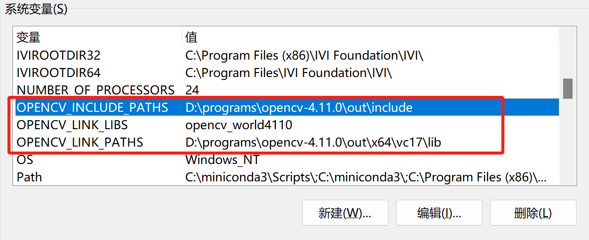

## opencv 源码编译

参考: https://www.runoob.com/opencv/opencv-install-cpp.html

CMake Clang Git

https://github.com/opencv/opencv/archive/refs/tags/4.11.0.zip

解压, 进入解压后的目录

cmake -DCMAKE_BUILD_TYPE=Release -DCMAKE_INSTALL_PREFIX=out -DBUILD_opencv_java=OFF -DBUILD_TESTS=OFF -DBUILD_PERF_TESTS=OFF -DBUILD_EXAMPLES=OFF -DBUILD_STATIC_LIBS=OFF -DBUILD_SHARED_LIBS=ON -DBUILD_opencv_world=ON -DCMAKE_CXX_FLAGS="-DOPENCV_DISABLE_EIGEN_TENSOR_SUPPORT=1" -B build -S .

cmake --build build --parallel 20 --config Release

cmake --build build --target install --config Release

说明:

    windows系统中, 需要加上 --config Release, 否则无效, 为Debug

设置环境变量

