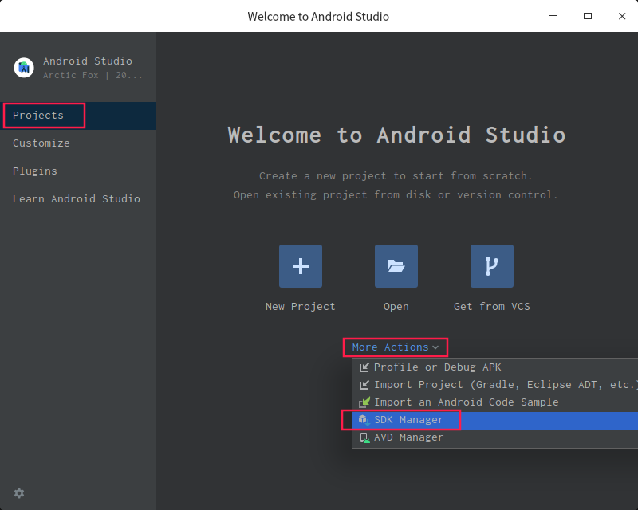
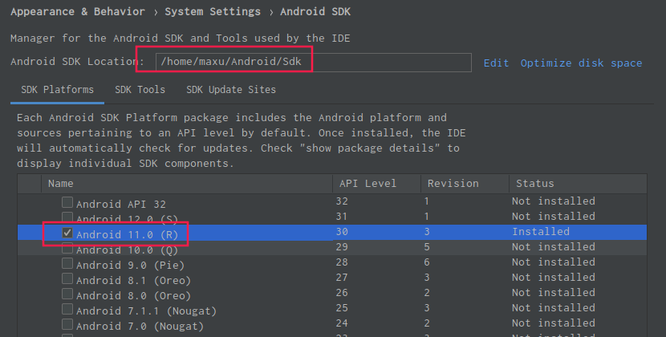
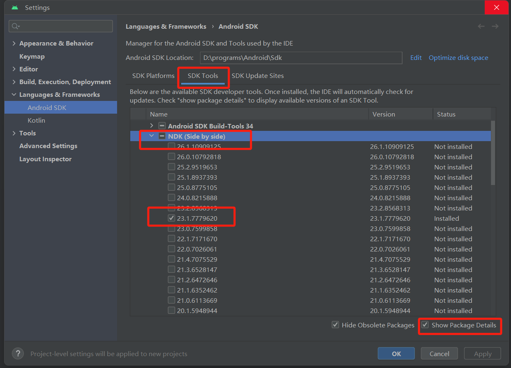
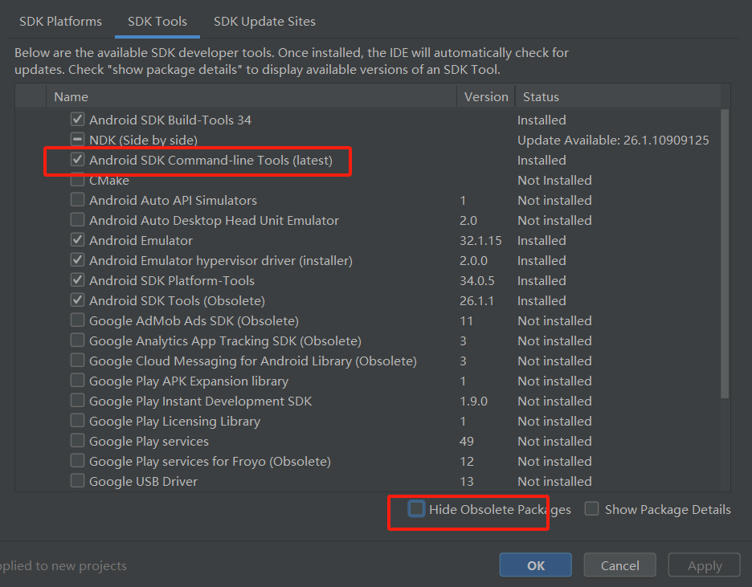

# deepin系统 rust for android 基本环境配置

## 安装 sdk 及必要的工具

1. 下载 android studio: https://developer.android.com/studio， 只是为了用这个管理sdk及其tools

2. 解压下载的 android studio 压缩包到 /opt (当前最新版本: 2020.3.1 for Linux 64-bit)

3. 安装sdk及tools, 我的手机是 红米10X -- android 11

    打开: /opt/android-studio/bin/studio.sh

    前几个显示的窗口 略, 记得配代理

    打开 sdk tool 管理:
        

    选中 指定版本的sdk 下载
        

    选择 SDK Tools 中，
        NDK (Side by side) 版本: 23.1.7779620

    

    安装 Android SDK Command-line Tools (latest)

    

4. 手机连接linux主机, 安装 相应的 driver或配置

    https://developer.android.com/studio/run/device

    dmesg -w 确认一下 usb的设备号: 18d1 4ee7

    apt-get install android-sdk-platform-tools-common

    创建文件: /etc/udev/rules.d/50-android.rules, 处理用户对 usb 设备的权限, 添加内容:

        SUBSYSTEM=="usb",ATTRS{idVendor}=="18d1",ATTRS{idProduct}=="4ee7",MODE="0666"

    重启 udev 服务

        sudo service udev reload
        sudo service udev restart

    添加当前用户分组, adb 命令需要权限

        sudo usermod -a -G plugdev maxu

    连接手机 到 linux 主机, 然后 启动 adb, 查看设备列表, 记住这个顺序, 不然可能找不到设备 !!!

    adb命令

        adb start-server, 启动 adb 服务
        adb devices, 查看设备列表

5. bevy

    安卓配置:
        https://github.com/bevyengine/bevy/tree/main/examples#android

    rustup target add aarch64-linux-android armv7-linux-androideabi
    cargo install cargo-apk

    添加环境变量

        export ANDROID_SDK_ROOT=~/Android/Sdk
        export ANDROID_NDK_ROOT=$ANDROID_SDK_ROOT/ndk/23.1.7779620
        export PATH=/opt/android-studio/jre/bin:$ANDROID_SDK_ROOT/platform-tools:$PATH

    cargo apk run --example android

    查看日志, 在终端执行:

        # 清除以前的日志
        adb logcat -c

        # 使用管道过滤 特定App 的日志
        adb logcat | grep rust.example.hello_world

        adb logcat | grep RustStdoutStderr

