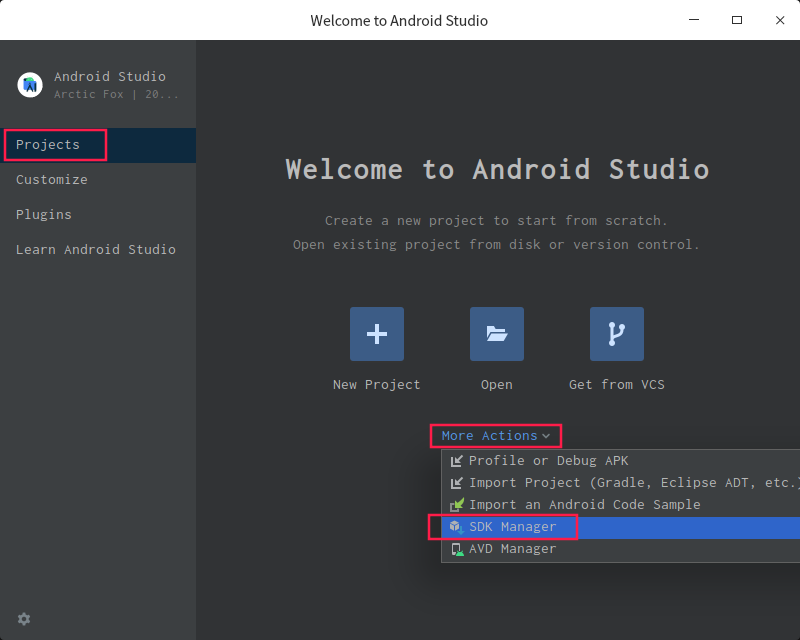
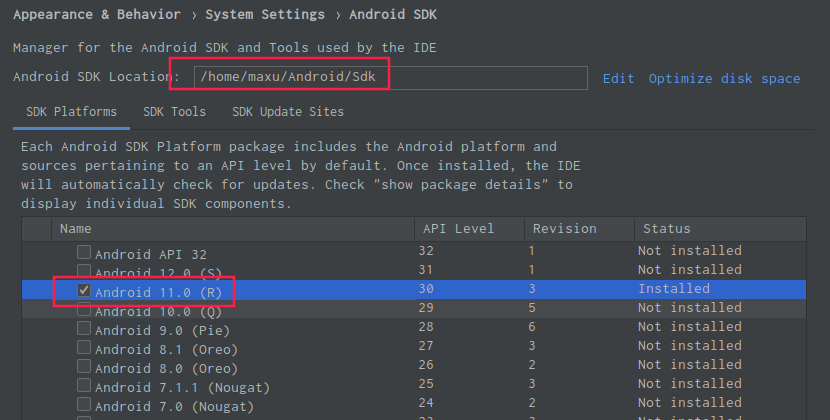
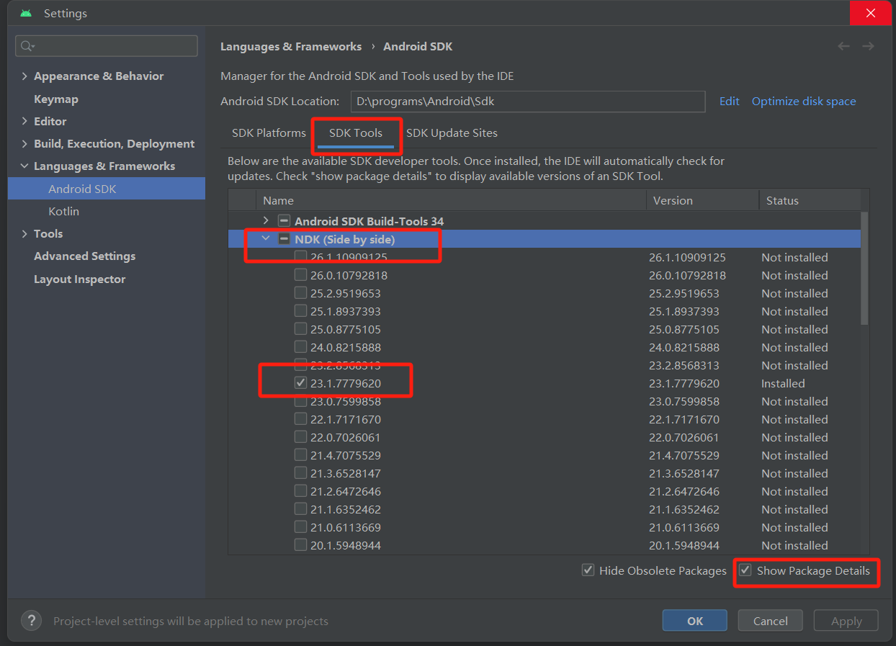
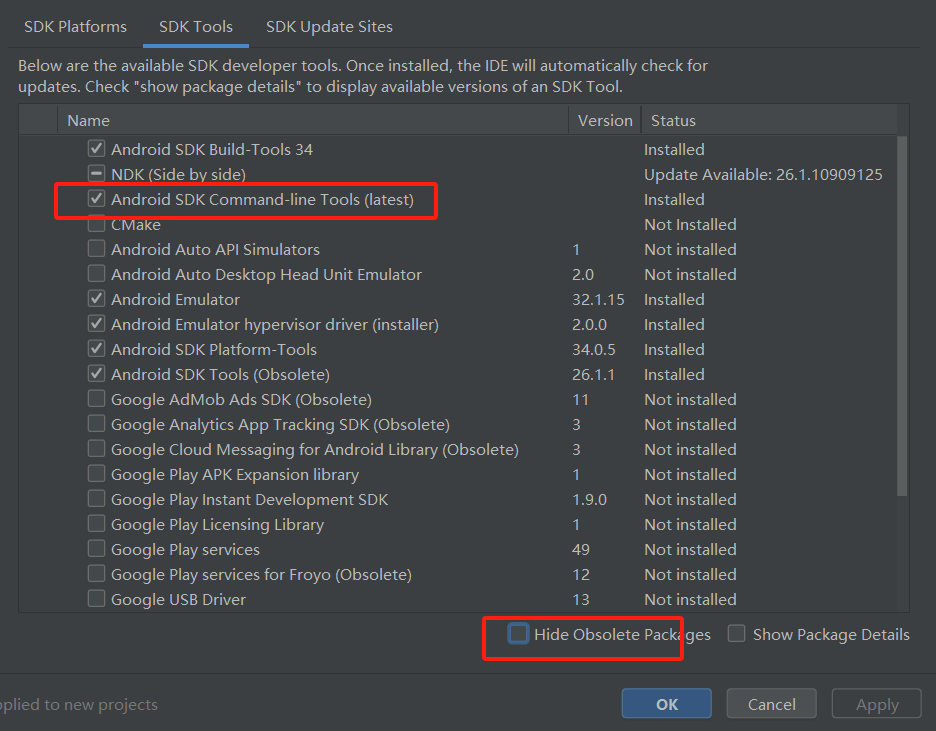

# Rust for Android 基本环境设置

## 说明

- 记录 Linux / Deepin 环境下配置 Android SDK, NDK, adb 与 Rust 目标的基本流程.
- 文中的 Android Studio 与 NDK 版本属于历史实测记录, 使用前请结合当前版本核对.

## 安装 SDK 与必要工具

1. 下载 Android Studio: https://developer.android.com/studio
2. 将 Android Studio 解压到 `/opt`.
3. 启动 `/opt/android-studio/bin/studio.sh`, 通过图形界面安装 SDK 与工具链.

SDK Tools 记录:

- `NDK (Side by side)`: `23.1.7779620`
- `Android SDK Command-line Tools (latest)`

界面记录:






## 设备连接与 adb

手机连接 Linux 主机后, 先参考官方文档确认调试方式:

- https://developer.android.com/studio/run/device

查看设备 ID:

```sh
dmesg -w
```

示例记录: `18d1:4ee7`.

安装平台工具:

```sh
apt-get install android-sdk-platform-tools-common
```

创建 `/etc/udev/rules.d/50-android.rules`:

```conf
SUBSYSTEM=="usb",ATTRS{idVendor}=="18d1",ATTRS{idProduct}=="4ee7",MODE="0666"
```

重启 `udev`:

```sh
sudo service udev reload
sudo service udev restart
```

将当前用户加入 `plugdev` 组:

```sh
sudo usermod -a -G plugdev maxu
```

常用 `adb` 命令:

```sh
adb start-server
adb devices
```

## Rust 目标与 Bevy 验证

参考:

- https://github.com/bevyengine/bevy/tree/main/examples#android

安装目标与工具:

```sh
rustup target add aarch64-linux-android armv7-linux-androideabi
cargo install cargo-apk
```

环境变量示例:

```sh
export ANDROID_SDK_ROOT=~/Android/Sdk
export ANDROID_NDK_ROOT=$ANDROID_SDK_ROOT/ndk/23.1.7779620
export PATH=/opt/android-studio/jre/bin:$ANDROID_SDK_ROOT/platform-tools:$PATH
```

运行示例:

```sh
cargo apk run --example android
```

查看日志:

```sh
adb logcat -c
adb logcat | grep rust.example.hello_world
adb logcat | grep RustStdoutStderr
```
