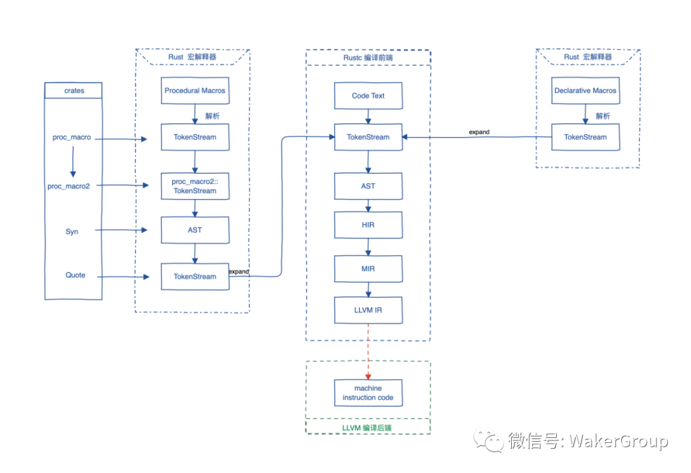

# Rust in action

## 在 .config/config.toml 中设置默认编译目标

    # out-dir 需要添加编译选项 cargo build -Z unstable-options

    [build]
    target = "i686-pc-windows-msvc"
    out-dir = "D:/programs/ehTestCore_V1.2.1.13/plugin"

## 在 Cargo.toml 中指定 target, nightly

    cargo-features = ["per-package-target"]

    [package]
    default-target = "i686-pc-windows-msvc"

## TAB 键 自动补全

参考: https://rust-lang.github.io/rustup/installation/index.html#enable-tab-completion-for-bash-fish-zsh-or-powershell

### for linux

mkdir -p ~/.local/share/bash-completion/completions
rustup completions bash >> ~/.local/share/bash-completion/completions/rustup

## cargo 命令

    安装常用的工具:

        # 扩展cargo, 允许对 dependencies 的增删改
        # 查看依赖关系
        # 基于模板生成项目
        # 宏展开
        cargo install cargo-edit cargo-tree cargo-generate cargo-expand

        ps:
            cargo-edit 部分命令:
                cargo add <crate>
                cargo add <crate> --allow-prerelease, 允许使用beta版本的库
                cargo rm <crate>
                cargo upgrade

            cargo-tree 部分命令:
                cargo tree
                cargo tree -e features
                cargo tree -f "{p} {f}"

        # 文档生成, 及插件: 用于数学表达式, 生成流程图表
        cargo install mdbook mdbook-katex mdbook-mermaid

    # 创建项目
    cargo new hello_cargo

    # 编译 并生成可执行程序
    cd hello_cargo
    cargo build
    cargo build --release
    cargo build --target thumbv7m-none-eabi

    # 编译 但不生成 可执行程序
    cargo check

    # 运行目标程序 (也可以一步构建项目)
    cargo run

    # 创建
    cargo new hello_world <--bin>, 创建一个二进制程序
    cargo new hello_world --lib, 创建一个库

    # 参数

    不使用默认的features:
        --no-default-features

        指定features:
            --features="FEATURE1 FEATURE2 ..."

    # 显示详细的编译信息, 包括 build.rs 中的 print
    cargo build -vv

    # 安装 binutils 工具
    cargo install cargo-binutils
    rustup component add llvm-tools-preview

## vscode 中 rust 的插件

    1. rust-analyzer
    2. Crates
    3. Even Better TOML
    4. CodeLLDB

## Ownership

    1. Rust 中的每一个变量都有一个 owner
    2. 在同一时刻 owner 只有一个.
    3. 当 owner 离开作用域时, 它的值将会被丢弃

### References and Borrowing

    & 引用
    * 解引用

    mut 可变
    默认不可变

    借用, 即 获取引用作为函数参数

    ps:
       1. 在任意给定时刻, 只能拥有一个可变引用或任意数量的不可变引用 之一 (而不是两者)
       2. 引用必须总是有效的

### Lifetimes

    第一条规则是每一个是引用的参数都有它自己的生命周期参数

    第二条规则是如果只有一个输入生命周期参数, 那么它被赋予所有输出生命周期参数

    第三条规则是如果方法有多个输入生命周期参数并且其中一个参数是 &self 或 &mut self, 那么所有输出生命周期参数被赋予 self 的生命周期

## Rust 的 安装与卸载

    参考链接:
        https://www.rust-lang.org/zh-CN/tools/install

    安装:
        curl --proto '=https' --tlsv1.2 https://sh.rustup.rs -sSf | sh

    版本号:
        rustc --version

    升级:
        rustup update stable
        rustup update

    使用 不同 版本:
        rustup default stable
        rustup default nightly

    添加工具:
        cargo install cargo-generate
        cargo install cargo-edit
        cargo install mdbook

    卸载:
        rustup self uninstall

## 使用特定的 rust 版本

    参考: https://doc.rust-lang.org/edition-guide/rust-2018/rustup-for-managing-rust-versions.html

    rustup toolchain install nightly-2020-11-19
    rustup toolchain list
    rustup default nightly-2020-11-19

    ps:
        "2020-11-19" 这个时间是在 rust 的 git 中的tag上找的

    # 安装 nightly 版本的工具链
    rustup toolchain install nightly

    # 对当前项目使用 nightly
    rustup override set nightly

    # 对所有项目使用 nightly
    rustup default nightly

## 指定 默认编译器

创建 rust-toolchain.toml 文件, 添加:

```toml
[toolchain]
channel = "nightly-2024-01-05"
components = [
  "cargo",
]
```

## cargo 指定编译器 报错:

`'cargo.exe' binary, normally provided by the 'cargo' component, is not applicable to ..`

    rustup component remove cargo
    rustup component add cargo

## 一些额外的命令

输出 详细的编译命令

    cargo build --build-plan -- -Z unstable-options > build.json

## riscv

    rustup target add riscv32imac-unknown-none-elf

## stm32

    rustc install thumbv7m-none-eabi
    rustup target install thumbv7m-none-eabi
    cargo build --target thumbv7m-none-eabi

## vscode 中 rust 的插件

    1. rust-analyzer
    2. Crates
    3. Better TOML
    4. CodeLLDB

## Rust hello_world

    编写点一个程序:
        vim main.rs

        fn main() {
            println!("Hello, world!");
        }

    编译:
        rustc main.rs

    运行:
        ./main

## Rust 编译过程



Rust 编译器(rustc)是一个编译器前端, 它负责把文本代码一步步编译到 LLVM 中间码(LLVM IR), 再交给 LLVM, 最终生成机器码, 所以 LLVM 是编译器后端.

宏展开 --> 语法语义分析 --> 生成抽象语法树 --> LLVM IR (LLVM 中间语言) --> 通过 LLVM 生成机器码

## 使用 Cargo 创建项目

    创建项目 hello_cargo:
        cargo new hello_cargo

    cd hello_cargo

    编译 并生成可执行程序:
        cargo build
        cargo build --release

    编译 但不生成 可执行程序:
        cargo check

    运行目标程序 (也可以一步构建项目):
        cargo run

    创建:
        cargo new hello_world <--bin>, 创建一个二进制程序
        cargo new hello_world --lib, 创建一个库

## 库

    kurbo
        曲线工具

    lyon
        路径细分库, 可以用于基于GPU的2D图形渲染


    tokio
        https://github.com/tokio-rs/tokio

    embedded_graphics
        mcu gui

    embedded_sdmmc

## GUI 开发

### iced

    sudo apt install libssl-dev

    官方的例子:

        git clone https://github.com/hecrj/iced.git

        cd iced

        cargo build

        // --features glow,glow_canvas
        cargo run --package todos

    // 如果无法运行, 就安装下面的软件包
    sudo apt install libvulkan1 mesa-vulkan-drivers vulkan-utils

### iced: 编译 并 运行所有的 examples

    #!/bin/bash

    examples=(iced_core iced_futures iced_graphics iced_native iced_style iced_glow iced_glutin iced_winit iced_web iced_wgpu bezier_tool iced clock color_palette counter custom_widget download_progress events game_of_life geometry integration pane_grid pick_list pokedex progress_bar qr_code scrollable solar_system stopwatch styling svg todos tour)

    for example in ${examples[@]}; do
        cargo build --verbose --package $example
    done

    for example in ${examples[@]}; do
        echo "start run: cargo run --verbose --package $example"
        cargo run --verbose --package $example
    done

### iced 例子

    学习基本的布局:
        target/debug/pane_grid
        examples/tour

    学习canvas:
        examples/clock

### bevy, 游戏引擎

    git clone https://github.com/bevyengine/bevy
    cargo run --example breakout

## libusb, usb 库

    https://stackoverflow.com/questions/1710922/how-to-install-pkg-config-in-windows


    在windows上找不到libusb库, 在 ~/.cargo/config 中添加:

    [target.x86_64-pc-windows-msvc.'usb-1.0']
    rustc-link-search = ['D:\libs\64bit']
    rustc-link-lib = ['libusb-1.0']

## wasm 开发

    安装 wasm-pack:

        curl https://rustwasm.github.io/wasm-pack/installer/init.sh -sSf | sh

    cargo install cargo-generate

    cargo generate --git https://github.com/rustwasm/wasm-pack-template -n wasm-app

    cd wasm-app
    wasm-pack build

    npm init wasm-app www

    cd www
    yarn

    cd ../pkg
    yarn link

    cd ../www
    yarn link "wasm-app"

## vue vite rust wasm

    yarn create @vitejs/app my-vue-app --template vue

    cd my-vue-app
    yarn add -D vite-plugin-rsw

    yarn

    cargo generate --git https://github.com/rustwasm/wasm-pack-template -n wasm-app

    vite.config.js:

        import { defineConfig } from "vite";
        import vue from "@vitejs/plugin-vue";
        import ViteRsw from 'vite-plugin-rsw';

        // https://vitejs.dev/config/
        export default defineConfig({
            plugins: [
                vue(),
                ViteRsw({
                    mode: "release",
                    crates: ["wasm-app"],
                }),
            ],
        });

## 异步

    impl Future for Server

    Server实例就可以直接使用 .await 了

## 汇编

    https://godbolt.org/ 二进制浏览器

## rust 编译选项

在 build.rs 中

```rust
println!("cargo:rustc-link-arg=-fPIC");
```

在 .config/config.toml 中

```toml
[target.arm-unknown-linux-gnueabihf]
rustflags = [
    # "-Clink-arg=-Tsrc/linker.ld",
    # "-Cforce-frame-pointers=yes"

    # "-C", "linker=arm-linux-gnueabihf-ld",
    "-C", "linker=arm-linux-gnueabihf-gcc",
    "-C", "relocation-model=pic",
    "-C", "target-feature=+crt-static",

    # LLD (shipped with the Rust toolchain) is used as the default linker
    # "-C", "link-arg=-Tlink.x",
]
```

## 调试 rust dll

.vscode\launch.json

```json
{
    "type": "lldb",
    "request": "launch",
    "name": "ehTestCore",
    "program": "xxx.exe",
    "args": [],
    "cwd": "xxx",
    "stopOnEntry": false,
    "sourceLanguages": [
        "rust"
    ],
    "sourceMap": {
        "/rustc/73c9eaf21454b718e7c549984d9eb6e1f75e995c": "C:/Users/maxu/.rustup/toolchains/nightly-x86_64-pc-windows-msvc/lib/rustlib/src/rust"
    }
},
```

rust 的标准库 调试, 需要添加下面的内容, 其中 rustc 后面的 commit-hash 可以通过命令获得:

```json
"sourceMap": {
    "/rustc/73c9eaf21454b718e7c549984d9eb6e1f75e995c": "C:/Users/maxu/.rustup/toolchains/nightly-x86_64-pc-windows-msvc/lib/rustlib/src/rust"
}
```

`rustc -Vv | grep commit-hash | cut -d' ' -f 2`

## 静态 c++ 运行时库

[build-dependencies]
static_vcruntime = "2.0"

## rust-toolchain.toml

```toml
[toolchain]
channel = "1.77.2-x86_64-pc-windows-msvc"
```

windows 系统编译报错, `#![cfg_attr(feature = "stdsimd", feature(stdsimd))]`

```toml
[toolchain]
channel = "nightly-2024-02-04"
```

## 打印配置

rustc --print cfg

## 显示版本

cargo --version --verbose
