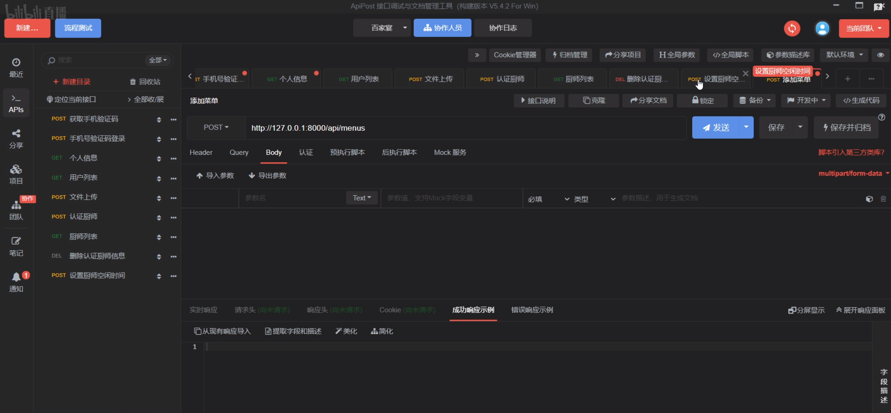

# Rust 后端开发

## 说明

- 本页保留 Rust 后端学习资源和接口调试工具入口.
- 当前内容偏“起步资源导航”, 适合作为后续继续扩展的占位页.

## 学习项目

- 一个较基础的学习项目: https://github.com/noxue/banquet

## 接口调试工具

- 一个方便写接口和调试请求的工具: https://www.apipost.cn/download.html

## 记录

## 后续可补

- Web 框架选型, 例如 Axum, Actix Web, Poem.
- 配置管理, 日志, 数据库和中间件组织方式.
- 接口测试与压测工具链.
